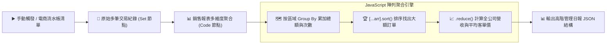

# 💻 Code Node (JavaScript)
## 範例 4：陣列操作與銷售報表重組（Group By 分組與多維度聚合）

### 📚 工作流程說明

在商業智慧（BI）與自動化報表生成中，經常需要將扁平的數百筆「原始交易流水帳」按部門、區域或產品類別重新分組（Group By），並計算各群組的總銷售額、平均客單價與最高金額訂單。

本範例展示：
1. 使用 JavaScript 物件映射（Object Map / Dictionary）實現動態 **Group By 分組**。
2. 使用陣列解構複製 `[...transactions].sort()` 進行不可變安全排序，避免修改原始數據。
3. 利用 `.reduce()` 與 `Object.values()` 產出結構清晰的多維度營運日報。

---

### 流程架構圖



---

### 工作流程樣版下載

- [📥 陣列操作與銷售報表重組工作流程樣版 (04_sales_report_aggregation.json)](./04_sales_report_aggregation.json)

---

#### 📋 節點詳細說明

1. **📝 流程說明（Sticky Note）**
   - **功能**：介紹 JavaScript 高階陣列方法（`map`, `reduce`, `filter`, `forEach`）與分組邏輯。

2. **🛒 原始交易資料（Set Node）**
   - 包含多筆具有 `product`, `category`, `amount`, `region` 屬性的交易陣列。

3. **📊 銷售報表多維度聚合 (Code Node)**
   - **分組聚合**：
     ```javascript
     const regionStats = {};
     transactions.forEach(t => {
       if (!regionStats[t.region]) {
         regionStats[t.region] = { region: t.region, total_amount: 0, transaction_count: 0, products: [] };
       }
       regionStats[t.region].total_amount += t.amount;
       regionStats[t.region].transaction_count += 1;
       regionStats[t.region].products.push(t.product);
     });
     ```

---

#### 🎯 學習重點

- **陣列不可變性 (Immutability)**：JavaScript 的 `.sort()` 會直接修改原陣列，使用 `[...transactions].sort()` 先淺拷貝再排序是專業前端與後端開發的最佳實踐。
- **資料塑形 (Data Shaping)**：掌握將扁平陣列轉為階層式巢狀報表的關鍵技巧。

---

<details>
<summary>🤖 <strong>AI 賦能延伸實作（附 Prompt 提詞）</strong></summary>

> 💡 **任務目標**：透過 MCP 連線，讓 AI 將聚合後的報表自動格式化為 Slack / Telegram Markdown 表格字串。

**可直接複製給 AI 的 Prompt 提詞**：
```text
請幫我在「銷售報表聚合」Code 節點中加入 Markdown 排版輸出：
1. 依據 regional_breakdown 產出美觀的 Markdown 表格（欄位：區域、總銷售額、訂單數、平均客單價）。
2. 在 highlights 中加上 🏆 冠軍訂單商品與金額。
3. 輸出一個 markdown_summary 字串欄位，方便後續直接發送給通訊軟體。
請提供修改後的 Code 節點程式碼！
```
</details>
