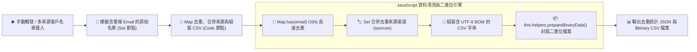

# 💻 Code Node (JavaScript)
## 範例 5：進階資料去重與二進位檔案生成（Map 去重與 UTF-8 CSV 封裝）

### 📚 工作流程說明

當企業從多個管道（如 Facebook 廣告名單、官網填單、LINE 客服進線）收集潛在客戶時，常遇到相同的客戶使用不同大小寫的 Email 重複登記，或每次登記時留下了不同的手機號碼與來源。

本範例展示：
1. 使用 JavaScript 的 **`Map`** 與 **`Set`** 結構，依據標準化後的 Email（小寫與修剪空格）實現 $O(N)$ 級別的高效名單去重。
2. 自動合併歷史來源渠道（例如 `FB廣告; 官網填單`）並保留最新手機與姓名。
3. 加入 **`\uFEFF` (UTF-8 BOM)** 標記，解決 Windows Excel 開啟中文 CSV 出現亂碼的痛點。
4. 透過 **`this.helpers.prepareBinaryData`** 動態將清洗後的名單生成為標準的 CSV 二進位檔案供後續節點寄出或儲存。

---

### 流程架構圖



---

### 工作流程樣版下載

- [📥 進階資料去重與二進位檔案生成工作流程樣版 (05_data_deduplication_binary_export.json)](./05_data_deduplication_binary_export.json)

---

#### 📋 節點詳細說明

1. **📝 流程說明（Sticky Note）**
   - **功能**：介紹 `Map` 資料結構在大量數據去重中的效能優勢與 `Buffer` 二進位處理。

2. **👥 含重複名單的原始資料（Set Node）**
   - 包含大小寫不一致的 Email（如 `ming@example.com` 與 `MING@example.com`）及多筆不同管道重複填單資料。

3. **🧹 Map 去重與生成 CSV Binary (Code Node)**
   - **核心程式碼**：
     ```javascript
     const contactMap = new Map();
     for (const contact of rawContacts) {
       const email = (contact.email || '').trim().toLowerCase();
       if (contactMap.has(email)) {
         // 合併來源
         const existing = contactMap.get(email);
         const sources = new Set(existing.sources);
         sources.add(contact.source);
         contactMap.set(email, { ...existing, sources: Array.from(sources) });
       } else {
         contactMap.set(email, { ...contact, sources: [contact.source] });
       }
     }
     
     // 產生二進位檔案
     const binaryData = await this.helpers.prepareBinaryData(
       Buffer.from(csvContent, 'utf-8'),
       'clean_contacts_export.csv',
       'text/csv'
     );
     ```

---

#### 🎯 學習重點

- **`Map` vs 雙重迴圈**：使用 `Map.has()` 查找時間為 $O(1)$，即使處理數萬筆資料也能在數毫秒內完成，避免傳統雙重迴圈卡死工作流程。
- **UTF-8 BOM 防亂碼**：在 CSV 字串最前端加上 `\uFEFF`，確保在 Microsoft Excel 開啟時繁體中文絕不出現亂碼。

---

<details>
<summary>🤖 <strong>AI 賦能延伸實作（附 Prompt 提詞）</strong></summary>

> 💡 **任務目標**：透過 MCP 連線，讓 AI 在去重後自動將 CSV 檔案作為附件，透過 Gmail 寄送給行銷團隊。

**可直接複製給 AI 的 Prompt 提詞**：
```text
請幫我在「資料去重與 CSV 生成」流程後方串接 Email 自動寄送：
1. 串接 Gmail 節點，發送主題為「【清洗報告】今日行銷名單已完成去重」的郵件。
2. 內文附上去重統計（原始筆數、清洗後筆數、剔除重複筆數）。
3. 將 Code 節點產出的 clean_contacts_export.csv 作為附件寄出。
請幫我配置好 Gmail 節點與連線！
```
</details>
