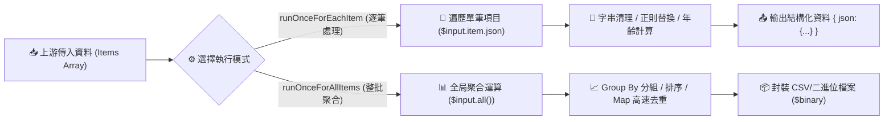

# 💻 Code Node (JavaScript) 節點進階應用實戰

歡迎來到 **n8n Code Node (JavaScript) 進階教學**！

雖然 n8n 是領先的 Low Code / No Code 自動化平台，提供了大量開箱即用的視覺化節點，但在面對真實企業場景時，**JavaScript Code 節點**是您突破限制、處理複雜業務邏輯的終極武器：

- ✅ **複雜資料清洗與轉換**：靈活處理非結構化文字、正規表達式與多重日期格式。
- ✅ **多條件智慧決策**：以單一節點取代由十幾個 IF/Switch 組成的繁瑣龐大流程。
- ✅ **陣列塑形與多維度聚合**：實現 Group By 分組、排序（Sort）、累加（Reduce）與報表重組。
- ✅ **去重與二進位檔案生成**：使用高效 `Map`/`Set` 去重，並動態打包生成 CSV/PDF 二進位附件。

> 💡 **AI 協作時代學習法**：在完成基礎節點設定並透過 MCP 連線 AI（Gemini、ChatGPT 或 Claude）後，您可以直接複製各範例中的 **「AI 賦能延伸實作」** 折疊區塊（`<details>`）內的 Prompt 提詞，由 AI 助理替您在畫布上全自動建構與擴充進階 JavaScript 程式碼！

---

## 🔑 n8n Code Node 核心變數與執行機制

> 📖 **進階技術文檔**：[n8n 執行機制與全域變數詳解](./n8n執行機制與全域變數詳解.md)

### 1. 輸入資料變數
| 變數名稱 | 適用模式 | 說明 |
| :--- | :--- | :--- |
| **`$input.item.json`** / **`$json`** | 逐筆模式 (`runOnceForEachItem`) | 取得當前處理項目的 JSON 物件 |
| **`$input.all()`** / **`$items()`** | 整批模式 (`runOnceForAllItems`) | 取得上游節點傳入的所有項目陣列 |
| **`$input.first()`** / **`$input.last()`** | 整批模式 (`runOnceForAllItems`) | 取得第一個或最後一個項目 |
| **`this.helpers.httpRequest`** | 異步 Helper | 在程式碼中直接發送 HTTP 請求（需加 `await`） |
| **`this.helpers.prepareBinaryData`**| 異步 Helper | 將 Buffer/文字封裝為 n8n 二進位檔案（需加 `await`） |

### 2. 輸出格式標準規範
```javascript
// ✅ 逐筆模式輸出格式 (回傳單一物件)
return {
  ...$input.item.json,
  newField: 'value'
};

// ✅ 整批模式輸出格式 (回傳陣列包覆 json 物件)
return [
  {
    json: {
      result: 'success',
      totalCount: 100
    },
    binary: {} // 若有二進位檔案放在這裡
  }
];
```

---

## 🧭 Code 節點資料處理核心架構



---

## 📚 實作範例導覽（由淺至深）

本教學規劃了五個由淺至深的實戰範例，帶您從初階語法步入高階大數據處理：

---

### 1. [範例 1：Code Node 互動式入門教學（兩種執行模式與內建 Helper）](./01_CodeNode互動式基礎教學/README.md)

**難度**：入門 🟢 ｜ **核心技術**：`runOnceForEachItem` vs `runOnceForAllItems` + API 請求 + CSV 生成

包含 6 個關卡的完整實作，帶您體驗逐筆模式、整批聚合、使用 `this.helpers.httpRequest` 呼叫外部 API，以及使用 `this.helpers.prepareBinaryData` 生成 CSV 檔案。

**學習重點**：
- `$input.item.json` 與 `$items()` 的使用時機
- JavaScript 異步運算（`async / await`）
- 內建 Helper 函數的強大功能

- **附帶資源**：[`01_code_node_basics.json`](./01_CodeNode互動式基礎教學/01_code_node_basics.json)

<details>
<summary>🤖 <strong>AI 賦能延伸實作（附 Prompt 提詞）</strong></summary>

> 💡 **任務目標**：透過 MCP 連線，讓 AI 在關卡 5 加入中位數 (Median) 與最大/最小年齡統計。

**可直接複製給 AI 的 Prompt 提詞**：
```text
請幫我在「5. Calculate Average Age」節點中擴充統計指標：
1. 計算所有使用者的最大年齡 (maxAge) 與最小年齡 (minAge)。
2. 將年齡陣列排序後計算年齡中位數 (medianAge)。
3. 在輸出 JSON 中同時包含 totalUsers, averageAge, maxAge, minAge, medianAge。
請提供修改後的 Code 節點 JavaScript 程式碼！
```
</details>

---

### 2. [範例 2：字串清理與日期格式標準化（正規表達式與 ISO 轉換）](./02_字串清理與日期格式標準化/README.md)

**難度**：初級 🟢 ｜ **核心技術**：`.replace(/\//g, '-')` + `.trim()` + `toLocaleDateString('zh-TW')`

多來源資料清理必備！將不同來源的日期統一轉換為 ISO 8601 標準格式（`YYYY-MM-DD`），並清除姓名中的空格與雜訊標籤。

**學習重點**：
- 正則表達式在資料清洗中的實用技巧
- JavaScript `Date` 物件與語系化格式轉換
- 建立標準 Code Node 輸出格式

- **附帶資源**：[`02_date_format_normalization.json`](./02_字串清理與日期格式標準化/02_date_format_normalization.json)

<details>
<summary>🤖 <strong>AI 賦能延伸實作（附 Prompt 提詞）</strong></summary>

> 💡 **任務目標**：透過 MCP 連線，讓 AI 增加時間戳記（Timestamp）與星期幾（如「星期日」）的計算。

**可直接複製給 AI 的 Prompt 提詞**：
```text
請幫我在「日期格式標準化」Code 節點中擴充日期資訊：
1. 取得日期對應的 Unix Timestamp（毫秒數）。
2. 計算該日期是「星期幾」（例如：星期一、星期日）。
3. 計算該日期距離今天相差了幾天 (diffDays)。
請提供修改後的 Code 節點程式碼！
```
</details>

---

### 3. [範例 3：多條件分類與動態標籤（替代複雜 IF 節點）](./03_多條件分類與動態標籤/README.md)

**難度**：中級 🟡 ｜ **核心技術**：多重條件判斷 + 動態標籤陣列 + 除以零防禦設計

以單一節點取代十幾個 IF 節點！同時根據訂單數、累積消費金額、最後下單天數等維度，為客戶動態評級並自動貼上多重標籤。

**學習重點**：
- 邏輯運算元（`&&`, `||`）的多條件組合
- 動態陣列操作（`.push()`, `.join()`）
- 安全運算（三元運算子避免除以零）

- **附帶資源**：[`03_customer_classification.json`](./03_多條件分類與動態標籤/03_customer_classification.json)

<details>
<summary>🤖 <strong>AI 賦能延伸實作（附 Prompt 提詞）</strong></summary>

> 💡 **任務目標**：透過 MCP 連線，讓 AI 增加「客戶健康度評分 (Health Score: 0~100)」演算法。

**可直接複製給 AI 的 Prompt 提詞**：
```text
請幫我在「客戶分級邏輯」Code 節點中加入健康度評分 (0-100 分) 運算：
1. 訂單數權重 40%（超過 20 筆滿分）。
2. 消費金額權重 40%（超過 10 萬元滿分）。
3. 活躍天數權重 20%（7 天內滿分，超過 90 天 0 分）。
4. 在輸出 JSON 中新增 health_score 與 score_level ('極佳' | '良好' | '危險')。
請提供修改後的 Code 節點程式碼！
```
</details>

---

### 4. [範例 4：陣列操作與銷售報表重組（Group By 分組與多維度聚合）](./04_陣列操作與銷售報表重組/README.md)

**難度**：中高級 🟡 ｜ **核心技術**：動態 Object Map 分組 + `[...arr].sort()` + `.reduce()` 聚合

商業智慧報表利器！將扁平的多筆交易流水帳重新按區域與產品類別進行 Group By 分組，並計算總營收、平均客單價與找出銷售冠軍。

**學習重點**：
- 物件映射（Object Dictionary）分組技巧
- 陣列不可變性（避免直接修改原陣列）
- 巢狀 JSON 報表結構塑形

- **附帶資源**：[`04_sales_report_aggregation.json`](./04_陣列操作與銷售報表重組/04_sales_report_aggregation.json)

<details>
<summary>🤖 <strong>AI 賦能延伸實作（附 Prompt 提詞）</strong></summary>

> 💡 **任務目標**：透過 MCP 連線，讓 AI 將聚合後的報表自動格式化為 Slack / Telegram Markdown 表格字串。

**可直接複製給 AI 的 Prompt 提詞**：
```text
請幫我在「銷售報表聚合」Code 節點中加入 Markdown 排版輸出：
1. 依據 regional_breakdown 產出美觀的 Markdown 表格（欄位：區域、總銷售額、訂單數、平均客單價）。
2. 在 highlights 中加上 🏆 冠軍訂單商品與金額。
3. 輸出一個 markdown_summary 字串欄位，方便後續直接發送給通訊軟體。
請提供修改後的 Code 節點程式碼！
```
</details>

---

### 5. [範例 5：進階資料去重與二進位檔案生成（Map 去重與 UTF-8 CSV 封裝）](./05_進階資料去重與二進位檔案生成/README.md)

**難度**：進階旗艦 🔴 ｜ **核心技術**：JavaScript `Map` 去重 + `\uFEFF` BOM 標記 + `prepareBinaryData`

大數據清洗旗艦範例！從多來源匯入潛在客戶名單，使用 `Map` 依 Email 高速 $O(N)$ 去重、合併來源管道，並動態組裝成防止 Excel 亂碼的 CSV 二進位檔案。

**學習重點**：
- `Map` 與 `Set` 在大數據去重中的極致效能
- Windows Excel UTF-8 BOM（`\uFEFF`）防亂碼機制
- `this.helpers.prepareBinaryData` 二進位管道封裝

- **附帶資源**：[`05_data_deduplication_binary_export.json`](./05_進階資料去重與二進位檔案生成/05_data_deduplication_binary_export.json)

<details>
<summary>🤖 <strong>AI 賦能延伸實作（附 Prompt 提詞）</strong></summary>

> 💡 **任務目標**：透過 MCP 連線，讓 AI 在去重後自動將 CSV 檔案作為附件，透過 Gmail 寄送給行銷團隊。

**可直接複製給 AI 的 Prompt 提詞**：
```text
請幫我在「資料去重與 CSV 生成」流程後方串接 Email 自動寄送：
1. 串接 Gmail 節點，發送主題為「【清洗報告】今日行銷名單已完成去重」的郵件。
2. 內文附上去重統計（原始筆數、清洗後筆數、剔除重複筆數）。
3. 將 Code 節點產出的 clean_contacts_export.csv 作為附件寄出。
請幫我配置好 Gmail 節點與連線！
```
</details>

---

## ⚡ 撰寫 JavaScript Code Node 的黃金守則

1. **永遠遵循標準回傳結構**：
   - 逐筆模式：`return { ...$input.item.json, field: value }`
   - 整批模式：`return [{ json: { ... } }]`
2. **防禦性程式設計（Defensive Programming）**：
   - 存取深層屬性使用 Optional Chaining（如 `item.json.user?.address?.city || '未填寫'`）。
   - 數值除法務必檢查分母大於 0。
3. **避免修改輸入原陣列**：
   - 排序時使用 `[...array].sort()` 進行拷貝。
4. **善用 `console.log()` 除錯**：
   - 在 Code 節點中印出的日誌會直接顯示在 n8n 畫布的 Executions 執行面板中。

---

## 🎯 學習路徑建議

```
[初階打底]
1. Code Node 互動式入門教學 ➔ 掌握兩種執行模式與 API 呼叫
2. 字串清理與日期格式標準化 ➔ 掌握正規表達式與 ISO 轉換

[中階業務實戰]
3. 多條件分類與動態標籤 ➔ 取代複雜 IF 節點，實現多維度決策
4. 陣列操作與銷售報表重組 ➔ 掌握 Group By 分組與多維度統計

[高階檔案處理]
5. 進階資料去重與二進位檔案生成 ➔ 掌握 Map 去重與 CSV 檔案封裝
```

---

## 📚 相關資源

- [n8n 官方 Code Node 文件](https://docs.n8n.io/integrations/builtin/core-nodes/n8n-nodes-base.code/)
- [🗄️ 雲端資料庫整合 (PostgreSQL, Supabase & Pinecone)](../雲端資料庫整合/README.md)
- [🌐 前端網頁與 WebAPI 整合](../前端網頁與WebAPI整合/README.md)
- [📜 Google Apps Script (GAS) 整合實作](../GAS整合/README.md)
