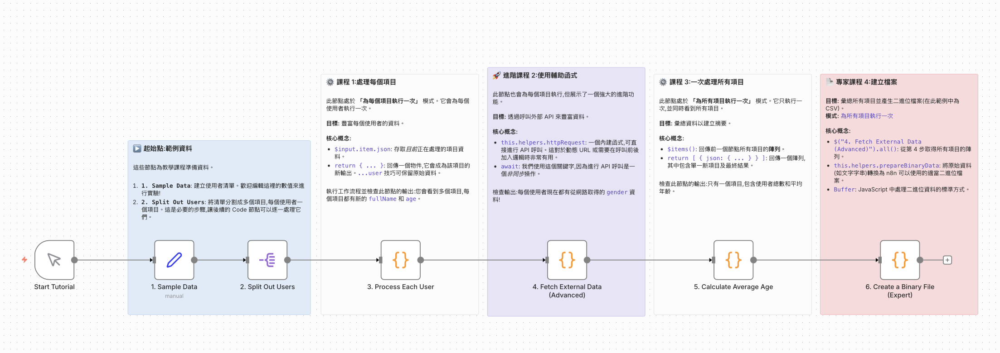

# Code Node 基礎教學：透過互動式實作學習

## 📋 範例說明

這是一個完整的互動式教學工作流程，透過實際案例逐步引導您學習 n8n Code Node 的核心概念與進階技巧。從基礎的資料處理到呼叫外部 API，再到產生二進位檔案，涵蓋了 Code Node 的主要應用場景。

## 工作流程樣版下載

[透過互動式實作教學學習程式碼javascrpt節點.json](透過互動式實作教學學習程式碼javascrpt節點.json)

## 🎯 使用場景

當您需要：
- **學習 Code Node 的兩種執行模式**：每個項目執行一次 vs. 所有項目執行一次
- **掌握 n8n 的資料存取方式**：`$input.item.json`、`$items()` 等變數的使用
- **呼叫外部 API**：使用 `this.helpers.httpRequest` 進行動態請求
- **產生檔案**：使用 `this.helpers.prepareBinaryData` 建立 CSV 等檔案
- **理解資料流動**：如何在節點之間傳遞和轉換資料

## 為什麼需要這個教學？

❌ **直接學習文件的困境**：
- 概念抽象，缺乏實際操作
- 不知道何時該用哪種模式
- 難以理解資料結構的轉換

✅ **互動式教學的優勢**：
- 每個概念都有實際可執行的範例
- Sticky Note 提供清晰的步驟說明
- 從簡單到進階，循序漸進
- 可以立即看到執行結果

## 工作流程圖



## 📦 工作流程結構

此教學工作流程包含 6 個主要節點和 5 個說明 Sticky Note，按照學習難度遞進：

### 節點說明

#### 起始節點
1. **Start Tutorial** (Manual Trigger)：手動觸發開始學習
2. **1. Sample Data** (Set Node)：建立測試資料（4 位使用者）
   - `firstName`: "Alice", "Bob", "Charlie", "Alex"
   - `lastName`: "Smith", "Jones", "Brown", "Garcia"
   - `birthDate`: 不同的出生日期
3. **2. Split Out Users** (Split Out Node)：將使用者陣列拆分成多個項目

#### Lesson 1: 處理每個項目（初級）
4. **3. Process Each User** (Code Node)
   - **執行模式**：`runOnceForEachItem`（每個項目執行一次）
   - **學習目標**：
     - 使用 `$input.item.json` 存取當前項目資料
     - 進行資料轉換（組合全名、計算年齡）
     - 使用 `return { ...user, ... }` 保留原始資料並新增欄位

#### Lesson 2: 呼叫外部 API（進階）
5. **4. Fetch External Data (Advanced)** (Code Node)
   - **執行模式**：`runOnceForEachItem`
   - **學習目標**：
     - 使用 `this.helpers.httpRequest` 呼叫外部 API
     - 理解 `await` 非同步操作
     - 動態組合 URL（使用使用者名稱查詢性別）
     - 整合 API 回傳資料到原始資料

#### Lesson 3: 聚合所有項目（中級）
6. **5. Calculate Average Age** (Code Node)
   - **執行模式**：`runOnceForAllItems`（所有項目執行一次）
   - **學習目標**：
     - 使用 `$items()` 取得所有項目的陣列
     - 使用 `.reduce()` 累加計算
     - 回傳單一聚合結果 `return [{ json: {...} }]`

#### Lesson 4: 產生二進位檔案（專家級）
7. **6. Create a Binary File (Expert)** (Code Node)
   - **執行模式**：`runOnceForAllItems`
   - **學習目標**：
     - 使用 `$("節點名稱").all()` 存取特定節點的資料
     - 動態產生 CSV 內容
     - 使用 `this.helpers.prepareBinaryData` 建立檔案
     - 回傳包含 `binary` 屬性的資料結構

## 💻 核心程式碼解析

### Lesson 1: 處理每個項目的資料

```javascript
// 執行模式：runOnceForEachItem
// 此程式碼會為每個使用者執行一次

// 1. 取得當前項目的資料
const user = $input.item.json;

// 2. 執行資料處理
const fullName = `${user.firstName} ${user.lastName}`;

const birthDate = new Date(user.birthDate);
const ageDiffMs = Date.now() - birthDate.getTime();
const ageDate = new Date(ageDiffMs);
const age = Math.abs(ageDate.getUTCFullYear() - 1970);

console.log(`Processing user: ${fullName}, Age: ${age}`);

// 3. 回傳新資料，保留原始欄位
return {
  ...user,  // 保留原始資料 (firstName, lastName, birthDate)
  fullName: fullName,
  age: age
};
```

### Lesson 2: 呼叫外部 API（進階）

```javascript
// 執行模式：runOnceForEachItem

// 1. 取得當前項目的資料
const user = $input.item.json;

// 2. 使用輔助函數進行 HTTP 請求
// 呼叫免費 API 根據名字推測性別
const url = `https://api.genderize.io?name=${user.firstName}`;

console.log(`Fetching external data for ${user.firstName} from ${url}`)

// this.helpers.httpRequest 是強大的內建函數
// 使用 'await' 因為這是非同步操作
const response = await this.helpers.httpRequest({ 
  url: url, 
  json: true 
});

// 3. 回傳原始資料與新的 API 資料合併
return {
  ...user,  // 保留所有現有資料 (fullName, age 等)
  gender: response.gender,
  genderProbability: response.probability
};
```

### Lesson 3: 聚合所有項目

```javascript
// 執行模式：runOnceForAllItems
// 此程式碼只執行一次，處理所有使用者

// 1. 取得前一個節點的所有項目
const allUsers = $items();

// 2. 執行聚合計算
const totalAge = allUsers.reduce((sum, item) => {
  return sum + item.json.age;
}, 0);

const userCount = allUsers.length;
const averageAge = totalAge / userCount;

console.log(`Calculated average age for ${userCount} users.`);

// 3. 回傳單一新項目包含結果
return [
  {
    json: {
      totalUsers: userCount,
      averageAge: parseFloat(averageAge.toFixed(2))  // 格式化到小數點後 2 位
    }
  }
];
```

### Lesson 4: 產生 CSV 檔案（專家級）

```javascript
// 執行模式：runOnceForAllItems

// 1. 從特定節點取得所有項目
const allUsers = $("4. Fetch External Data (Advanced)").all();

// 2. 從資料建立 CSV 字串
let csvContent = "FullName,Age,GenderGuess,ProcessedBy\n";  // CSV 表頭

for (const item of allUsers) {
  const user = item.json;
  const row = `"${user.fullName}",${user.age},${user.gender},n8n`;
  csvContent += row + "\n";
}

// 3. 使用輔助函數從字串建立二進位檔案
const binaryData = await this.helpers.prepareBinaryData(
  Buffer.from(csvContent), 
  'user_report.csv'
);

// 4. 回傳包含二進位資料的新項目
return [
  {
    json: {
      reportGenerated: new Date().toISOString(),
      userCount: allUsers.length
    },
    binary: {
      'report': binaryData
    }
  }
];
```

## 🔑 關鍵概念對照表

| 概念 | 使用時機 | 變數/方法 | Lesson |
|------|---------|----------|--------|
| 存取當前項目 | 每個項目執行一次 | `$input.item.json` | Lesson 1, 2 |
| 存取所有項目 | 所有項目執行一次 | `$items()` | Lesson 3, 4 |
| 存取特定節點資料 | 跨節點資料存取 | `$("節點名稱").all()` | Lesson 4 |
| 呼叫外部 API | 需要動態請求時 | `this.helpers.httpRequest` | Lesson 2 |
| 建立二進位檔案 | 產生檔案輸出 | `this.helpers.prepareBinaryData` | Lesson 4 |
| 保留原始資料 | 資料擴充 | `...user` (展開運算子) | Lesson 1, 2 |
| 非同步操作 | API 呼叫、檔案處理 | `await` | Lesson 2, 4 |

## 🔍 預期輸出

### Lesson 1 輸出（多個項目）
```json
{
  "firstName": "Alice",
  "lastName": "Smith",
  "birthDate": "1990-05-15",
  "fullName": "Alice Smith",
  "age": 34
}
```

### Lesson 2 輸出（多個項目）
```json
{
  "firstName": "Alice",
  "lastName": "Smith",
  "birthDate": "1990-05-15",
  "fullName": "Alice Smith",
  "age": 34,
  "gender": "female",
  "genderProbability": 0.99
}
```

### Lesson 3 輸出（單一項目）
```json
{
  "totalUsers": 4,
  "averageAge": 31.25
}
```

### Lesson 4 輸出（單一項目含檔案）
```json
{
  "json": {
    "reportGenerated": "2024-12-11T01:43:29.000Z",
    "userCount": 4
  },
  "binary": {
    "report": {
      "data": "...",
      "fileName": "user_report.csv",
      "mimeType": "text/csv"
    }
  }
}
```

## 🚀 如何使用

### 步驟一：匯入工作流程

1. 登入 n8n
2. 點擊「新增工作流程」
3. 點擊右上角「...」選單 → 「匯入自檔案」
4. 選擇 `透過互動式實作教學學習程式碼javascrpt節點.json`

### 步驟二：按順序學習

1. **仔細閱讀每個 Sticky Note**：它們包含該 Lesson 的學習目標和重點
2. **執行工作流程**：點擊「執行工作流程」按鈕
3. **查看每個節點的輸出**：理解資料如何轉換
4. **閱讀程式碼**：雙擊 Code Node 查看完整程式碼和註解
5. **實驗修改**：嘗試修改程式碼，觀察結果變化

### 步驟三：重點觀察

建議按照以下順序檢查節點輸出：

1. **節點 2 (Split Out Users)**：觀察如何將陣列拆分成多個項目
2. **節點 3 (Process Each User)**：檢查 4 個輸出項目，每個都有 `fullName` 和 `age`
3. **節點 4 (Fetch External Data)**：查看每個使用者新增的 `gender` 欄位
4. **節點 5 (Calculate Average Age)**：注意只有 1 個輸出項目包含聚合結果
5. **節點 6 (Create Binary File)**：下載產生的 CSV 檔案查看內容

### 步驟四：修改練習

嘗試以下修改來加深理解：

1. **修改使用者資料**：在「1. Sample Data」節點新增更多使用者
2. **改變計算邏輯**：在 Lesson 3 中計算最大/最小年齡而非平均值
3. **呼叫不同 API**：在 Lesson 2 中嘗試其他免費 API
4. **改變檔案格式**：在 Lesson 4 中產生 JSON 檔案而非 CSV

## 💡 延伸練習

### 練習 1：新增資料驗證
在 Lesson 1 中加入資料驗證：
```javascript
if (!user.firstName || !user.lastName) {
  throw new Error('姓名欄位不可為空');
}
```

### 練習 2：處理 API 錯誤
在 Lesson 2 中加入錯誤處理：
```javascript
try {
  const response = await this.helpers.httpRequest({ url: url, json: true });
  return { ...user, gender: response.gender };
} catch (error) {
  console.error(`API 呼叫失敗: ${error.message}`);
  return { ...user, gender: 'unknown' };
}
```

### 練習 3：進階統計
在 Lesson 3 中增加更多統計指標：
- 年齡的標準差
- 男性/女性的數量統計
- 最常見的姓氏

### 練習 4：產生 HTML 報表
修改 Lesson 4 產生 HTML 格式的報表而非 CSV。

### 練習 5：整合實際應用
將學到的技巧應用到實際場景：
- 從資料庫讀取客戶資料
- 呼叫 CRM API 更新資訊
- 產生每日報表並寄送 Email

## 🎓 學習重點

### Lesson 1 重點
1. ✅ 理解 `runOnceForEachItem` 執行模式
2. ✅ 掌握 `$input.item.json` 的使用
3. ✅ 學會使用展開運算子 `...` 保留原始資料
4. ✅ 熟悉日期計算和字串模板

### Lesson 2 重點
1. ✅ 掌握 `this.helpers.httpRequest` 的用法
2. ✅ 理解 `async/await` 非同步操作
3. ✅ 學會動態組合 API URL
4. ✅ 整合外部資料到工作流程

### Lesson 3 重點
1. ✅ 理解 `runOnceForAllItems` 執行模式
2. ✅ 掌握 `$items()` 的使用
3. ✅ 熟悉 `.reduce()` 陣列方法
4. ✅ 學會回傳聚合結果的正確格式

### Lesson 4 重點
1. ✅ 掌握跨節點資料存取 `$("節點名稱").all()`
2. ✅ 學會使用 `this.helpers.prepareBinaryData`
3. ✅ 理解 `Buffer` 的基本用法
4. ✅ 掌握二進位資料的輸出格式

## 🤔 常見問題

### Q1: 何時使用 `runOnceForEachItem` vs `runOnceForAllItems`?
- **Each Item**: 當您需要對每個項目進行獨立處理（如轉換、驗證、API 呼叫）
- **All Items**: 當您需要聚合、統計、或產生單一輸出

### Q2: `$input.item.json` 和 `$json` 有什麼區別？
- `$input.item.json`: 明確的寫法，推薦使用
- `$json`: 簡寫形式，兩者功能相同

### Q3: 為什麼要用 `await`？
- API 呼叫和檔案操作是非同步的，必須等待完成
- 不使用 `await` 會得到 Promise 而非實際結果

### Q4: 如何除錯 Code Node？
- 使用 `console.log()` 輸出中間結果
- 查看 n8n 的執行記錄（Executions）
- 逐步執行，檢查每個節點的輸出

## 📚 相關資源

- [n8n Code Node 官方文件](https://docs.n8n.io/code-examples/overview/)
- [JavaScript 基礎教學](https://developer.mozilla.org/zh-TW/docs/Web/JavaScript)
- [範例一：日期格式標準化](../將日期格式標準化/README.md)
- [範例二：客戶分級與標籤](../根據多個條件分類資料/README.md)
- [範例三：陣列操作與資料重組](../陣列操作與資料重組/README.md)

## 🌟 學習路徑建議

1. **完成本教學** → 掌握 Code Node 基礎概念
2. **範例一** → 練習簡單的資料轉換
3. **範例二** → 學習複雜的條件邏輯
4. **範例三** → 精通陣列和物件操作
5. **實際專案** → 應用到真實工作流程

---

**難度**: ⭐☆☆ (初級，適合完全新手)  
**適用對象**: Code Node 初學者、想系統學習的使用者  
**預計學習時間**: 60-90 分鐘  
**前置知識**: 不需要程式設計基礎，教學中會逐步說明

**教學亮點**:
- 📘 互動式學習，即學即用
- 🔍 每個概念都有實際範例
- 📊 清晰的 Sticky Note 說明
- 🚀 從簡單到進階的完整路徑
- 💡 豐富的延伸練習
