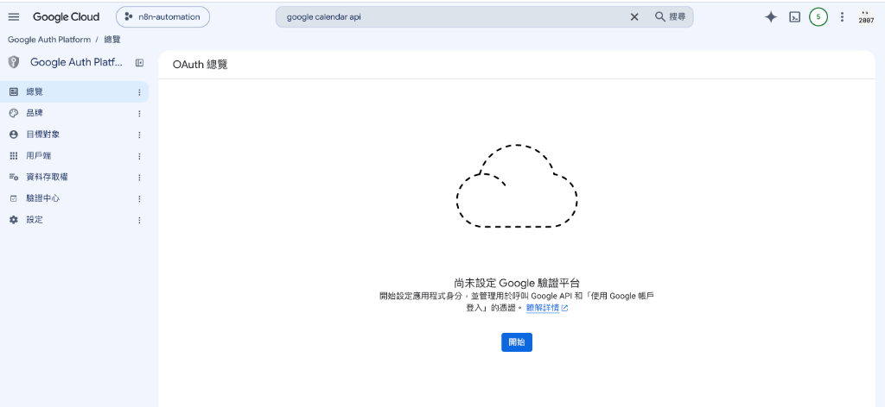
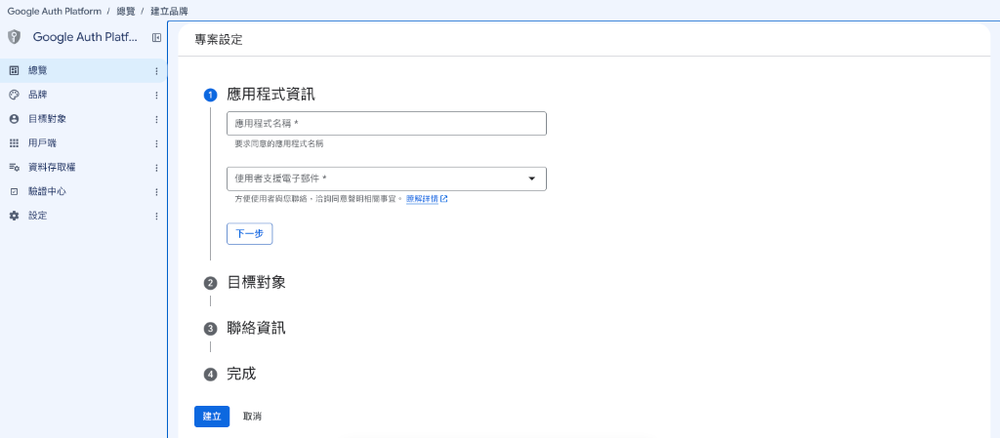
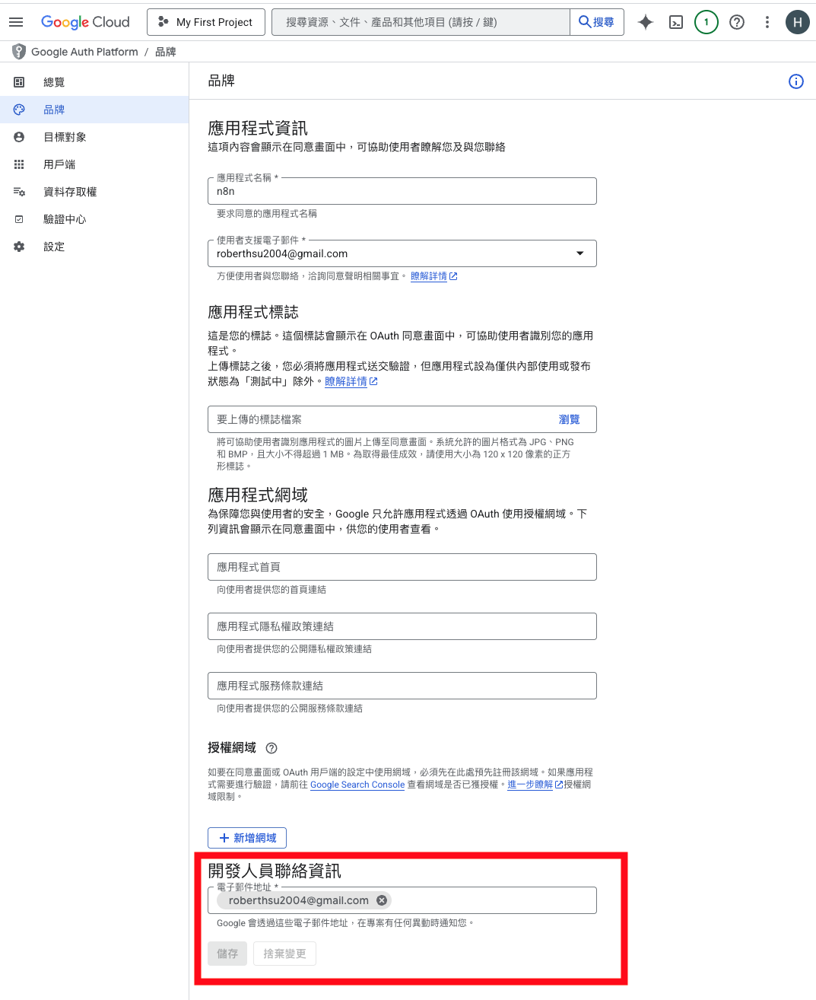
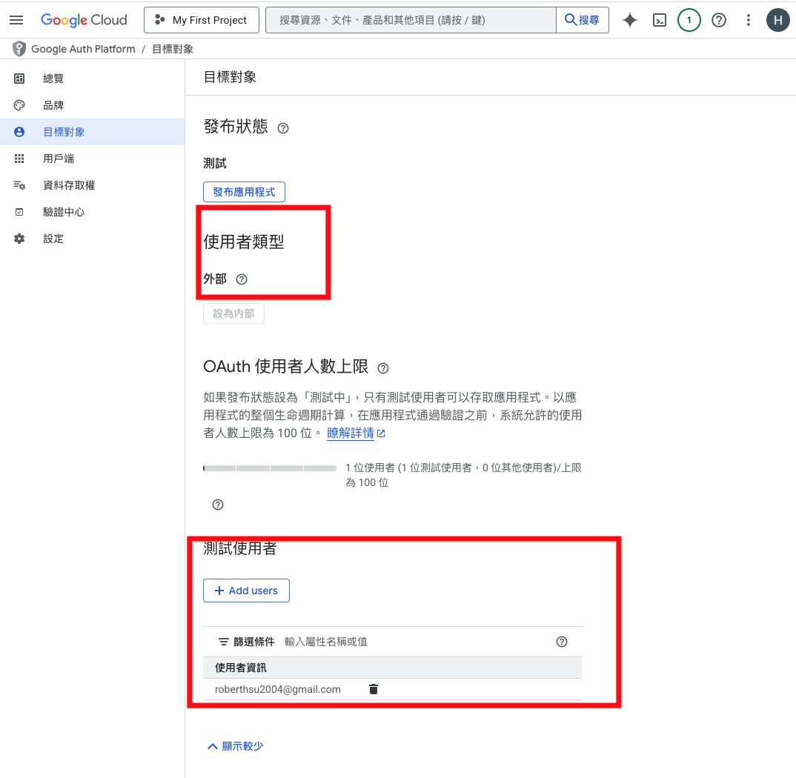
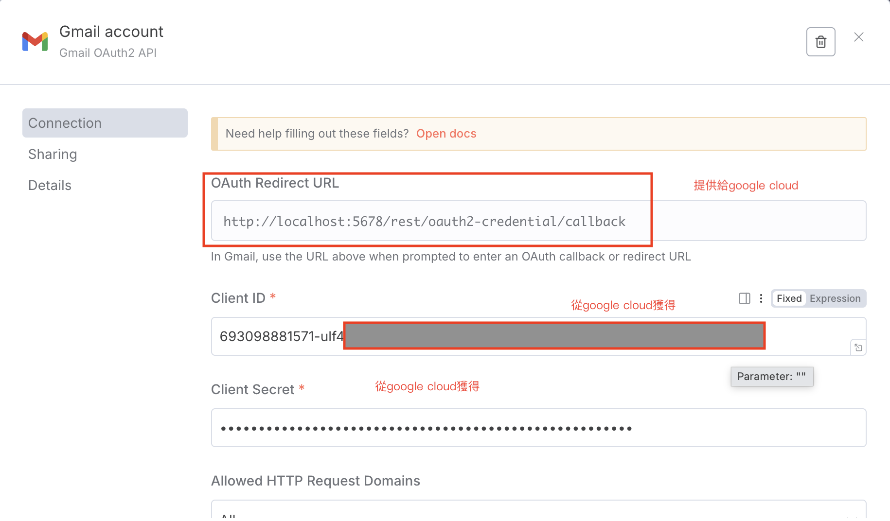
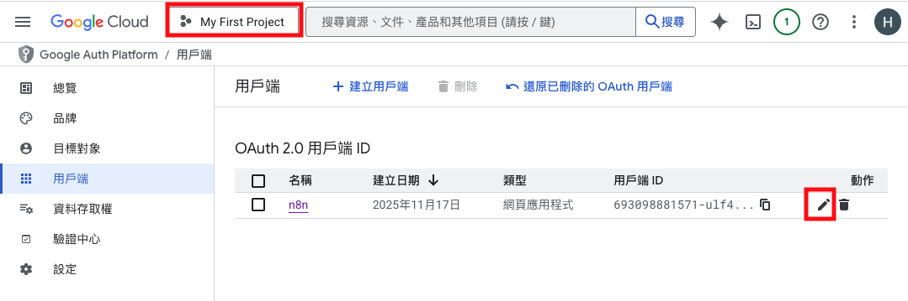
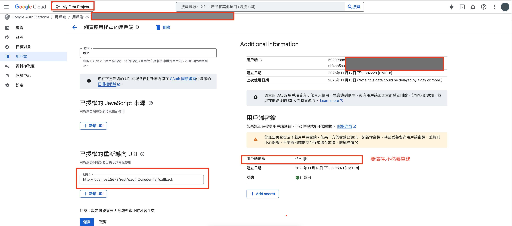

# Google Cloud API 服務設定指南 ☁️

本指南詳細說明如何使用 **Google Cloud Console** 建立專案、啟用 Google 服務 API，並透過標準 **OAuth 2.0** 授權流程取得憑證，讓 n8n 能代表您安全地操作 Google 試算表 (Sheets)、雲端硬碟 (Drive)、Gmail 與日曆 (Calendar) 等服務。

---

> 👨‍🏫 **教學與課堂展示重要守則（給授課老師）**：
> 老師在向學生示範 Google Cloud 設定前，**請務必先刪除舊的 Google Cloud 專案（或重新建立全新空白專案）進行教學**！
> 
> **為什麼必須重新建立專案？**
> 1. **畫面與操作流程完全同步**：Google Cloud 在專案「首次啟用 API」與「首次設定 OAuth 同意畫面（Google Auth Platform）」時會有一套初始化引導流程。若使用已有設定的舊專案，會跳過許多關鍵步驟，導致學生的畫面與老師不一致。
> 2. **確保每個防呆步驟完整展示**：從建立專案、設定品牌、新增測試使用者到產生 Client ID / Secret，從零開始操作能讓學生清楚理解每一步的因果關係。
> 3. ⭐️ **最後務必提醒開啟 API 服務**：OAuth 憑證綁定成功**不代表**可以使用服務！請務必帶領學生至「API 與服務 > 程式庫」**啟用目標 API 服務**（例如要操作 Google Drive 雲端硬碟就**必須開啟 `Google Drive API`**，要操作試算表就**必須開啟 `Google Sheets API`**），否則工作流程執行時會直接報錯（Error: API not enabled）！
> 
> 💡 **如何刪除舊專案**：在 Google Cloud Console 頂部選取舊專案 > 點選左上角「三條線選單」 >「IAM 與管理」>「專案設定」> 點擊上方「**關閉 (Shut down)**」即可刪除。

---

## 📋 目錄

- [🛠️ 詳細設定標準流程](#️-詳細設定標準流程)
  - [第 1 階段：Google Cloud 專案建立與 API 啟用](#第-1-階段google-cloud-專案建立與-api-啟用)
  - [第 2 階段：設定 OAuth 同意畫面與測試人員 (Google Auth Platform)](#第-2-階段設定-oauth-同意畫面與測試人員-google-auth-platform)
  - [第 3 階段：建立 OAuth 用戶端與 n8n 雙向綁定](#第-3-階段建立-oauth-用戶端與-n8n-雙向綁定)
  - [第 4 階段：🔄 授權驗證與登入](#第-4-階段-授權驗證與登入)
- [⚠️ 常見錯誤與排錯重點 (必看)](#️-常見錯誤與排錯重點-必看)

---

## 🛠️ 詳細設定標準流程

### 第 1 階段：Google Cloud 專案建立與 API 啟用

1. **登入並建立新專案**
   - 前往 [Google Cloud Console](https://console.cloud.google.com/)。
   - 點擊頂部專案選單 > 點選「**新增專案 (New Project)**」，輸入專案名稱（例如：`n8n-automation`）並點擊「**建立**」。
   - 確保頂部專案選單已切換至剛剛建立的專案。

2. **啟用您需要的 Google API（以頂部搜尋為主軸）**
   > 💡 **搜尋技巧**：Google Cloud 提供的 API 與服務多達數百種，在選單程式庫中逐一翻找非常耗時。**強烈建議直接在 Google Cloud Console 最頂部的「搜尋欄」輸入 API 英文全名進行搜尋**，點選結果進入後直接點擊「**啟用 (Enable)**」。

   - 請在頂部搜尋欄依據工作流程需求，搜尋並逐一**啟用**對應的 API：
     - 🔍 搜尋 **`Google Sheets API`** ➔ 點擊啟用（試算表讀取、寫入與資料更新）
     - 🔍 搜尋 **`Google Drive API`** ➔ 點擊啟用（雲端硬碟檔案上傳、建立資料夾與搜尋檔案）
     - 🔍 搜尋 **`Gmail API`** ➔ 點擊啟用（郵件讀取、自動發信與標籤操作）
     - 🔍 搜尋 **`Google Calendar API`** ➔ 點擊啟用（日曆行程查詢與活動建立）

---

### 第 2 階段：設定 OAuth 同意畫面與測試人員 (Google Auth Platform)

1. **進入 OAuth 同意畫面並點擊「開始」**
   - **主要方式（推薦）**：點擊左側導覽選單「**API 與服務**」>「**OAuth 同意畫面**」（系統會自動導引至 Google Auth Platform 總覽頁面）。
   - **輔助方式**：亦可在頂部搜尋欄輸入 **`Google Auth Platform`** 或 **`OAuth 同意畫面`** 快速進入。
   - **點擊「開始」按鈕**：首次進入會顯示「尚未設定 Google 驗證平台」，請點擊畫面中的藍色「**開始**」按鈕。

   

   - **自動進入專案設定精靈（總覽 / 建立品牌）**：按完「開始」後，系統會自動進入「**總覽 / 建立品牌**」引導畫面（包含 ❶ 應用程式資訊、❷ 目標對象、❸ 聯絡資訊、❹ 完成）。

   

2. **設定品牌資訊 (Brand / 同意畫面)**
   - **應用程式名稱**：輸入自訂名稱（例如：`My n8n Workflow` 或 `My n8n Automation`）。
   - **使用者支援電子郵件**：選擇您自己的 Google / Gmail 電子郵件。
   - **授權網域 (Authorized domains)**：輸入您的 **n8n 網域名稱**（例如：`xxxx.ngrok-free.dev`，**請注意：不可包含 `https://` 或後續路徑**）。
   - **開發人員聯絡資訊**：填寫您自己的 Email。
   - 填寫完成後點擊儲存進入下一步。

   

3. **設定目標對象與測試使用者 (Audience / Test Users)**
   - **使用者類型**：設定為「**外部 (External)**」。
   - **測試使用者 (Test users)**：
     > ⚠️ **重要**：請務必點擊「**+ ADD USERS**」，手動加入您登入 n8n 授權時所要使用的 **Gmail 帳號**！若未加入，在授權時會出現 `403 access_denied` 錯誤。

   

---

### 第 3 階段：建立 OAuth 用戶端與 n8n 雙向綁定

1. **在 n8n 建立憑證並複製 Redirect URL**
   - 登入您的 n8n 工作區，點選左側選單「**Credentials (憑證)**」> 點擊右上角「**Add credential**」。
   - 搜尋並選擇「**Google OAuth2 API**」（或各 Google 節點專屬的 OAuth 憑證）。
   - 在設定面板中，複製「**OAuth Redirect URL**」（格式如：`https://xxxx.ngrok-free.dev/rest/oauth2/callback`）。

   

2. **在 GCP 建立 OAuth 2.0 用戶端 ID**
   - 回到 Google Cloud Console，點選左側「**用戶端 (Clients)**」或「**憑證 (Credentials)**」> 點擊「**+ 建立用戶端 (Create Client)**」/「**建立憑證 > OAuth 用戶端 ID**」。
   - **應用程式類型**：選擇「**網頁應用程式 (Web application)**」。
   - **名稱**：自訂識別名稱（例如：`n8n Client`）。
   - **已授權的重新導向 URI (Authorized redirect URIs)**：點擊「**+ 新增 URI**」，貼上剛剛從 n8n 複製的 **OAuth Redirect URL**。
   - 點擊「**建立**」。

   

3. **取得 Client ID 與 Client Secret 並填回 n8n**
   - 建立完成後，Google 會彈出視窗顯示 **用戶端 ID (Client ID)** 與 **用戶端密碼 (Client Secret)**。
   - 複製 **用戶端 ID** 貼到 n8n 的「**Client ID**」欄位。
   - 複製 **用戶端密碼** 貼到 n8n 的「**Client Secret**」欄位。

   

4. **儲存 n8n 憑證**
   - 在 n8n 憑證面板右下角點擊「**Save**」。

---

### 第 4 階段：🔄 授權驗證與登入

1. **發起 Google 授權**
   - 在 n8n 憑證設定面板中，點擊「**Sign in with Google**」按鈕。
   - 系統會彈出 Google 登入視窗，請選擇您在「**測試使用者 (Test users)**」名單中所加入的 Google 帳號。

2. **通過安全警告提示**
   - 若畫面提示「**Google 尚未驗證這個應用程式 (Google hasn't verified this app)**」：
     1. 點擊左下角的「**進階 (Advanced)**」。
     2. 點擊「**前往「My n8n Workflow」(不安全) / Go to My n8n Workflow (unsafe)**」（此為個人/開發中專案的正常提示）。

3. **同意授權並完成連線**
   - 勾選同意存取權限並點擊「**允許 (Allow)**」/「**繼續 (Continue)**」。
   - 視窗關閉並返回 n8n，當面板顯示「**Connection successful!**」綠色提示時，即代表已完成授權綁定！🎉

---

## ⚠️ 常見錯誤與排錯重點 (必看)

| 錯誤訊息 / 狀況 | 常見原因 | 解決方式 |
| :--- | :--- | :--- |
| **Error 403: access_denied** | 登入授權的 Google 帳號**未被加入**測試使用者清單。 | 前往 GCP 的 **Google Auth Platform > 目標對象 (Audience)**，在「測試使用者」中點擊「+ ADD USERS」加入該 Gmail 帳號。 |
| **Error 400: redirect_uri_mismatch** | GCP 用戶端設定中的「已授權重新導向 URI」與 n8n 回呼網址不一致。 | 檢查 GCP OAuth 用戶端中的 Redirect URI 是否完整包含 `https://` 以及 `/rest/oauth2/callback`，且網域與當前 n8n 一致。 |
| **Error: API not enabled / 403 Forbidden** | 流程執行時未啟用該 Google 服務的 API。 | 前往 GCP Console「**API 與服務 > 程式庫**」，搜尋並點擊「**啟用**」對應的 API（如 `Google Drive API`、`Google Sheets API`）。 |
| **連線逾時或無法轉址 (Connection Refused)** | n8n 使用 ngrok 等內網穿透工具，連線網址已過期更新。 | 每次重啟 ngrok 取得新網域後，需同步更新 GCP 中的「授權網域」、「已授權的重新導向 URI」，以及 n8n 的 `WEBHOOK_URL` 環境變數。 |
