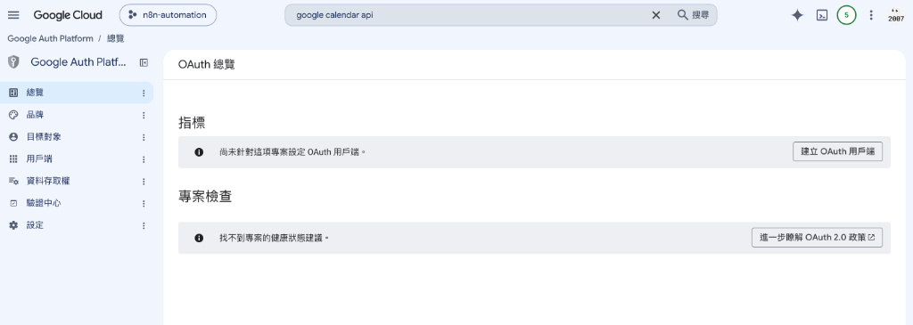
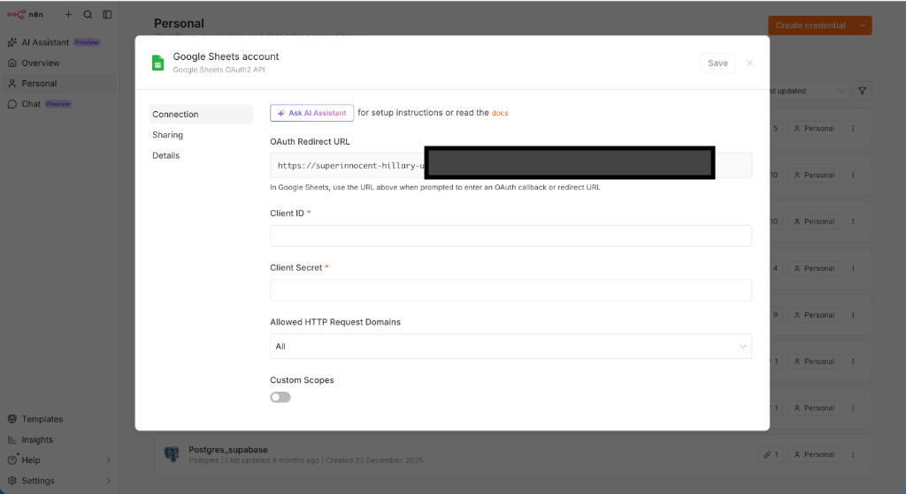
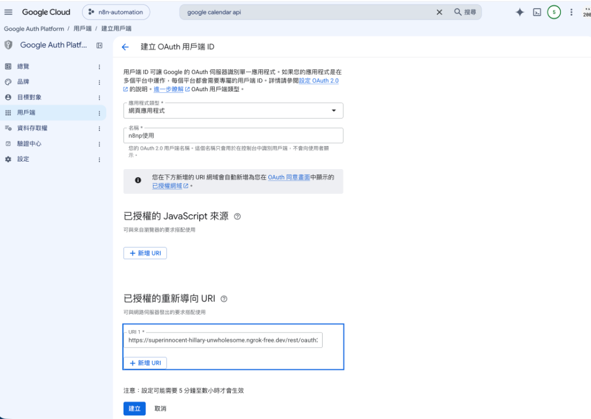
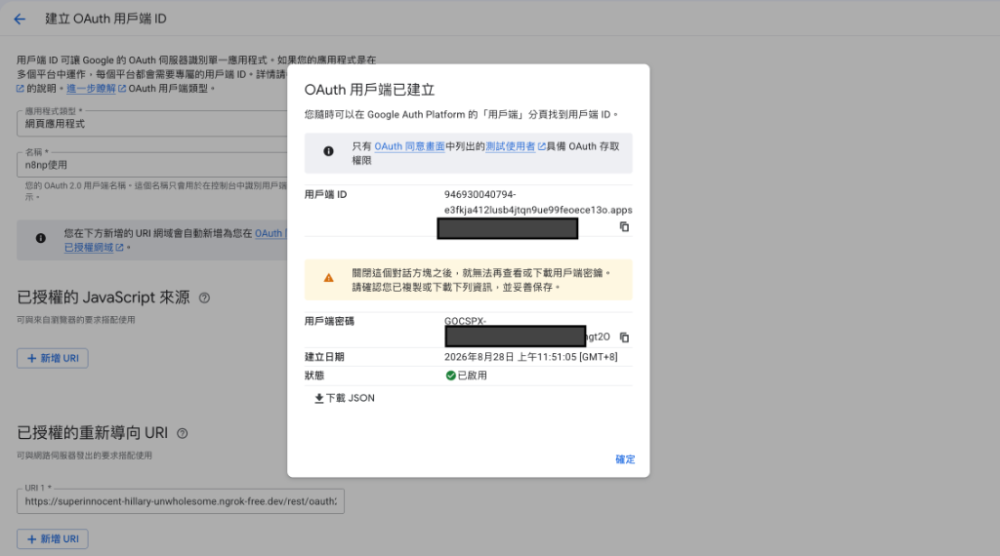
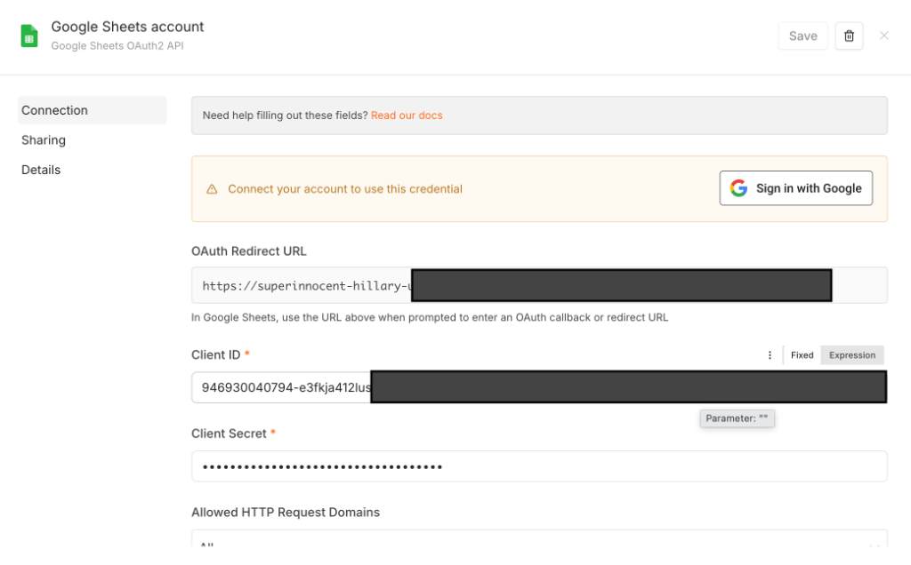

# Google Cloud API 服務設定指南 ☁️

本指南詳細說明如何使用 **Google Cloud Console** 建立專案、啟用 Google 服務 API，並透過標準 **OAuth 2.0** 授權流程取得憑證，讓 n8n 能代表您安全地操作 Google 試算表 (Sheets)、雲端硬碟 (Drive)、Gmail 與日曆 (Calendar) 等服務。

---

> 👨‍🏫 **教學與課堂展示重要守則（給授課老師）**：
> 老師在向學生示範 Google Cloud 設定前，**請務必先刪除舊的 Google Cloud 專案（或重新建立全新空白專案）進行教學**！
> 
> **為什麼必須重新建立專案？**
> 1. **畫面與操作流程完全同步**：Google Cloud 在專案「首次啟用 API」與「首次設定 OAuth 同意畫面（Google Auth Platform）」時會有一套初始化引導流程。若使用已有設定的舊專案，會跳過許多關鍵步驟，導致學生的畫面與老師不一致。
> 2. **確保每個防呆步驟完整展示**：從建立專案、設定品牌、新增測試使用者到產生 Client ID / Secret，從零開始操作能讓學生清楚理解每一步的因果關係。
> 3. ⭐️ **最後務必提醒開啟 API 服務**：OAuth 憑證綁定成功**不代表**可以使用服務！請務必帶領學生至「API 與服務 > 程式庫」**啟用目標 API 服務**（例如要操作 Google Drive 雲端硬碟就**必須開啟 `Google Drive API`**，要操作試算表就**必須開啟 `Google Sheets API`**），否則工作流程執行時會直接報錯（Error: API not enabled）！
> 
> 💡 **如何刪除舊專案**：在 Google Cloud Console 頂部選取舊專案 > 點選左上角「三條線選單」 >「IAM 與管理」>「專案設定」> 點擊上方「**關閉 (Shut down)**」即可刪除。

---

## 📋 目錄

- [🛠️ 詳細設定標準流程](#️-詳細設定標準流程)
  - [第 1 階段：Google Cloud 專案建立與 API 啟用](#第-1-階段google-cloud-專案建立與-api-啟用)
  - [第 2 階段：設定 OAuth 同意畫面與建立品牌 (Google Auth Platform)](#第-2-階段設定-oauth-同意畫面與建立品牌-google-auth-platform)
  - [第 3 階段：建立 OAuth 用戶端與 n8n 雙向設定](#第-3-階段建立-oauth-用戶端與-n8n-雙向設定)

---

## 🛠️ 詳細設定標準流程

### 第 1 階段：Google Cloud 專案建立與 API 啟用

1. **登入並建立新專案**
   - 前往 [Google Cloud Console](https://console.cloud.google.com/)。
   - 點擊頂部專案選單 > 點選「**新增專案 (New Project)**」，輸入專案名稱（例如：`n8n-automation`）並點擊「**建立**」。
   - 確保頂部專案選單已切換至剛剛建立的專案。

2. **啟用您需要的 Google API（以頂部搜尋為主軸）**
   > 💡 **搜尋技巧**：Google Cloud 提供的 API 與服務多達數百種，在選單程式庫中逐一翻找非常耗時。**強烈建議直接在 Google Cloud Console 最頂部的「搜尋欄」輸入 API 英文全名進行搜尋**，點選結果進入後直接點擊「**啟用 (Enable)**」。

   - 請在頂部搜尋欄依據工作流程需求，搜尋並逐一**啟用**對應的 API：
     - 🔍 搜尋 **`Google Sheets API`** ➔ 點擊啟用（試算表讀取、寫入與資料更新）
     - 🔍 搜尋 **`Google Drive API`** ➔ 點擊啟用（雲端硬碟檔案上傳、建立資料夾與搜尋檔案）
     - 🔍 搜尋 **`Gmail API`** ➔ 點擊啟用（郵件讀取、自動發信與標籤操作）
     - 🔍 搜尋 **`Google Calendar API`** ➔ 點擊啟用（日曆行程查詢與活動建立）

---

### 第 2 階段：設定 OAuth 同意畫面與建立品牌 (Google Auth Platform)

1. **進入 OAuth 同意畫面並點擊「開始」**
   - **主要方式（推薦）**：點擊左側導覽選單「**API 與服務**」>「**OAuth 同意畫面**」（系統會自動導引至 Google Auth Platform 總覽頁面）。
   - **輔助方式**：亦可在頂部搜尋欄輸入 **`Google Auth Platform`** 或 **`OAuth 同意畫面`** 快速進入。
   - **點擊「開始」按鈕**：首次進入會顯示「尚未設定 Google 驗證平台」，請點擊畫面中的藍色「**開始**」按鈕。

   

   - **自動進入專案設定精靈（總覽 / 建立品牌）**：按完「開始」後，系統會自動進入「**總覽 / 建立品牌**」引導畫面，請依序填寫前 3 個項目並完成建立：

   

   - 📋 **專案設定精靈填寫清單**：
     1. **❶ 應用程式資訊 (App Information)**：
        - **應用程式名稱 (App name)**：輸入自訂名稱（例如：`n8n-automation` 或 `My n8n Workflow`）。
        - **使用者支援電子郵件 (User support email)**：下拉選擇您自己的 Google / Gmail 電子郵件。
        - 點擊「**下一步**」。
     2. **❷ 目標對象 (Audience)**：
        - **使用者類型 (Audience)**：選擇「**外部 (External)**」（讓任何具備 Google 帳號的測試人員皆可進行授權測試）。
        - 點擊「**下一步**」。
     3. **❸ 聯絡資訊 (Contact Information)**：
        - **開發人員聯絡資訊 (Email addresses)**：填入您自己的電子郵件地址（用於接收 Google 平台的服務異動或安全通知）。
        - 點擊「**下一步**」。
     4. **❹ 完成 (Finish)**：
        - 確認設定內容無誤，勾選同意相關條款後點擊「**建立 (Create)**」完成專案身分初始化！

2. **建立完成後的 OAuth 總覽畫面**
   - 點擊「建立」完成初始化後，頁面會自動返回「**OAuth 總覽**」頁面。
   - 此時會看到「尚未針對這項專案設定 OAuth 用戶端」提示，後續可由此點擊「**建立 OAuth 用戶端**」繼續下一步。

   

---

### 第 3 階段：建立 OAuth 用戶端與 n8n 雙向設定

1. **在 n8n 建立憑證並複製 OAuth Redirect URL**
   - 進入 n8n 工作區，點選左側選單「**Credentials (憑證)**」> 點擊右上角「**Create credential**」。
   - 搜尋並選擇目標 Google 服務（例如：`Google Sheets OAuth2 API` 或 `Google OAuth2 API`）。
   - 在彈出的憑證設定視窗中，找到並複製「**OAuth Redirect URL**」（例如：`https://xxxx.ngrok-free.dev/rest/oauth2-credential/callback`）。

   

2. **在 Google Cloud 建立 OAuth 2.0 用戶端 ID**
   - 回到 GCP「OAuth 總覽」點擊「**建立 OAuth 用戶端**」（或點選左側選單「**用戶端**」>「**+ 建立用戶端**」）。
   - **應用程式類型**：下拉選擇「**網頁應用程式 (Web application)**」。
   - **名稱**：自訂名稱（例如：`n8n使用` 或 `n8n Client`）。
   - **已授權的重新導向 URI (Authorized redirect URIs)**：點擊「**+ 新增 URI**」，貼上剛剛從 n8n 複製的 **OAuth Redirect URL**。
   - 點擊下方「**建立**」按鈕。

   

3. **複製用戶端 ID 與用戶端密碼至 n8n 憑證**
   - 建立成功後，Google 會彈出「**OAuth 用戶端已建立**」視窗：
     > ⚠️ **重要提醒**：關閉此對話框後，Google 將**無法再查看或下載用戶端密碼**，請務必先複製或下載保存後再點擊確定！
   - **複製用戶端 ID**：點擊「用戶端 ID」右側的複製按鈕 📋，貼回 n8n 憑證設定視窗的「**Client ID**」欄位。
   - **複製用戶端密碼**：點擊「用戶端密碼」右側的複製按鈕 📋，貼回 n8n 憑證設定視窗的「**Client Secret**」欄位。
   - 複製完成後在 Google 彈出視窗點擊「**確定**」。

   

4. **儲存憑證並發起 Google 帳號授權 (Sign in with Google)**
   - 確認 **Client ID** 與 **Client Secret** 均已正確填入。
   - 點擊右上角的「**Save**」按鈕儲存憑證。
   - 儲存成功後，點擊上方提示區塊中的「**Sign in with Google**」按鈕，發起 Google 帳號授權流程。

   
