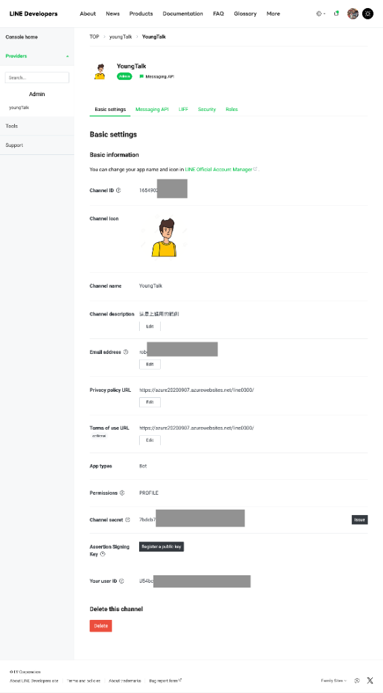
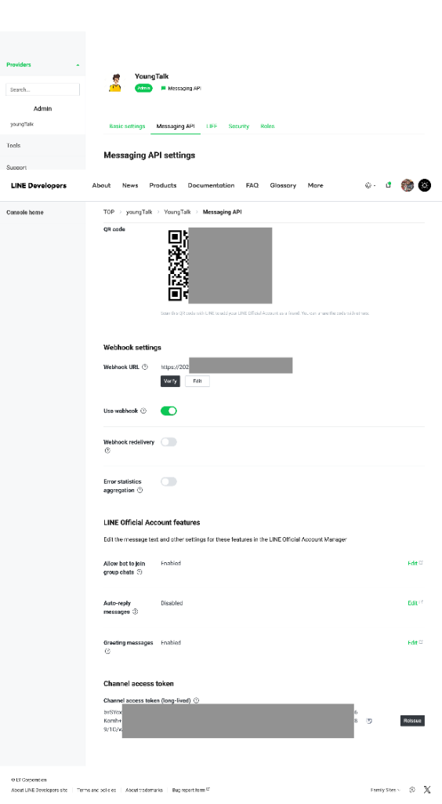
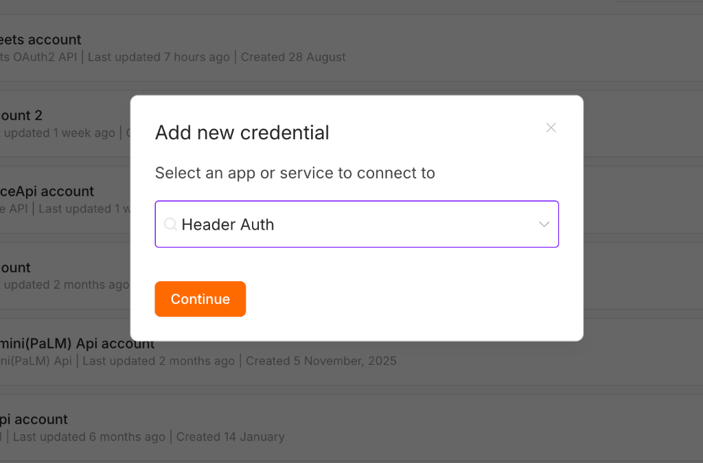
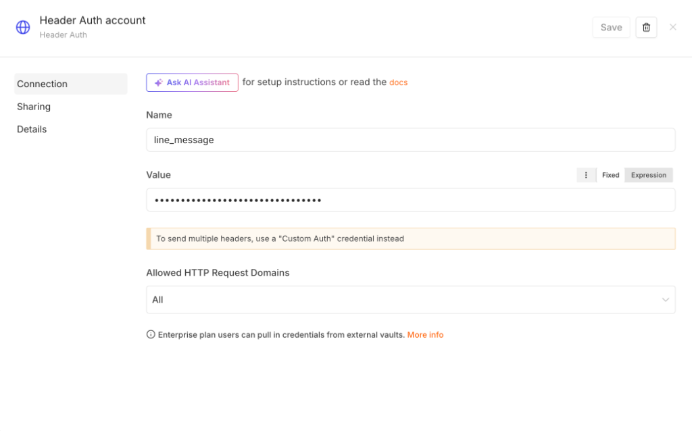

# 使用 LINE Messaging API 串接 n8n 設定指南

本指南說明如何透過 LINE Developers Console 建立 Messaging API Channel，並完成 Webhook 與憑證設定，讓 n8n 能夠接收與發送 LINE 訊息。

---

## 目錄
1. [建立 LINE Messaging API Channel](#步驟-1建立-line-messaging-api-channel)
2. [取得 Channel 憑證](#步驟-2取得-channel-憑證)
3. [設定 Webhook 與加入好友/群組（接收訊息進 n8n）](#步驟-3在-line-設定-webhook-與加入好友群組接收訊息進-n8n)
4. [在 n8n 設定 Header Auth 憑證與發送訊息](#步驟-4在-n8n-設定-header-auth-憑證與發送訊息)

---

## 步驟 1：建立 LINE Messaging API Channel

1. 前往 [LINE Developers Console](https://developers.line.biz/console/) 並以 LINE 帳號登入。

   

2. 點擊 **Create a new provider**（若已有 Provider 亦可直接選擇）。

   

3. 在 Provider 下點選 **Create a Messaging API channel**（或點擊 `+ Create a new channel`），並填寫必要欄位：

   

   - **Channel name**：機器人名稱
   - **Channel description**：機器人描述
   - **Category / Subcategory**：選擇合適的分類
   - **Email address**：聯絡電子信箱
4. 勾選同意相關服務條款後，點擊 **Create** 完成建立。

> [!NOTE]
> 建立 Channel 時僅需填寫基本必要欄位，**不需要**加入或綁定商用 ID（Business ID）。

---

## 步驟 2：取得 Channel 憑證

用於後續在 n8n 設定連線與驗證。

### 1. 取得 Channel Secret
- 進入 **Basic settings** 分頁。
- 向下滾動找到 **Channel secret**，點擊複製並妥善保存。

  

### 2. 取得 Channel Access Token (long-lived)
- 進入 **Messaging API** 分頁。
- 滑動至最下方找到 **Channel access token (long-lived)**。
- 點擊 **Issue（發行）** 並複製產生的 Token 字串。

---

## 步驟 3：在 LINE 設定 Webhook 與加入好友/群組（接收訊息進 n8n）



### 1. 掃描 QR Code 將 Bot 加入好友或群組
> [!IMPORTANT]
> 必須先使用手機 LINE 掃描 QR Code 將 Bot 加入好友，才能進行後續測試或將 Bot 邀請加入群組！

1. 在 **Messaging API** 分頁最上方找到 **QR code** 區塊。
2. 使用手機 LINE App **掃描 QR code**，將建立的 Bot（官方帳號）加入為好友。
3. 若需要將 Bot 用於群組對話，請在個人 LINE 中將 Bot **邀請加入指定的 LINE 群組**。
4. 在 **LINE Official Account features** 區塊確認 **Allow bot to join group chats** 為 **Enabled**（允許 Bot 加入群組聊天）。

### 2. Webhook 設定
1. 在 **Messaging API** 分頁中找到 **Webhook settings** 區塊：
   - **Webhook URL**：填入 n8n 的 Production Webhook URL（例如：`https://<your-n8n-domain>/webhook/...`）。
     > [!IMPORTANT]
     > - **必須先 Publish（啟用）工作流程**：LINE 點擊 Verify 或接收真實訊息時，n8n 工作流程必須處於 **Published / Active** 狀態且使用 **Production URL** 才能正常回應 200 OK。
     > - LINE Webhook 必須使用 **HTTPS** 協定，且需使用有效 SSL 憑證。
   - 點擊 **Verify** 測試連線，確認出現 **Success**。
   - 將 **Use webhook** 切換為 **啟用（Enabled/On）**。

### 3. LINE Official Account Manager 回應設定
為避免 LINE 官方系統的預設回應干擾 n8n 的自動化流程：
1. 點擊頁面上的 **LINE Official Account Manager** 連結（或在 **LINE Official Account features** 點擊各項目旁邊的 Edit）。
2. 進入 **設定** > **回應設定（Response settings）**：
   - **回應模式（Response mode）**：設為 **聊天機器人（Bot）**。
   - **自動回應訊息（Auto-response messages）**：設定為 **停用 / 關閉（Disabled）**。
   - **加入好友歡迎訊息（Greeting messages）**：可依需求保留或關閉。

---

## 步驟 4：在 n8n 設定 Header Auth 憑證與發送訊息

由於 n8n 目前無內建專屬的獨立 LINE Messaging API Credential，官方 Workflow 範本與社群標準做法皆是使用 **Header Auth** 憑證搭配 **HTTP Request 節點** 呼叫 LINE API。

### 1. 建立 Header Auth 憑證

1. 開啟 n8n 管理介面，前往 **Credentials** > **Add Credential**。
2. 搜尋並選擇 **Header Auth**，點擊 **Continue**。

   

3. 填寫憑證資訊：
   - **Name**（HTTP Header 名稱）：填入 `Authorization`
   - **Value**（HTTP Header 內容）：填入 `Bearer <你的 Channel Access Token>`
     > [!IMPORTANT]
     > - `Bearer` 與 Token 之間必須**保留一個半形空白**。
     > - Token 請使用步驟 2 取得的 **Channel Access Token (long-lived)**。
   - **Allowed HTTP Request Domains**：選擇 `All`（或限定 `api.line.me`）。
4. 點擊右上角 **Save** 完成儲存。

   

---

### 2. 在 HTTP Request 節點呼叫 LINE API

所有呼叫 LINE API 的 HTTP Request 節點都可以共用此 Header Auth 憑證，n8n 會自動在請求標頭帶上 `Authorization: Bearer <Token>`。

#### (1) 回覆訊息（Reply Message）
- **Method**：`POST`
- **URL**：`https://api.line.me/v2/bot/message/reply`
- **Authentication**：選擇 **Predefined Credential Type** > **Header Auth**（選取剛建立的憑證）
- **Body Parameters (JSON)**：
  ```json
  {
    "replyToken": "從 Webhook 接收到的 replyToken",
    "messages": [
      {
        "type": "text",
        "text": "你好！這是來自 n8n 的回覆訊息。"
      }
    ]
  }
  ```

#### (2) 主動推播訊息（Push Message）
- **Method**：`POST`
- **URL**：`https://api.line.me/v2/bot/message/push`
- **Authentication**：選擇 **Predefined Credential Type** > **Header Auth**
- **Body Parameters (JSON)**：
  ```json
  {
    "to": "目標用戶的 User ID 或群組 Group ID",
    "messages": [
      {
        "type": "text",
        "text": "你好！這是來自 n8n 的推播訊息。"
      }
    ]
  }
  ```

---

## 測試與驗證 Checklist

- [ ] 已使用手機 LINE 掃描 QR code 將 Bot 加入好友（或邀請至 LINE 群組）。
- [ ] **Allow bot to join group chats** 已設定為 Enabled（若有群組需求）。
- [ ] Webhook URL 正確填寫且支援 HTTPS。
- [ ] LINE Developers 中的 **Use webhook** 已開啟。
- [ ] LINE 官方帳號後台已關閉「自動回應訊息」。
- [ ] n8n Header Auth 憑證設定為 `Name: Authorization`，`Value: Bearer <Channel Access Token>`。
- [ ] n8n Webhook 節點成功接收訊息，且 HTTP Request 節點成功回覆/推播訊息。
