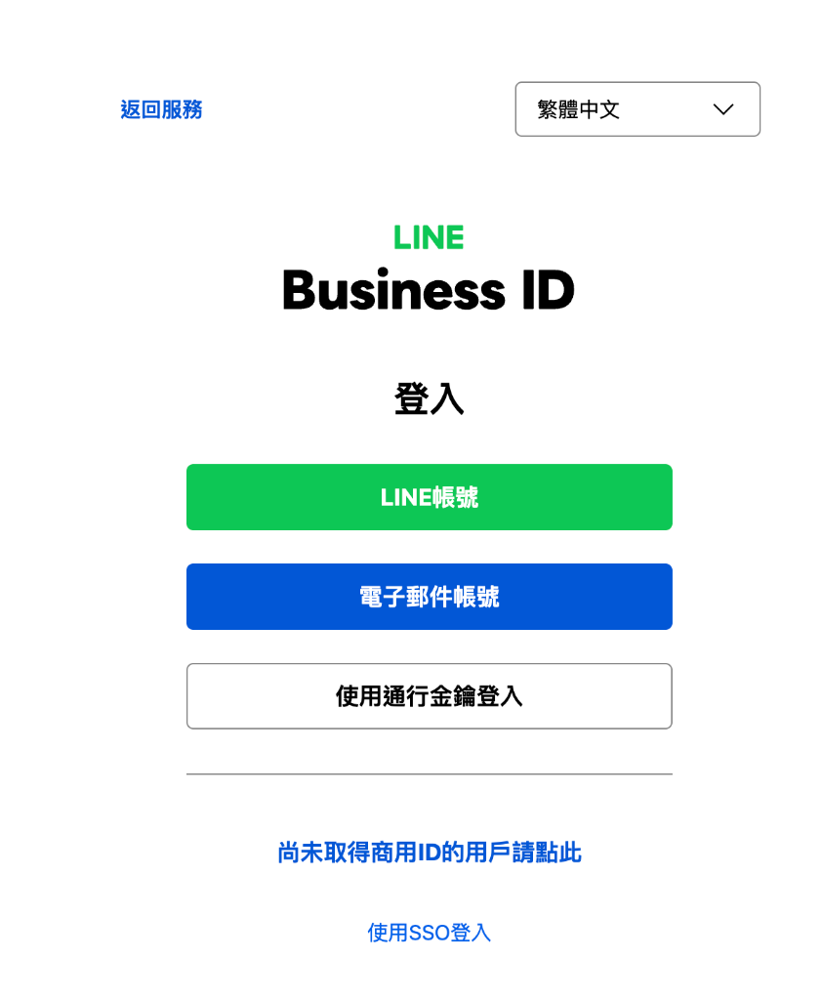
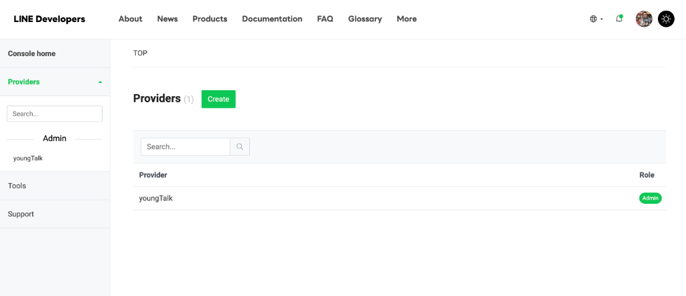
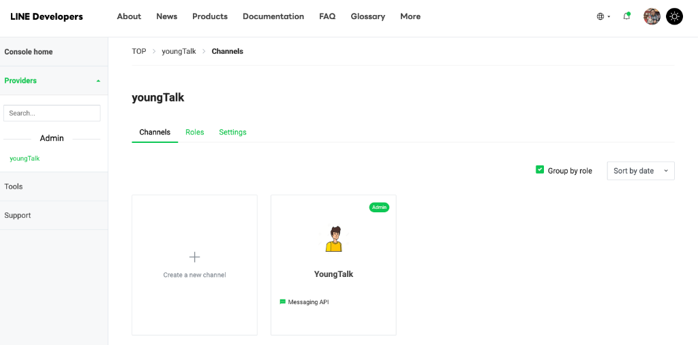

# 使用 LINE Messaging API 串接 n8n 設定指南

本指南說明如何透過 LINE Developers Console 建立 Messaging API Channel，並完成 Webhook 與憑證設定，讓 n8n 能夠接收與發送 LINE 訊息。

---

## 目錄
1. [建立 LINE Messaging API Channel](#步驟-1建立-line-messaging-api-channel)
2. [取得 Channel 憑證](#步驟-2取得-channel-憑證)
3. [設定 Webhook 與回應模式](#步驟-3在-line-設定-webhook接收訊息進-n8n)
4. [在 n8n 設定 LINE 憑證](#步驟-4在-n8n-設定-credentials)

---

## 步驟 1：建立 LINE Messaging API Channel

1. 前往 [LINE Developers Console](https://developers.line.biz/console/) 並以 LINE 帳號登入。

   

2. 點擊 **Create a new provider**（若已有 Provider 亦可直接選擇）。

   

3. 在 Provider 下點選 **Create a Messaging API channel**（或點擊 `+ Create a new channel`），並填寫必要欄位：

   

   - **Channel name**：機器人名稱
   - **Channel description**：機器人描述
   - **Category / Subcategory**：選擇合適的分類
   - **Email address**：聯絡電子信箱
4. 勾選同意相關服務條款後，點擊 **Create** 完成建立。

> [!NOTE]
> 建立 Channel 時僅需填寫基本必要欄位，**不需要**加入或綁定商用 ID（Business ID）。

---

## 步驟 2：取得 Channel 憑證

用於後續在 n8n 設定連線與驗證。

### 1. 取得 Channel Secret
- 進入 **Basic settings** 分頁。
- 向下滾動找到 **Channel secret**，點擊複製並妥善保存。

### 2. 取得 Channel Access Token (long-lived)
- 進入 **Messaging API** 分頁。
- 滑動至最下方找到 **Channel access token (long-lived)**。
- 點擊 **Issue（發行）** 並複製產生的 Token 字串。

---

## 步驟 3：在 LINE 設定 Webhook（接收訊息進 n8n）

### 1. Webhook 設定
1. 在 **Messaging API** 分頁中找到 **Webhook settings** 區塊：
   - **Webhook URL**：填入 n8n 的 Webhook 節點 URL（例如：`https://<your-n8n-domain>/webhook/...`）。
     > [!IMPORTANT]
     > LINE Webhook 必須使用 **HTTPS** 協定，且需使用有效 SSL 憑證。
   - 點擊 **Verify** 測試連線（需確保 n8n 的 Webhook 節點處於監聽或 Workflow 已啟用狀態）。
   - 將 **Use webhook** 切換為 **啟用（Enabled/On）**。

### 2. LINE Official Account Manager 回應設定
為避免 LINE 官方系統的預設回應干擾 n8n 的自動化流程：
1. 點擊頁面上的 **LINE Official Account Manager** 連結（或直接前往後台）。
2. 進入 **設定** > **回應設定（Response settings）**：
   - **回應模式（Response mode）**：設為 **聊天機器人（Bot）**。
   - **自動回應訊息（Auto-response messages）**：設定為 **停用 / 關閉**。
   - **加入好友歡迎訊息**：可依需求保留或關閉。

---

## 步驟 4：在 n8n 設定 Credentials

1. 開啟 n8n 管理介面，進入 **Credentials** > **Add Credential**。
2. 搜尋並選擇 **LINE Messaging API**（或在相關節點內建立）。
3. 填入步驟 2 取得的憑證資訊：
   - **Channel Access Token**：貼上發行的長效 Token。
   - **Channel Secret**：貼上 Channel Secret。
4. 點擊 **Save** 完成儲存。

---

## 測試與驗證 Checklist

- [ ] Webhook URL 正確填寫且支援 HTTPS。
- [ ] LINE Developers 中的 **Use webhook** 已開啟。
- [ ] LINE 官方帳號後台已關閉「自動回應訊息」。
- [ ] n8n Webhook 節點成功接收到 LINE 發送的測試事件（如發送訊息給官方帳號）。
