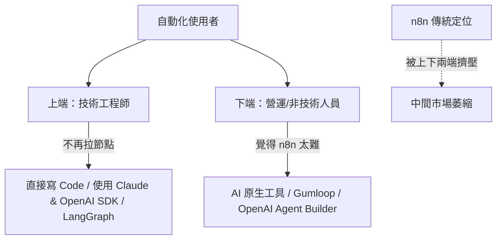
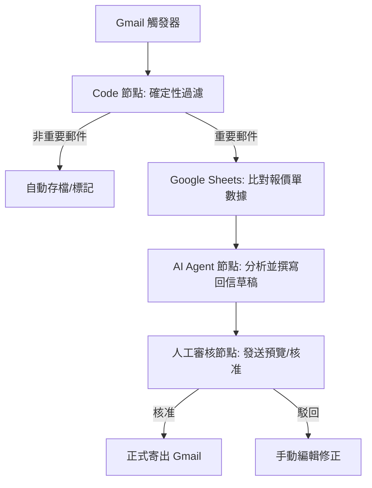

# 📈 2026 年自動化工具評估簡報：n8n 的市場定位與轉型分析

## 🎯 重點摘要

隨著 **2026 年 AI Agent（人工智慧代理）技術的大爆發**，傳統工作流自動化工具 n8n 正面臨前所未有的市場重塑與競爭壓力。雖然 OpenAI 的 Agent Builder、Gumloop 等 AI 原生工具大幅降低了自動化門檻，但 **n8n 憑藉其「確定性執行（Deterministic Execution）」與「視覺化偵錯」的獨特優勢，在複雜且嚴謹的企業生產環境中，依然保有不可替代的核心價值**。

本報告深入剖析了 n8n 在 2026 年的市場競爭態勢、雲端計費陷阱，並為不同背景的用戶提供最佳技術路線建議，特別強調「自建服務（Self-hosting）」在成本控管與資料安全上的必要性。

---

## 🧭 本文目錄
- [1. 2026 年自動化市場重大轉折](#1-2026-年自動化市場重大轉折)
- [2. n8n 目前面臨的核心挑戰](#2-n8n-目前面臨的核心挑戰)
  - [學習曲線與使用體驗](#學習曲線與使用體驗)
  - [雲端版計費陷阱（高昂的隱性成本）](#雲端版計費陷阱高昂的隱性成本)
  - [市場端的雙重擠壓（結構性問題）](#市場端的雙重擠壓結構性問題)
- [3. 2026 年 n8n 的核心價值與適用場景](#3-2026-年-n8n-的核心價值與適用場景)
  - [確定性執行（Deterministic Execution）](#確定性執行deterministic-execution)
  - [視覺化偵錯與路徑追蹤](#視覺化偵錯與路徑追蹤)
  - [混合動力模式（Hybrid Approach）](#混合動力模式hybrid-approach)
- [4. 實踐建議與技術方案](#4-實踐建議與技術方案)
  - [棄雲轉自駕：自建 VPS 的必要性](#棄雲轉自駕自建-vps-的必要性)
  - [不同用戶族群的學習路徑](#不同用戶族群的學習路徑)
  - [典型應用範例：AI 郵件智能分類與安全回覆](#典型應用範例ai-郵件智能分類與安全回覆)
- [5. 結論](#5-結論)

---

## 1. 2026 年自動化市場重大轉折

2026 年上半年發生的四項關鍵事件，重塑了自動化與 AI 工具的市場格局：

*   **📅 1 月：n8n 2.0 正式發布**
    *   內建 LangChain 技術架構，新增超過 70 個原生 AI 節點，且核心引擎升級支援「長時運行（Long Running）」，象徵傳統靜態工作流必須向智能化轉型。
*   **📅 3 月：AI 原生新創崛起與資本狂熱**
    *   AI 工作流平台 **Gumloop** 宣布獲得由 Benchmark 領投的 5,000 萬美元 B 輪融資，代表市場資金正高度向「以 AI 為核心」的自動化賽道靠攏。
*   **📅 3 月：大廠強勢進攻**
    *   **OpenAI 推出 Agent Builder**，提供完全視覺化的節點搭建功能，讓一般用戶可在原生生態內直接挑戰 n8n 的核心領地。
*   **📅 4 月：純 AI 控制引發安全警訊**
    *   全球發生多起因 AI Agent 失控導致的災情（例如 Cursor 結合 Claude AI Agent 在短短 9 秒內誤刪了公司整個 Production 資料庫），引發全球對「缺乏邊界控制的純 AI 代理」之高度安全擔憂。

---

## 2. n8n 目前面臨的核心挑戰

### 學習曲線與使用體驗
雖然 n8n 自稱為「無程式碼 (No-code)」工具，但在實務應用中，它其實更偏向 **「低程式碼 (Low-code)」**。對於非技術背景用戶來說，依然存在顯著的上手障礙：
*   **資料結構（Data Shape）理解**：用戶必須理解 JSON 格式、陣列（Arrays）與物件（Objects）的運作。
*   **表達式（Expressions）的應用**：在節點間傳遞變數時，經常需要撰寫基礎 JavaScript 邏輯。
*   **靜默失敗（Silent Failures）**：部分節點未順利執行卻不會主動報錯，用戶必須有能力去挖掘、閱讀系統日誌（Logs）才能排除故障。
*   **時間成本**：技術人員需要約 5-10 小時熟悉，非技術人員則需要數倍的時間成本。

### 雲端版計費陷阱（高昂的隱性成本）
2026 年，n8n 雲端官方託管版（n8n Cloud）的階梯式執行次數計費方式，正成為生產環境用戶的最大痛點。

> [!WARNING]
> **雲端版致命風險**：n8n 雲端版若超過當月執行額度，系統是**直接停止所有工作流**，而非記帳後繼續扣款。這對於生產環境中的關鍵業務（如訂單處理、客戶回覆）是極為巨大的中斷隱憂。

#### 雲端版方案與壓力測試對比：
| 方案等級 | 每月費用 (USD) | 每月執行次數限制 | 實際生產環境壓力測試結果 |
| :--- | :--- | :--- | :--- |
| **Starter** | $20 | 2,500 次 | 光是設定一個「每小時執行一次」的伺服器健康檢查，就會吃掉當月 **28%** 的配額。 |
| **Pro** | $50 | 10,000 次 | 每天處理約 150 個多步驟訂單的工作流，通常在月中就會用掉 **60%** 以上的配額。 |
| **Business** | $800 | 40,000 次 | 門檻過高，不適合一般新創公司或中小企業。 |

### 市場端的雙重擠壓（結構性問題）
n8n 原本處於「高技術工程師」與「零技術一般人」中間的甜蜜點，但這個定位正在被迅速侵蝕：

*   **上端（開發者）**：開始轉向直接撰寫程式碼，搭配 OpenAI/Claude SDK，或是使用更靈活的 LangGraph 架構，不再需要視覺化連線。
*   **下端（營運與行銷人員）**：轉向使用 Gumloop、Lendy 等「用純文字對話就能組裝」的 AI 原生視覺化工具，認為 n8n 的設定依然過於繁瑣。

---

## 3. 2026 年 n8n 的核心價值與適用場景

儘管遭遇擠壓，n8n 在 **「確定性（Deterministic）」** 與 **「機率性（Probabilistic）」** 的光譜中，成功為自己定位為**最可靠的自動化中介基礎設施**。

### 確定性執行（Deterministic Execution）
大語言模型（LLM）本質上是機率性的，同樣的輸入可能有不同的輸出，這意味著它可能產生「幻覺（Hallucination）」。
而在生產環境中，**財務出帳、伺服器排程、敏感資料備份、API 數據同步**等任務要求 **100% 絕對準確且可預期**。n8n 這類「基於嚴格邏輯規則」的工具在此處完勝純 AI Agent，扮演了防範 AI 失控的**安全護欄（Guardrails）**。

### 視覺化偵錯與路徑追蹤
相較於 AI 複雜 Prompt 背後難以追溯的「黑盒子」決策過程，n8n 的節點圖提供了清晰的運行路徑：
*   **錯誤即時定位**：哪個環節出錯，紅燈一目了然。
*   **資料透明**：可完整檢視每個節點輸入與輸出的 JSON 數據，大幅縮短 Debug 時間。

### 混合動力模式（Hybrid Approach）
2026 年最聰明的自動化策略是 **「n8n + AI Agent 協同作戰」**：
*   **n8n 負責（骨幹骨架）：** 觸發源、資料清洗、條件路由、API 連接與最後的人工核准（100% 確定性執行）。
*   **AI Agent 負責（大腦）：** 文本分析、推理決策、生成草稿（發揮非結構化思考能力）。

---

## 4. 實踐建議與技術方案

### 棄雲轉自駕：自建 VPS 的必要性
為了規避雲端版的費用陷阱與隱私外洩風險，**「使用 Docker 在自建伺服器（VPS）上運行 n8n」**已成為 2026 年的業界共識。

> [!TIP]
> **自建版 (Self-hosting) 的絕佳優勢**：
> *   **極低成本**：使用 Hostinger 等 VPS，每月僅需約 **$8 USD**，是 Pro 雲端版費用的幾分之一。
> *   **執行次數無上限**：免除 2,500 次或 10,000 次的限制，適合高頻率的背景執行排程。
> *   **資料主權自主**：所有金鑰（API Keys）、客戶隱私憑證與執行紀錄（Logs）都保留在您自己的伺服器上，免去第三方託管的安全風險。

### 不同用戶族群的學習路徑
1.  **軟體工程師**：建議將 n8n 作為與營運、行銷等非技術團隊交接工作流的「視覺化介面」；個人開發則建議直接編寫代碼或使用專門的 Agent 框架。
2.  **營運 / 行銷 / 自由職業者**：**強烈建議深入學習 n8n**，但務必跳過雲端託管版，直接以 Docker 自建部署以保障成本控制與靈活性。
3.  **完全零基礎的自動化新手**：可以先從 OpenAI Agent Builder 或 Gumloop 入手培養「流程自動化邏輯」，等遇到複雜 API 串接或成本限制時，再無縫轉移到自建的 n8n 上。

### 典型應用範例：AI 郵件智能分類與安全回覆

下圖展示了在 2026 年，一個安全且穩健的自動化工作流架構：

這套工作流的巧妙之處在於，**最容易出錯的 AI 思考層被安全地包裹在確定性的骨幹（Code 節點、Sheets 比對）與人工核准機制之中**，防範了失控與幻覺風險。

---

## 5. 結論

在 2026 年的 AI 浪潮下，n8n 的「萬能工具」色彩雖然稍有減弱，但它正被重新定義為 **最可靠、最安全的自動化中介基礎設施**。對於追求流程穩定、需要視覺化管理並注重長期營運成本的團隊而言，**透過自建 VPS 運行的 n8n 2.0，依然是現代自動化武器庫中不可或缺的核心重武器**。
