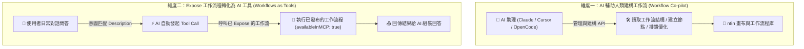

# n8n Instance-level MCP 連線設定與介面功能指南 (v2.34.6 最新版)

> **適用版本**：`n8n Version 2.34.6` 或更高版本  
> **功能定位**：Instance-level MCP (Preview)  
> **核心目標**：讓外部 AI 助理與 IDE（如 OpenCode、Claude、Cursor 等）透過 **Model Context Protocol (MCP)** 協議安全連線至 n8n 實例，並精細控制開放的工作流程與權限。  
> 💡 **客戶端現況說明**：目前 **Claude.ai** 與 **OpenCode / Cursor** 已完整支援 MCP 直連；**ChatGPT 網頁與桌面版** 目前尚未支援原生 MCP Connector 連線（ChatGPT 需透過瀏覽器擴充套件或自訂 Actions 進行協作）。

---

## 📑 目錄

1. [架構概念與連線流程](#architecture)
2. [n8n 後台介面與所有按鈕功能詳解 (v2.34.6)](#n8n-ui-features)
   - [Connection details（連線設定區）](#connection-details)
   - [Access（存取控制區）](#access-control)
   - [Connected clients（已連線客戶端管理區）](#connected-clients)
3. [n8n MCP 的兩大核心維度：AI 輔助建構 vs. Expose 工具化調用](#expose-vs-permissions)
4. [各 AI 客戶端連線設定教學](#client-setups)
   - [Claude Connector (OAuth 模式)](#claude-connector)
   - [OpenCode 全域管理指令（推薦免手寫設定檔）](#opencode-mcp)
   - [Google Antigravity 專案等級 MCP 設定](#antigravity-mcp)
5. [課堂實戰範例（附 AI Prompt 提詞）](#practical-examples)

---

<a id="architecture"></a>
## 一、架構概念與連線流程

```text
┌─────────────────────────────────────────────────────────────┐
│             外部 AI 客戶端 / IDE / CLI 工具                  │
│       (OpenCode / Claude Desktop / Cursor / ChatGPT)        │
└──────────────────────────────┬──────────────────────────────┘
                               │ MCP over HTTP / SSE / OAuth
                               ▼ (需公開 HTTPS，如 ngrok)
┌─────────────────────────────────────────────────────────────┐
│                 n8n Instance-level MCP Server               │
│                  (n8n Version 2.34.6)                       │
├──────────────────────────────┬──────────────────────────────┤
│  存取權限控制 (Access Control) │  已開放工作流 (Exposed Workflows)│
└──────────────────────────────┬──────────────────────────────┘
                               │
                               ▼
┌─────────────────────────────────────────────────────────────┐
│              n8n 核心工作流、節點與自動化執行引擎             │
└─────────────────────────────────────────────────────────────┘
```

* AI 客戶端**不是直接存取 n8n 的底層資料庫**，而是透過 n8n 內建的 MCP Server API 操作工作流程。
* 若 n8n 部署於本機 (Self-hosted)，必須透過 ngrok、Cloudflare Tunnel 或反向代理提供**公開 HTTPS 網址**。

---

<a id="n8n-ui-features"></a>
## 二、n8n 後台介面與所有按鈕功能詳解 (v2.34.6)

### 進入路徑
點擊 n8n 左下角 **Settings（設定）** ➔ 左側選單選擇 **Instance-level MCP**。

---

<a id="connection-details"></a>
### 1. Connection details（連線設定區）

| 介面項目 | 類型 / 狀態標示 | 功能說明與操作指引 |
| :--- | :--- | :--- |
| **MCP status** | 狀態下拉選單<br>`● Enabled ˇ` / `Disabled` | **控制全域 MCP 伺服器的啟用狀態**。<br>• 設為 **Enabled（綠色）** 時，外部 AI（Claude、Cursor、ChatGPT、OpenCode）才能與本 n8n 實例建立 MCP 連線。<br>• 若暫時不希望任何外部 AI 連線，可切換為 **Disabled** 進行快速阻斷。 |
| **Connect your client** | 動作按鈕<br>`[ 🔌 Connect ]` | **開啟用戶端連線引導精靈 (Setup Wizard)**。<br>點擊後會彈出視窗，讓您挑選目標 AI 工具（如 Claude、Cursor、OpenCode、ChatGPT、VS Code），並自動產生專屬的設定步驟、連線資訊：<br>• **OAuth Server URL**（供 Claude 等支援 OAuth 的工具）<br>• **Access Token / HTTP Endpoint**（通常為 `https://<網域>/mcp-server/http`）。 |

---

<a id="access-control"></a>
### 2. Access（存取控制區）

| 介面項目 | 類型 / 狀態標示 | 功能說明與操作指引 |
| :--- | :--- | :--- |
| **Workflows exposed** | 導航按鈕<br>`1 workflow >` (依數量顯示) | **管理開放給 MCP 工具呼叫的工作流程清單**。<br>• 點擊進入工作流程選擇頁面，可直接勾選要開放給 AI 的 Workflow。<br>• **Description**：強烈建議為每個開放的工作流填寫清晰的描述，AI 會依據這段描述在對話中智能判斷何時呼叫該工具。 |
| **Allowed callback URLs** | 安全設定按鈕<br>`All >` / `Custom >` | **限制 OAuth 登入授權的回調（Redirect）網址白名單**。<br>• **All（預設）**：允許所有客戶端重定向網址，方便快速測試，但安全性較寬鬆。<br>• **自訂白名單**：可限定只有特定的客戶端 callback 網址（如 Claude 官方回調網址）才能完成授權，避免未經授權的應用程式發起 OAuth 劫持。 |

---

<a id="connected-clients"></a>
### 3. Connected clients（已連線客戶端管理區）

| 介面項目 | 類型 / 狀態標示 | 功能說明與操作指引 |
| :--- | :--- | :--- |
| **All connected clients** | 列表導航按鈕<br>`View all >`<br>*(顯示目前例如: 2 clients have access)* | **檢視並管理所有已成功連線並取得授權的外部 AI 客戶端**。<br>• 點擊進入可檢視目前有存取權限的應用程式列表（如 OpenCode CLI、Claude Desktop 等）。<br>• 可在此查看個別連線的授權時間，並在需要時執行 **Revoke（撤銷連線）**，立即中止特定客戶端的存取權。 |

---

<a id="expose-vs-permissions"></a>
## 三、n8n MCP 的兩大核心維度：AI 輔助建構 vs. Expose 工具化調用

在 n8n MCP 協作中，最核心的價值在於將 **「AI 輔助開發」** 與 **「工作流程工具化」** 完美結合：



---

### 1. 維度一：AI 輔助人類建構與維護工作流程 (Workflow Builder & Co-pilot)
* **主要功能**：讓 AI 成為您的 **n8n 結對程式設計師（Pair Programmer）**。
* **運作機制**：透過 MCP 連線提供的管理權限，AI 可以：
  - 檢視目前畫布上現有的工作流程結構與節點設定。
  - 自動生成、新增或修改節點連線與 JavaScript Code。
  - 讀取執行日誌（Execution Logs），協助分析報錯原因並即時修復流程。

---

### 2. 維度二：Expose 功能 — 將已完成的工作流程封裝為 AI 工具 (Workflows as Tools)
* **主要功能**：當您在 n8n 完成並測試好某個自動化流程（例如：查詢今日營收、發送 LINE 推播、發票核銷等），透過 **Expose** 可直接將其變成 AI 的「外掛技能（Custom Tool）」。
* **底層標記**：被勾選 Expose 的工作流程，其設定檔會標記為：
  ```json
  "settings": {
    "availableInMCP": true
  }
  ```
* 後台顯示例如 **`1 workflow exposed`**，代表已對外註冊 1 個可供 AI 自主執行的功能工具。

---

### 3. 🎯 AI 如何觸發 Expose 的工作流程？—— 核心關鍵：Description（描述）

外部 AI 大模型（LLM）無法直接看穿您複雜的工作流節點圖，**AI 完全是透過「工作流程名稱」與「Description（描述文字）」來理解工具用途並決定何時觸發**！

#### 🔍 AI 意圖匹配與觸發流程：
1. **工具註冊 (Tool Discovery)**：當 AI 客戶端連線至 n8n 時，n8n 會將所有已 Expose 的工作流程清單，連同它們的 **名稱**、**Description** 與 **輸入參數格式 (Input Schema)** 提供給 AI。
2. **語意意圖匹配 (Semantic Matching)**：
   - 當使用者在聊天中輸入：「*幫我查一下上個月營業額*」或「*發送一則推播給客戶*」。
   - LLM 會在背景比對所有可用工具的 **Description**。
3. **發起工具調用 (Tool Call)**：
   - 當 LLM 判定某個 Expose 工作流程的 Description 符合使用者需求，便會自動提取對話中的參數，發起 MCP Tool 執行請求。
   - n8n 執行該工作流程後，將結果回傳給 AI，由 AI 整理成自然語言回覆給使用者。

#### 💡 撰寫 Description 的黃金法則（Best Practices）：

> [!TIP]
> **寫好 Description 是讓 AI 精準調用工作流程的關鍵！**
> 
> * ❌ **不良範例**：`查詢資料用的流程`、`Test Workflow 1`（AI 無法判斷使用時機與輸入內容）。
> * ✅ **優良範例**：`用於查詢指定日期區間的電商營業額與訂單數量。輸入參數包含 startDate (YYYY-MM-DD) 與 endDate (YYYY-MM-DD)，執行完成後會回傳訂單總金額與熱銷品項清單。`

---

<a id="client-setups"></a>
## 四、各 AI 客戶端連線設定教學

<a id="claude-connector"></a>
### 1. Claude.ai Connector (OAuth 模式)

適用於 **Claude.ai** 網頁版或 **Claude Desktop** 應用程式：

1. **啟動 ngrok 反向代理（必備指令）**：
   確保本機已啟動 ngrok 並轉發 n8n 埠號（預設 5678）。
   > [!WARNING]
   > **⚠️ ngrok 反向代理必加參數**：
   > 使用 ngrok 代理 n8n MCP 時，若未停用壓縮可能導致 SSE / MCP 串流解析失敗，**必須**使用以下指令啟動：
   ```bash
   ngrok http 5678 --request-header-add "Accept-Encoding: identity"
   ```
2. **開啟 Claude Connectors 介面**：
   * 在 Claude.ai 側邊欄點選 **Customize** ➔ **Connectors**（或 **Settings > Connectors**）。
3. **新增與連線 n8n**：
   * **搜尋連線**：在 Connectors 列表中找到 **n8n**（Type 為 `Web`），或點擊右上角 **`Add ˇ`** ➔ 選擇 **`Browse connectors`** 搜尋 official `n8n` (by n8n GmbH)。
   * 點選 **`Connect`** 按鈕。
   * 輸入 ngrok 產生的 Server URL（例如 `https://<你的ngrok網域>.ngrok-free.app`）。
4. **瀏覽器 OAuth 授權**：
   * 系統會自動開啟 n8n 登入/授權畫面，點擊確認允許連線。
5. **確認連線狀態**：
   * 授權完成後，Claude Connectors 列表中的 n8n 狀態會變更為 **`✓` (已連線)**。
   * 同步可在 n8n 後台 **Settings > Instance-level MCP > Connected clients** 查看到 Claude 已連線。

---

<a id="opencode-mcp"></a>
### 2. OpenCode 全域管理指令（推薦免手寫設定檔）

> [!TIP]
> **全域設定推薦使用 CLI 指令直接操作**：
> OpenCode 內建完整的 MCP CLI 管理工具。**不需要手動建立或編輯 `opencode.json`**，只需透過指令即可在全域完成 n8n MCP 的新增、OAuth 授權與狀態管理，設定一次即在任何目錄與 OpenCode Desktop 桌面版中全域生效！

> [!WARNING]
> **⚠️ 啟動 ngrok 反向代理的重要指令**：
> 當透過 ngrok 提供公開 HTTPS 供 OpenCode 或其他 AI 客戶端連線時，為避免串流與編碼壓縮問題，ngrok 請一律使用以下指令啟動：
> ```bash
> ngrok http 5678 --request-header-add "Accept-Encoding: identity"
> ```

#### 🛠️ 常用管理指令（全域 / Global 設定）

```bash
# 0. 啟動 ngrok 反向代理（必加 Accept-Encoding 參數避免串流出錯）
ngrok http 5678 --request-header-add "Accept-Encoding: identity"

# 1. 登入 OpenAI / ChatGPT 帳號提供者（全域登入，供 ChatGPT 用戶使用）
opencode auth login

# 2. 全域新增 n8n MCP 服務（自動註冊至全域環境）
opencode mcp add n8n --url https://<你的ngrok公開網域>/mcp-server/http

# 3. 手動觸發 / 進行全域 OAuth 網頁授權（若首次加入未自動彈出時執行）
opencode mcp auth n8n

# 4. 查看全域所有已註冊的 MCP 連線狀態
opencode mcp list

# 5. 診斷與測試全域 n8n 連線狀態
opencode mcp debug n8n

# 6. 登出或移除全域 n8n 連線憑證
opencode mcp logout n8n
```

> [!IMPORTANT]
> **⭐ 進入 Session 最關鍵驗證：在 Prompt 輸入 `/mcp`**：
> 指令授權完成後，**不代表當前 OpenCode Session 已經正確掛載 n8n**。
> 1. 執行 `opencode` 進入對話互動介面（或開啟 OpenCode Desktop 桌面版）。
> 2. 在對話輸入框中直接輸入斜線指令 **`/mcp`**。
> 3. **確認連線狀態**：檢查選單列表中是否包含 `n8n`，且狀態是否為已連線 (Active / Connected)。
> 4. 只有在 `/mcp` 列表中確認看到 `n8n` 連線成功後，ChatGPT / GPT-4o 模型才能在 Session 中自動調用 n8n 工作流程與工具！

> 📌 **運作與授權機制說明**：
> - **OAuth 自動授權流程**：執行 `opencode mcp add n8n --url ...` 後，連線時會自動喚起瀏覽器進行 n8n 登入授權（或執行 `opencode mcp auth n8n` 手動喚起），授權 Token 會由 OpenCode 自動保存至本地憑證庫（`~/.local/share/opencode/`）。
> - **全域共用優勢**：設定完成後，在終端機任何目錄執行 `opencode` 或開啟 **OpenCode Desktop 桌面版**，皆能自動辨識並調用 n8n MCP 工具。
> - **ChatGPT 用戶專屬優勢**：若您擁有 ChatGPT / OpenAI 帳號，在 OpenCode 透過 `opencode auth login` 登入後，即可直接使用 ChatGPT 的模型（如 GPT-4o、o1 等）藉由 MCP 自動化操控 n8n 工作流程！

---

<a id="antigravity-mcp"></a>
### 3. Google Antigravity 專案等級 MCP 設定

Google Antigravity 支援**專案等級（Workspace-level）**與**全域等級（Global-level）**設定：

* 🌐 **全域設定（Global）**：位於 `~/.gemini/config/`，適用於本機所有專案。
* 📁 **專案等級設定（Workspace）**：位於專案根目錄下的 `.agents/` 資料夾，只對當前專案生效，可隨 Git 版本庫一同提交分享。

#### A. 專案目錄結構
```text
專案根目錄/
├── .agents/
│   ├── mcp_config.json                 # 專案層級 MCP 設定
│   └── plugins/
│       └── n8n/
│           ├── plugin.json             # Plugin 宣告檔
│           └── mcp_config.json         # Plugin 內部的 MCP 設定
└── ...
```

#### B. 設定檔案內容
1. **Plugin 宣告檔 (`.agents/plugins/n8n/plugin.json`)**：
   ```json
   {
     "name": "n8n"
   }
   ```
2. **MCP 設定檔 (`.agents/mcp_config.json` 或 `.agents/plugins/n8n/mcp_config.json`)**：
   > 💡 **認證注意**：Antigravity 不支援瀏覽器 OAuth 授權流程，若啟用認證需在 `headers` 帶入 `"Authorization": "Bearer <YOUR_ACCESS_TOKEN>"`。

   ```json
   {
     "mcpServers": {
       "n8n": {
         "serverUrl": "https://<你的ngrok公開網址>/mcp-server/http",
         "headers": {
           "Authorization": "Bearer <你的_n8n_ACCESS_TOKEN>",
           "Accept-Encoding": "identity"
         }
       }
     }
   }
   ```

> 📘 **詳細指南與除錯範例**：請參閱專題講義 **[Antigravity 專案等級 n8n MCP 設定教學](./antigravity_mcp_setup_guide.md)**。

---

<a id="practical-examples"></a>
## 🚲 課堂實戰範例（附 AI Prompt 提詞）

選好你的 AI 工具後，立即跟著實戰範例動手練習：

* 🚲 **[台北市 YouBike 低車輛站點自動記錄](./台北市的youbike/README.md)**
  * **任務目標**：定時抓取政府即時開放資料，篩選車輛不足 3 輛的站點並自動寫入 Google Sheets。
  * **課堂提詞**：內附完整的 **「AI Prompt 範本」**，直接貼給 Gemini、ChatGPT 或 Claude，讓 AI 替你全自動打造完整工作流程！
