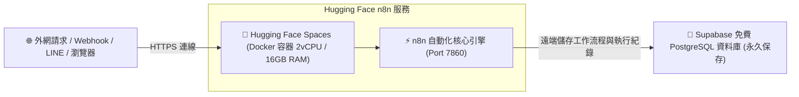

# 🚀 方案 1：Hugging Face Spaces 免費雲端部署指南（學生首選）

本方案是**最推薦給學生的 0 元免費雲端部署方案**：
- 🟢 **完全免信用卡**：註冊帳號無需綁定任何信用卡。
- 🟢 **超大硬體規格**：免費提供 **2 vCPU + 16GB RAM + 50GB 儲存空間**。
- 🟢 **自帶 HTTPS 網址**：自動分配獨立的二級網域（如 `https://username-n8n.hf.space`），可直接作為 LINE、Telegram 與 Webhook 的外網回呼端點！
- 🟢 **永久運行不休眠**：Spaces 預設為全天候 7x24 小時運行。

---

## 🧭 架構運作原理

由於 Hugging Face 免費容器在重啟或重新建置時，容器內部檔案會重置，因此我們將 n8n 的資料庫指向前面章節學過的 **免費 Supabase PostgreSQL**，實現**資料永久保存、工作流程絕不遺失**！



---

## 🛠️ Step-by-Step 部署步驟教學

### 步驟 1：準備免費 Supabase 資料庫

1. 登入 [Supabase 官方網站](https://supabase.com)（免費註冊，免信用卡）。
2. 建立一個新專案（Project），記下您的**資料庫密碼**。
3. 前往 **Project Settings -> Database**，找到 **Connection Parameters**：
   - **Host**：`aws-0-ap-southeast-1.pooler.supabase.com`（範例）
   - **Database**：`postgres`
   - **Port**：`5432` 或 `6543`
   - **User**：`postgres.YOUR_PROJECT_REF`
   - **Password**：您的資料庫密碼

---

### 步驟 2：在 Hugging Face 建立 Space

1. 註冊並登入 [Hugging Face 官方網站](https://huggingface.co/)。
2. 點擊右上角頭像 -> **New Space**。
3. 填寫 Space 建立資訊：
   - **Space name**：例如 `my-n8n-server`
   - **License**：`apache-2.0` 或 `mit`
   - **Space SDK**：選擇 **Docker**（選擇 **Blank** 空白範本）
   - **Space Hardware**：選擇 **CPU Basic (Free - 2 vCPU · 16 GB · 50 GB)**
   - **Visibility**：選擇 **Public**（或 Private）
4. 點擊 **Create Space**。

---

### 步驟 3：建立 Dockerfile

在 Space 頁面中，點擊 **Files** 標籤頁 -> **Add file -> Create a new file**：
- 檔名輸入：`Dockerfile`
- 貼入以下內容：

```dockerfile
FROM docker.io/n8nio/n8n:latest

USER root

# Hugging Face Spaces 預設使用 Port 7860
ENV PORT=7860
ENV N8N_PORT=7860
ENV N8N_LISTEN_ADDRESS=0.0.0.0

# 建立儲存資料夾並給予權限
RUN mkdir -p /home/node/.n8n && chown -R node:node /home/node/.n8n

USER node

EXPOSE 7860

CMD ["n8n", "start"]
```

點擊頁面下方的 **Commit new file to main**。

---

### 步驟 4：設定環境變數（Repository Secrets）

前往該 Space 的 **Settings** 標籤頁 -> 找到 **Variables and secrets** 區塊：

點擊 **New secret**，依序新增以下機密變數：

| Secret 名稱 | 數值內容 (範例) | 說明 |
| :--- | :--- | :--- |
| **`DB_TYPE`** | `postgresdb` | 指定使用 PostgreSQL 資料庫 |
| **`DB_POSTGRESDB_HOST`** | `aws-0-ap-southeast-1.pooler.supabase.com` | Supabase 主機位置 |
| **`DB_POSTGRESDB_PORT`** | `6543` | 連接埠 (建議使用 Session Pooler 6543) |
| **`DB_POSTGRESDB_DATABASE`** | `postgres` | 資料庫名稱 |
| **`DB_POSTGRESDB_USER`** | `postgres.your_project_id` | 資料庫使用者帳號 |
| **`DB_POSTGRESDB_PASSWORD`**| `你的Supabase密碼` | 資料庫密碼 |
| **`DB_POSTGRESDB_SSL_REJECT_UNAUTHORIZED`** | `false` | 允許 Supabase SSL 加密連線 |
| **`N8N_ENFORCE_SETTINGS_FILE_PERMISSIONS`** | `true` | 安全權限設定 |
| **`WEBHOOK_URL`** | `https://你的帳號-my-n8n-server.hf.space` | 你的 Space 公開網址 |

---

### 步驟 5：啟動與驗證

1. 設定完畢後，回到 Space 的 **App** 標籤頁。
2. Hugging Face 會自動編譯 Docker 映像檔並啟動容器（約需 1~2 分鐘，看到狀態變為 **Running**）。
3. 畫面上會直接跳出 n8n 註冊/登入介面！
4. 點擊右上角的「Embed this Space」或直接用瀏覽器開啟 `https://你的帳號-my-n8n-server.hf.space`。
5. 建立您的 n8n 管理員帳號密碼，即可開始使用 7x24 小時免費運行的雲端 n8n！

---

## 💡 學生常見問題與小撇步

- **Q：我的 Webhook 能正常收到外部通知嗎？**
  - **A**：可以！只要在環境變數中設定好 `WEBHOOK_URL=https://your-space.hf.space`，LINE、Telegram 與外部網頁都能正常透過 HTTPS 發送請求進來。
- **Q：Hugging Face 會收費嗎？**
  - **A**：不會！CPU Basic 是 Hugging Face 官方承諾的永久免費層，且註冊完全不需填寫信用卡。
