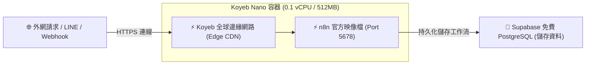

# 🚀 方案 2：Koyeb Serverless 容器雲端部署指南（免休眠 PaaS）

**Koyeb** 是一個現代化的無伺服器容器平台（Serverless Container Engine）：
- 🟢 **免費額度**：提供每月免費的 **Nano 實例 (512MB RAM + 0.1 vCPU)**。
- 🟢 **免休眠運作**：不同於 Render，Koyeb 免費實例不會因為閒置而自動停止，可全天候接收 Webhook！
- 🟢 **全球 CDN 與自動 HTTPS**：自動配置專屬二級域名（如 `https://n8n-app-yourname.koyeb.app`）。
- 🟢 **免寫 Dockerfile**：直接填入 Docker Hub 官方映像檔 `docker.io/n8nio/n8n:latest` 即可一鍵拉取部署。

---

## 🧭 架構運作原理



---

## 🛠️ Step-by-Step 部署步驟教學

### 步驟 1：註冊 Koyeb 帳號

1. 前往 [Koyeb 官方網站](https://www.koyeb.com/) 註冊免費帳號（支援 GitHub / Google 一鍵登入）。
2. 完成 Email 信箱驗證。

---

### 步驟 2：建立新服務 (Create Service)

1. 在 Koyeb Dashboard 點擊 **Create Service**。
2. 選擇部署來源：點選 **Docker**。
3. 在 **Docker Image** 欄位輸入：
   ```text
   docker.io/n8nio/n8n:latest
   ```
4. **Service Type**：選擇 **Web Service**。

---

### 步驟 3：設定實例規格與連接埠

1. **Instance Type**：選擇 **Free / Nano (512MB RAM)**。
2. **Regions**：選擇離台灣最近的節點（例如 **Frankfurt** 或 **Washington DC** / **Singapore**）。
3. **Ports**：
   - Protocol：`HTTP`
   - Port：`5678`
   - Path：`/`

---

### 步驟 4：配置環境變數 (Environment Variables)

展開 **Environment variables** 區塊，加入以下鍵值（資料庫連線資訊使用前面取得的 Supabase 資訊）：

| 變數名稱 | 範例數值 | 說明 |
| :--- | :--- | :--- |
| **`DB_TYPE`** | `postgresdb` | 指定資料庫類型 |
| **`DB_POSTGRESDB_HOST`** | `aws-0-ap-southeast-1.pooler.supabase.com` | Supabase 主機 |
| **`DB_POSTGRESDB_PORT`** | `6543` | Supabase 連接埠 |
| **`DB_POSTGRESDB_DATABASE`** | `postgres` | 資料庫名稱 |
| **`DB_POSTGRESDB_USER`** | `postgres.your_project_id` | 資料庫使用者 |
| **`DB_POSTGRESDB_PASSWORD`**| `你的Supabase密碼` | 資料庫密碼 |
| **`DB_POSTGRESDB_SSL_REJECT_UNAUTHORIZED`** | `false` | 允許 SSL 加密 |
| **`N8N_ENFORCE_SETTINGS_FILE_PERMISSIONS`** | `true` | 安全權限 |
| **`WEBHOOK_URL`** | `https://你的服務名稱-你的帳號.koyeb.app` | Koyeb 產生的公開網址 |

---

### 步驟 5：完成部署

1. 點擊右下角的 **Deploy** 按鈕。
2. Koyeb 會在約 60 秒內完成容器啟動與健康檢查。
3. 看到狀態顯示 **Healthy** 後，點擊提供的 `https://...koyeb.app` 網址，即可登入使用！

---

## 💡 使用注意事項

- **記憶體限制**：Koyeb 免費 Nano 實例為 512MB RAM，適合運行中小型自動化流程、通訊軟體 Bot 與 API 微服務。若要執行大型 AI 本地模型（如 Ollama），建議搭配外部 API（如 OpenAI / Gemini / Groq API）運算。
