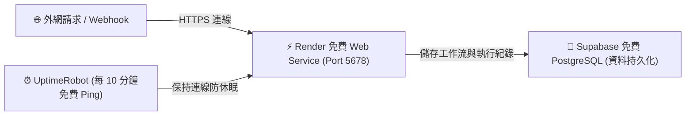

# 🚀 方案 3：Render 免費 Web 服務部署指南（搭配防休眠排程）

**Render** 是目前全球最知名的雲端應用代管平台之一：
- 🟢 **免費額度**：提供免費 Web Service（512MB RAM + 0.1 CPU）。
- 🟢 **操作直覺**：支援直接填寫 Docker Image URL 或 GitHub 倉庫部署。
- 🟢 **自動免費 SSL**：分配 `https://your-n8n-app.onrender.com` 網址。
- 💡 **防休眠技巧**：Render 免費方案在 15 分鐘無連線時會進入睡眠，只要設定外部定時 Ping（如 UptimeRobot），即可維持在線！

---

## 🧭 架構運作原理



---

## 🛠️ Step-by-Step 部署步驟教學

### 步驟 1：建立 Render 服務

1. 登入 [Render 官方網站](https://render.com/)（支援 GitHub 免費註冊）。
2. 在 Dashboard 點擊 **New +** -> 選擇 **Web Service**。
3. 選擇 **Existing image**（部署現成映像檔）。
4. 在 **Image URL** 欄位輸入：
   ```text
   docker.io/n8nio/n8n:latest
   ```
5. 點擊 **Next**。

---

### 步驟 2：基本設定與方案選擇

1. **Name**：輸入您的服務名稱（例如 `my-n8n-render`）。
2. **Region**：選擇 **Singapore**（新加坡）或 **Oregon (US West)**。
3. **Instance Type**：選擇 **Free ($0/month)**。

---

### 步驟 3：設定環境變數 (Environment Variables)

在 **Environment Variables** 區塊，點擊 **Add Environment Variable**：

| Key (變數名稱) | Value (數值) |
| :--- | :--- |
| **`DB_TYPE`** | `postgresdb` |
| **`DB_POSTGRESDB_HOST`** | `aws-0-ap-southeast-1.pooler.supabase.com` |
| **`DB_POSTGRESDB_PORT`** | `6543` |
| **`DB_POSTGRESDB_DATABASE`** | `postgres` |
| **`DB_POSTGRESDB_USER`** | `postgres.your_project_id` |
| **`DB_POSTGRESDB_PASSWORD`**| `你的Supabase密碼` |
| **`DB_POSTGRESDB_SSL_REJECT_UNAUTHORIZED`** | `false` |
| **`N8N_PORT`** | `5678` |
| **`WEBHOOK_URL`** | `https://my-n8n-render.onrender.com` |

---

### 步驟 4：防休眠設定（UptimeRobot 免費 Keep-Alive）

為了避免 Render 在閒置 15 分鐘後休眠導致 Webhook 逾時：

1. 前往 [UptimeRobot 官網](https://uptimerobot.com/) 註冊免費帳號。
2. 點擊 **Add New Monitor**：
   - **Monitor Type**：`HTTP(s)`
   - **Friendly Name**：`n8n Keep-Alive`
   - **URL (or IP)**：`https://my-n8n-render.onrender.com/healthz`
   - **Monitoring Interval**：每 `10 mins` 探測一次
3. 點擊 **Create Monitor**。如此一來，UptimeRobot 每 10 分鐘自動發送輕量請求，Render 就不會休眠！
