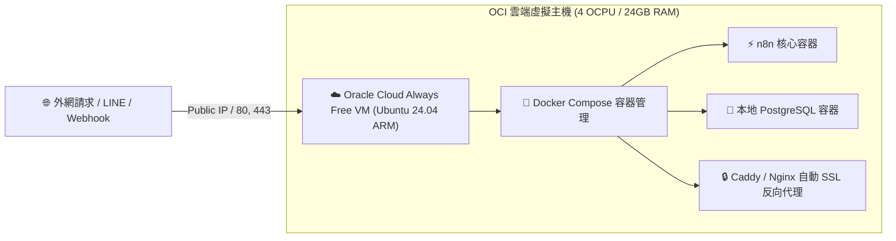

# 🚀 方案 4：Oracle Cloud (OCI) 永久免費雲端 VPS 主機指南（旗艦 24GB 方案）

如果學生手邊有**可供驗證身分的信用卡/簽帳金融卡（註冊時僅會扣 1 美元預授權並立即退還，保證 0 元不扣款）**，那麼 **Oracle Cloud Infrastructure (OCI) 的 Always Free（永久免費層）** 是全球雲端運算中最慷慨的伺服器方案！

---

## 🌟 OCI 永久免費規格亮點

- 🟢 **怪物級硬體規格**：免費提供最高 **4 OCPU (ARM Ampere A1) + 24GB 記憶體 + 200GB 雲端硬碟**！
- 🟢 **專屬獨立公網 IP (Public IPv4)**：擁有固定 IP，對外連線極度穩定。
- 🟢 **完全掌控 Root 權限**：具備完整的 Ubuntu Linux 作業系統，可自由安裝 Docker、Docker Compose、Ollama 本地大模型。

---

## 🧭 架構運作原理



---

## 🛠️ Step-by-Step 部署步驟教學

### 步驟 1：建立免費 VM 執行個體 (Compute Instance)

1. 登入 [Oracle Cloud 主控台](https://cloud.oracle.com/)。
2. 點擊 **建立 VM 執行個體 (Create VM Instance)**：
   - **映像檔 (Image)**：選擇 **Canonical Ubuntu 24.04**
   - **資源配置 (Shape)**：點擊變更，選擇 **Ampere (ARM 處理器)**：
     - OCPU：選擇 `2` 或 `4`
     - 記憶體：選擇 `12 GB` 或 `24 GB`
   - **SSH 金鑰**：下載自動產生的 Private Key（例如 `ssh-key.key`）並妥善保存。
3. 點擊 **建立 (Create)**，等待主機狀態變為綠色「執行中 (Running)」，記下其 **公共 IP 位址 (Public IP)**。

---

### 步驟 2：開啟 Oracle 雲端子網路防火牆 (Ingress Rules)

前往該 VM 所屬的 **虛擬雲端網路 (VCN) -> 安全清單 (Default Security List) -> 入站規則 (Ingress Rules)**，新增以下連接埠：
- **Port 80 (HTTP)**：來源 `0.0.0.0/0`
- **Port 443 (HTTPS)**：來源 `0.0.0.0/0`
- **Port 5678 (n8n)**：來源 `0.0.0.0/0`

---

### 步驟 3：透過 SSH 連線並安裝 Docker

在電腦終端機（Mac Terminal 或 Windows PowerShell）執行：

```bash
# 修改金鑰權限
chmod 400 ssh-key.key

# 連線至 OCI 雲端主機
ssh -i ssh-key.key ubuntu@你的主機公共IP
```

連線成功後，一鍵安裝 Docker 與 Docker Compose：

```bash
# 更新系統並安裝 Docker
sudo apt update && sudo apt upgrade -y
sudo apt install -y docker.io docker-compose-v2

# 開啟本機防火牆 (iptables/ufw)
sudo iptables -I INPUT 6 -m state --state NEW -p tcp --dport 80 -j ACCEPT
sudo iptables -I INPUT 6 -m state --state NEW -p tcp --dport 443 -j ACCEPT
sudo iptables -I INPUT 6 -m state --state NEW -p tcp --dport 5678 -j ACCEPT
sudo netfilter-persistent save
```

---

### 步驟 4：使用 Docker Compose 一鍵啟動 n8n + PostgreSQL

建立 `docker-compose.yml` 檔案：

```bash
mkdir -p ~/n8n-docker && cd ~/n8n-docker
nano docker-compose.yml
```

貼入以下標準生產環境設定檔：

```yaml
version: '3.8'

services:
  postgres:
    image: postgres:16-alpine
    restart: always
    environment:
      - POSTGRES_USER=n8n
      - POSTGRES_PASSWORD=YourStrongPassword123!
      - POSTGRES_DB=n8n
    volumes:
      - postgres_storage:/var/lib/postgresql/data
    healthcheck:
      test: ['CMD-SHELL', 'pg_isready -h localhost -U n8n -d n8n']
      interval: 5s
      timeout: 5s
      retries: 10

  n8n:
    image: docker.io/n8nio/n8n:latest
    restart: always
    ports:
      - "5678:5678"
    environment:
      - DB_TYPE=postgresdb
      - DB_POSTGRESDB_HOST=postgres
      - DB_POSTGRESDB_PORT=5432
      - DB_POSTGRESDB_DATABASE=n8n
      - DB_POSTGRESDB_USER=n8n
      - DB_POSTGRESDB_PASSWORD=YourStrongPassword123!
      - N8N_PORT=5678
      - WEBHOOK_URL=http://你的主機公共IP:5678/
      - GENERIC_TIMEZONE=Asia/Taipei
      - TZ=Asia/Taipei
    volumes:
      - n8n_storage:/home/node/.n8n
    depends_on:
      postgres:
        condition: service_healthy

volumes:
  postgres_storage:
  n8n_storage:
```

啟動服務：

```bash
sudo docker compose up -d
```

---

### 步驟 5：測試與上線

開啟瀏覽器輸入 `http://你的主機公共IP:5678/`，即可看到 n8n 管理介面！

> 💡 **進階網域與 SSL**：可搭配免費 Cloudflare 網域與 Cloudflare Tunnel，免費獲得 `https://n8n.yourdomain.com` 的綠色安全鎖與自動 SSL 憑證。
