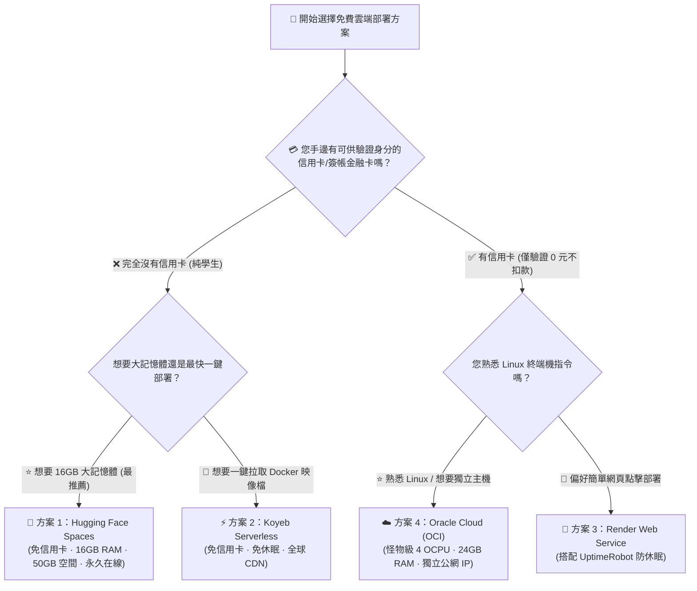
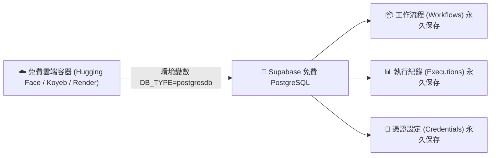

# 🌍 學生專屬：n8n 零預算「永久免費」雲端部署全指南

歡迎來到 **n8n 學生零成本雲端部署專題**！

在學習自動化流程與建置 LINE / Telegram 聊天機器人時，最大的痛點是：**「如果電腦關機或離開本機，工作流程就停止運作了！」**

本指南專為**預算為 $0 的學生與自學者**量身打造，**徹底排除需要額外購買實體硬體（如樹莓派 Raspberry Pi）的方案**，精選出全球主流的**四大免費雲端主機與 PaaS 容器平台**，讓您不必花一毛錢，即可將 n8n 架設在雲端伺服器上，享有 7x24 小時不間斷的自動化服務與專屬 HTTPS Webhook 網址！

---

## 🧭 學生免費雲端部署選型決策樹

---

## 📊 四大免費雲端部署方案評比

| 比較項目 | 🤗 方案 1：Hugging Face Spaces | ⚡ 方案 2：Koyeb Serverless | 🎨 方案 3：Render Web Service | ☁️ 方案 4：Oracle Cloud (OCI) |
| :--- | :--- | :--- | :--- | :--- |
| **信用卡需求** | 🟢 **完全不需要** | 🟢 **完全不需要** | 🟢 **完全不需要** | 🟡 需要（僅驗證不扣款） |
| **每月費用** | **NT$ 0 (永久免費)** | **NT$ 0 (永久免費)** | **NT$ 0 (永久免費)** | **NT$ 0 (永久免費)** |
| **硬體規格** | **2 vCPU / 16GB RAM** | 0.1 vCPU / 512MB RAM | 0.1 vCPU / 512MB RAM | **4 OCPU / 24GB RAM** |
| **休眠機制** | 🟢 **永久在線不休眠** | 🟢 **永久在線不休眠** | 🟡 15分無連線休眠（需Ping） | 🟢 **永久在線不休眠** |
| **公網網址** | 專屬 HTTPS 網址 | 專屬 HTTPS 網址 | 專屬 HTTPS 網址 | 專屬固定 Public IP |
| **資料持久化** | 外部 Supabase DB | 外部 Supabase DB | 外部 Supabase DB | 本地 PostgreSQL 容器 |
| **教學連結** | **[👉 查看詳細部署步驟](./01_HuggingFace_免信用卡Docker部署.md)** | **[👉 查看詳細部署步驟](./02_Koyeb_雲端容器免休眠部署.md)** | **[👉 查看詳細部署步驟](./03_Render_雲端Web服務部署.md)** | **[👉 查看詳細部署步驟](./04_OracleCloud_永久免費VPS架設.md)** |

---

## 📚 各方案詳細教學導覽

### 1. [🤗 方案 1：Hugging Face Spaces 免費雲端部署（學生首選）](./01_HuggingFace_免信用卡Docker部署.md)
- **特色**：免綁信用卡，免費分配 2 vCPU + 16GB RAM，自帶 HTTPS 網址，搭配 Supabase 免費資料庫儲存工作流。
- **適合**：全體學生、希望 0 門檻擁有大記憶體雲端主機的開發者。

### 2. [⚡ 方案 2：Koyeb Serverless 容器雲端部署（免休眠 PaaS）](./02_Koyeb_雲端容器免休眠部署.md)
- **特色**：免綁信用卡，直接輸入 `docker.io/n8nio/n8n:latest` 一鍵部署，內建全球邊緣 CDN。
- **適合**：希望 3 分鐘內透過網頁點擊快速完成上線的初學者。

### 3. [🎨 方案 3：Render 免費 Web 服務部署（搭配防休眠排程）](./03_Render_雲端Web服務部署.md)
- **特色**：支援 GitHub 倉庫連動或 Docker Image 部署，搭配免費 UptimeRobot 定時探測防止容器進入睡眠。
- **適合**：熟悉主流 PaaS 操作介面的使用者。

### 4. [☁️ 方案 4：Oracle Cloud (OCI) 永久免費雲端 VPS 主機（旗艦 24GB 方案）](./04_OracleCloud_永久免費VPS架設.md)
- **特色**：全球最慷慨的雲端運算資源，4 核心 ARM CPU、24GB RAM、200GB SSD 與獨立公網 IP，完整 Docker 操控權。
- **適合**：手邊有卡可供身分驗證、希望建立企業級全功能自動化與 AI 本地模型伺服器的進階學生。

---

## 🗄️ 核心技術：如何讓免費雲端主機「資料永不遺失」？

多數免費雲端容器（如 Hugging Face、Koyeb、Render）具備暫存特性（重新建置或重啟時容器內檔案會重置）。

因此，我們採用業界標準的 **「計算與儲存分離」** 架構：
1. **運算引擎（n8n）**：跑在免費雲端容器上（處理 Webhook 與流程運算）。
2. **資料庫儲存**：連線至前面章節學過的 **[Supabase 免費雲端 PostgreSQL](../雲端資料庫整合/Supabase/README.md)**。

只要設定好資料庫連線環境變數，無論雲端容器如何重新部署或重啟，**您的所有工作流程與設定都將 100% 完好無損！**