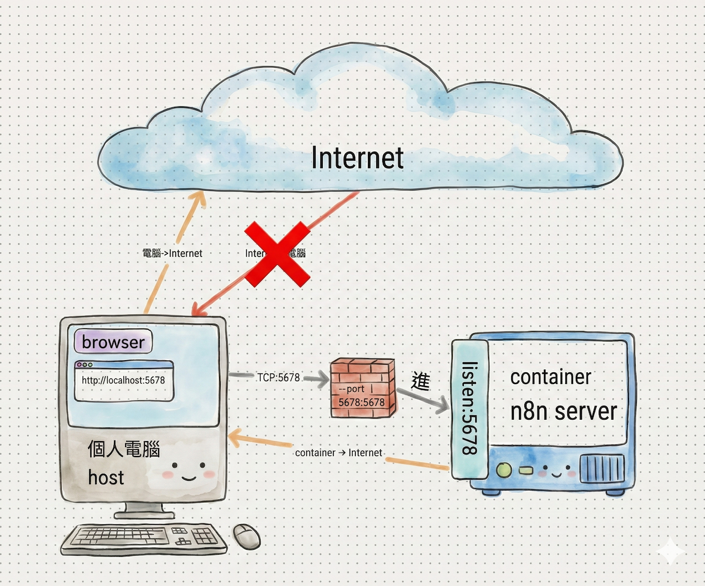

# 第一章：n8n 簡介與安裝


## 目錄

- [1.1 什麼是 n8n？](#11-什麼是-n8n)
- [1.2 n8n 的應用場景](#12-n8n-的應用場景)
- [1.3 安裝方式](#13-安裝方式)
- [1.4 初次啟動與設定](#14-初次啟動與設定)
- [n8n(Name Volume)備份的方式](#n8nname-volume備份的方式)
- [Mac的備份方式](#mac的備份方式)

## 1.1 什麼是 n8n？

n8n 是一個功能強大的開源自動化工作流工具，採用無程式碼（No Code）/低程式碼（Low Code）的設計理念，讓使用者能夠透過視覺化介面輕鬆建立自動化工作流程。

### 核心特色

- **開源免費**：完全開源，可自行部署和管理
- **視覺化設計**：透過拖放節點的方式設計工作流程，無需撰寫複雜程式碼
- **豐富整合**：支援數百種 API 和服務的整合
- **彈性擴充**：支援自訂節點和函數，滿足特殊需求
- **資料安全**：可完全私有化部署，資料不經過第三方服務

## 1.2 n8n 的應用場景

n8n 可以應用在各種自動化場景，以下是一些常見用途：

### 📊 資料同步
- 在不同系統間自動同步資料
- 定時備份重要資料
- 資料格式轉換與遷移

### 🔔 通知提醒
- 重要事件的即時通知
- 定期報告自動發送
- 多平台訊息同步

### 🔄 資料處理
- 資料清洗與轉換
- 批量處理檔案
- 資料驗證與過濾

### 🔌 API 整合
- 連接不同服務的 API
- 建立統一的工作流程
- 實現跨平台資料流動

### ⚙️ 自動化任務
- 定時執行重複性工作
- 事件驅動的自動化流程
- 複雜業務邏輯的自動化處理

## 1.3 安裝方式

根據您的使用需求，我們提供三種不同的安裝方式。請先參考下方的**使用情境選擇指南**，選擇最適合您的安裝方式。

### 📋 使用情境選擇指南

選擇適合您的安裝方式：

| 情境 | 適用安裝方式 | 說明 |
|------|------------|------|
| **只在本機使用**<br>不需要外部服務連接 | [方式一](#方式一本機安裝-localhost) | 最簡單的安裝方式，適合測試和學習 |
| **跨電腦訪問**<br>例如：Mac 訪問 Raspberry Pi 上的 n8n | [方式二](#方式二ssh-tunnel-安裝) | 透過 SSH Tunnel 安全連接，不需公開網址 |
| **需要外部服務整合**<br>例如：LINE Bot、Google OAuth、Webhook | [方式三](#方式三ngrok-公開網址安裝) | 使用 ngrok 建立公開網址，支援完整功能 |

---

### 方式一：本機安裝 (localhost)

#### 🎯 適用情境
- 只在同一台電腦上使用 n8n
- 不需要接收外部 Webhook
- 適合學習和測試

#### 前置需求
- 已安裝 Docker Desktop 或 Docker Engine
- 確保 Docker 服務正在運行

#### 安裝步驟

**步驟 1：建立資料卷**（用於持久化儲存 n8n 的設定和資料）

```bash
docker volume create n8n_data
```

**步驟 2：啟動 n8n 容器**

```bash
docker run -d \
  --name n8n \
  -p 5678:5678 \
  -v n8n_data:/home/node/.n8n \
  -e GENERIC_TIMEZONE="Asia/Taipei" \
  docker.n8n.io/n8nio/n8n
```

**步驟 3：訪問 n8n**

在瀏覽器中開啟：`http://localhost:5678`



---

### 方式二：SSH Tunnel 安裝

#### 🎯 適用情境
- n8n 安裝在另一台電腦上（例如：Raspberry Pi）
- 需要從本機電腦（Mac/Windows）訪問遠端的 n8n
- 不需要公開網址，只需內網訪問
- 需要使用 Google OAuth 等服務（因為這些服務要求 localhost 或 HTTPS）

#### 前置需求
- 遠端電腦已安裝 Docker
- 本機電腦可透過 SSH 連接遠端電腦
- 知道遠端電腦的 IP 位址

#### 安裝步驟

**步驟 1：在遠端電腦上建立資料卷**

```bash
docker volume create n8n_data
```

**步驟 2：在遠端電腦上啟動 n8n 容器**

```bash
docker run -d \
  --name n8n \
  -p 5678:5678 \
  -v n8n_data:/home/node/.n8n \
  -e GENERIC_TIMEZONE="Asia/Taipei" \
  -e N8N_SECURE_COOKIE=false \
  docker.n8n.io/n8nio/n8n
```

**步驟 3：在本機電腦建立 SSH Tunnel**

> ⚠️ **為什麼需要 SSH Tunnel？**
> 
> Google API 等服務通常不允許 `http://` 開頭的內部 IP 位址（如 `http://192.168.x.x:5678`）作為「已授權的重新導向 URI」，除非是 `localhost`。
> 
> 透過 SSH Tunnel，我們可以將本機的 `localhost:5678` 映射到遠端電腦的 n8n 服務，這樣就能以 `http://localhost:5678` 的形式訪問，滿足 OAuth 的要求。

在本機電腦執行以下指令：

```bash
# 語法：ssh -L <本地Port>:localhost:<遠端Port> <使用者>@<遠端IP>
ssh -L 5678:localhost:5678 pi@192.168.1.100
```

**步驟 4：訪問 n8n**

保持 SSH 連線不中斷，在本機瀏覽器中開啟：`http://localhost:5678`

---

### 方式三：ngrok 公開網址安裝

- 主要用途:開發,學習
- 網址都一樣(固定網址),但不能保證網址永遠不變

#### 🎯 適用情境
- 需要接收外部服務的 Webhook（例如：LINE Bot、GitHub Webhook）
- 需要使用 OAuth 2.0 整合第三方服務（例如：Google、Notion）
- 想要使用 **n8n MCP** 的功能 (讓 AI 能夠搜尋、執行、檢查您的工作流程)
- 需要在任何地方訪問你的 n8n
- n8n 可安裝在本機或遠端電腦（Raspberry Pi）

#### 前置需求
- 已安裝 Docker Desktop 或 Docker Engine
- 需要註冊 ngrok 帳號（免費版即可）

---

#### 第一階段：申請 ngrok 固定網址

##### 📝 準備工作（筆記區）

請在操作過程中將您的專屬資訊填寫在此處：

- **我的 ngrok 帳號 (Email):** `__________________________`
- **我的 ngrok Authtoken:** `__________________________`
- **我的固定網址 (Static Domain):** `__________________________` *(例如: poodle-calm-roughly.ngrok-free.app)*

##### 操作步驟

**步驟 1：註冊/登入 ngrok**
- 前往 [dashboard.ngrok.com/signup](https://dashboard.ngrok.com/signup)
- 建議使用 **Google 帳號登入**

**步驟 2：領取免費固定網址** ⭐️
- 登入後，點選左側選單的 **Universal Gateway** > **Domains**
- 點擊 **「+ Create Domain」** 按鈕
- 系統會自動配發一個網址
- **請將這個網址抄寫到上方的筆記區**

**步驟 3：取得身分驗證碼 (Authtoken)**
- 點選左側選單的 **Getting Started** > **Your Authtoken**
- 複製那串以 `2...` 開頭的長代碼
- **請將 Token 抄寫或暫存起來**

---


#### 第二階段：安裝 n8n 並設定

**步驟 1：建立資料卷**

```bash
docker volume create n8n_data
```

**步驟 2：啟動 n8n 容器**

⚠️ **請務必將 `<你的網址>` 替換為您在 ngrok 申請的固定網址**

```bash
docker run -d \
  --name n8n \
  --restart always \
  -p 5678:5678 \
  -e WEBHOOK_URL="https://<你的網址>" \
  -e GENERIC_TIMEZONE="Asia/Taipei" \
  -v n8n_data:/home/node/.n8n \
  docker.n8n.io/n8nio/n8n
```

**步驟 3：設定 ngrok tunnel**

根據您的作業系統，請參考對應的詳細教學：

- [🍓 **Raspberry Pi + ngrok 設定教學**](./Raspberry_Pi+n8n+ngrok.md)
- [🪟 **Windows + ngrok 設定教學**](./Windows+n8n+ngrok.md)
- [🍎 **Mac + ngrok 設定教學**](./Mac+n8n+ngrok.md)


---

### 方式四：Godaddy申請正式網址,使用cloudflare的tunnel-(暫停使用)

**申請流程**
1. 登入Godaddy申請正式網址(申請1年最便宜的,每年重新申請)
2. 登入cloudflare內,註冊免費帳號,將申請的正式網址加入cloudflare的設定中
3. 取得cloudflare的2組name server
4. 登入Godaddy的帳戶內,進入網域的設定中,將name server設定為cloudflare的2組name server(原本的godaddy的name server會被cloudflare的name server取代)

**驗証方式**
1. 登入Godaddy的帳戶內,進入網域的設定中,查看name server是否已經被cloudflare的name server取代
2. 登入cloudflare的帳戶內,查看是否已經有申請的正式網址

**終端機指令驗證方式**
- 查看dns server是否已經被cloudflare的name server取代
```bash
dig ns <你的網域> @8.8.8.8
dig ns <你的網域> @1.1.1.1

```

**進入[https://one.dash.cloudflare.com/](https://one.dash.cloudflare.com/)設定cloudflare的tunnel**

  1. 點選`網路`>`連接器`
  2. 建立通道(Tunnel)

**本機安裝tunnel的連接器**

```bash
brew install cloudflared
```

**啟動cloudflare的tunnel**
```bash
cloudflared tunnel run --token <你的token>
```

**驗證tunnel是否成功**
```bash
cloudflared tunnel list
```

#### 重要說明

- **連接本機服務**：若需要在 n8n 工作流程中連接本機電腦的服務（如本地 API、資料庫等），請使用 `host.docker.internal` 作為主機名稱
  - 例如：`http://host.docker.internal:8080/api`
- **時區設定**：已設定為 `Asia/Taipei`，確保工作流程的時間戳記正確
- **資料持久化**：使用 `n8n_data` 卷儲存所有設定，即使容器重新啟動也不會遺失資料

#### 驗證安裝

執行以下命令檢查容器是否正常運行：

```bash
docker ps | grep n8n
```

應該會看到 n8n 容器在運行中。

## 1.4 初次啟動與設定

### 訪問 n8n

1. 開啟瀏覽器，訪問：`http://localhost:5678`
2. 若看到 n8n 的歡迎頁面，表示安裝成功

### 建立帳號

首次訪問時，n8n 會要求您建立第一個使用者帳號：

- **使用者名稱**：設定您的登入名稱
- **密碼**：建議使用強密碼
- **電子郵件**：可選填，用於密碼重設等功能

### 熟悉介面

完成帳號建立後，您將進入 n8n 的主介面，建議先熟悉以下區域：

- **工作流程清單**：顯示所有已建立的工作流程
- **節點面板**：左側面板顯示所有可用的節點類型
- **工作流程畫布**：中間區域用於設計和編輯工作流程
- **執行歷史**：查看工作流程的執行記錄和結果

## n8n(Name Volume)備份的方式
- 備份完後,手動儲存到雲端資料夾(n8n)
### Mac的備份方式

```bash
# 1. 確認您的 n8n Volume 名稱為 n8n_data
# 2. 確定您在 Mac 終端機內位於想要儲存備份檔的位置（例如：~/Desktop/backup）

docker run --rm \
    -v n8n_data:/data \
    -v $(pwd):/backup \
    alpine sh -c "cd /data && tar -czvf /backup/n8n_backup_$(date +%Y%m%d).tar.gz ."
```

- docker run --rm: 運行一個執行完畢就會自動刪除的臨時容器。

- -v n8n_data:/data: 將您的 n8n Volume 掛載到臨時容器的 /data 資料夾。

- -v $(pwd):/backup: 將您當前所在的 Mac 資料夾 ($(pwd)) 掛載到臨時容器的 /backup 資料夾。

- alpine sh -c "...": 在容器內執行壓縮指令，將 /data（n8n 資料）打包成 .tar.gz 檔，並輸出到 /backup（您的 Mac 本機）。

執行完畢後，您就會在終端機當前所在的目錄找到名為 n8n_backup_YYYYMMDD.tar.gz 的完整備份檔，接著您就可以將它上傳到雲端了。

