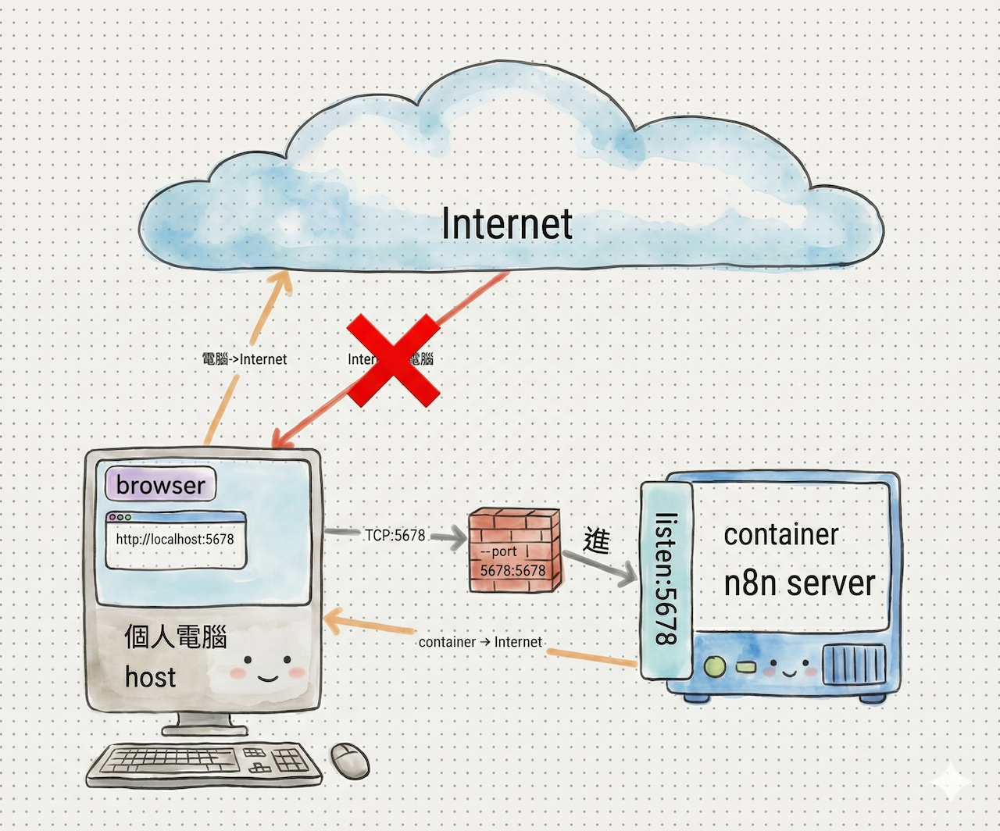
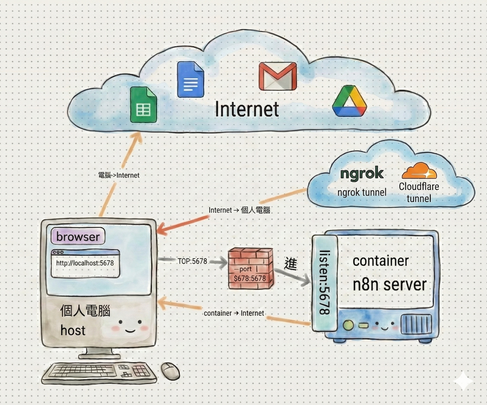

# 第一章：n8n 安裝與備份


## 目錄

- [1.1 安裝方式](#11-安裝方式)
- [1.2 n8n 備份與還原方式](#12-n8n-備份與還原方式)

---

## 1.1 安裝方式

根據您的使用需求，我們提供三種不同的安裝方式。請先參考下方的**使用情境選擇指南**，選擇最適合您的安裝方式。

### 📋 使用情境選擇指南

選擇適合您的安裝方式：

| 情境 | 適用安裝方式 | 說明 |
|------|------------|------|
| **只在本機使用**<br>不需要外部服務連接 | [方式一](#方式一本機安裝-localhost) | 最簡單的安裝方式，適合測試和學習 |
| **跨電腦訪問**<br>例如：Mac 訪問 Raspberry Pi 上的 n8n | [方式二](#方式二ssh-tunnel-安裝) | 透過 SSH Tunnel 安全連接，不需公開網址 |
| **需要外部服務整合**<br>例如：LINE Bot、Google OAuth、Webhook | [方式三](#方式三ngrok-公開網址安裝) | 使用 ngrok 建立公開網址，支援完整功能 |

---

### 方式一：本機安裝 (localhost)

#### 🎯 適用情境
- 只在同一台電腦上使用 n8n
- 不需要接收外部 Webhook
- 適合學習和測試

#### 前置需求
- 已安裝 Docker Desktop 或 Docker Engine
- 確保 Docker 服務正在運行

#### 安裝步驟

**步驟 1：建立資料卷**（用於持久化儲存 n8n 的設定和資料）

```bash
docker volume create n8n_data
```

**步驟 2：啟動 n8n 容器**

```bash
docker run -d \
  --name n8n \
  -p 5678:5678 \
  -v n8n_data:/home/node/.n8n \
  -e GENERIC_TIMEZONE="Asia/Taipei" \
  docker.n8n.io/n8nio/n8n
```

**步驟 3：訪問 n8n**

在瀏覽器中開啟：`http://localhost:5678`



---

### 方式二：SSH Tunnel 安裝

#### 🎯 適用情境
- n8n 安裝在另一台電腦上（例如：Raspberry Pi）
- 需要從本機電腦（Mac/Windows）訪問遠端的 n8n
- 不需要公開網址，只需內網訪問
- 需要使用 Google OAuth 等服務（因為這些服務要求 localhost 或 HTTPS）

#### 前置需求
- 遠端電腦已安裝 Docker
- 本機電腦可透過 SSH 連接遠端電腦
- 知道遠端電腦的 IP 位址

#### 安裝步驟

**步驟 1：在遠端電腦上建立資料卷**

```bash
docker volume create n8n_data
```

**步驟 2：在遠端電腦上啟動 n8n 容器**

```bash
docker run -d \
  --name n8n \
  -p 5678:5678 \
  -v n8n_data:/home/node/.n8n \
  -e GENERIC_TIMEZONE="Asia/Taipei" \
  -e N8N_SECURE_COOKIE=false \
  docker.n8n.io/n8nio/n8n
```

**步驟 3：在本機電腦建立 SSH Tunnel**

> ⚠️ **為什麼需要 SSH Tunnel？**
> 
> Google API 等服務通常不允許 `http://` 開頭的內部 IP 位址（如 `http://192.168.x.x:5678`）作為「已授權的重新導向 URI」，除非是 `localhost`。
> 
> 透過 SSH Tunnel，我們可以將本機的 `localhost:5678` 映射到遠端電腦的 n8n 服務，這樣就能以 `http://localhost:5678` 的形式訪問，滿足 OAuth 的要求。

在本機電腦執行以下指令：

```bash
# 語法：ssh -L <本地Port>:localhost:<遠端Port> <使用者>@<遠端IP>
ssh -L 5678:localhost:5678 pi@192.168.1.100
```

**步驟 4：訪問 n8n**

保持 SSH 連線不中斷，在本機瀏覽器中開啟：`http://localhost:5678`

---

### 方式三：ngrok 公開網址安裝

#### 🎯 適用情境
- 需要接收外部服務的 Webhook（例如：LINE Bot、GitHub Webhook）
- 需要使用 OAuth 2.0 整合第三方服務（例如：Google、Notion）
- 想要使用 **n8n MCP** 的功能 (讓 AI 能夠搜尋、執行、檢查您的工作流程)
- 需要在任何地方訪問你的 n8n
- n8n 可安裝在本機或遠端電腦（Raspberry Pi）

#### 前置需求
- 已安裝 Docker Desktop 或 Docker Engine
- 需要註冊 ngrok 帳號（免費版即可）

---

#### 第一階段：安裝 ngrok 並啟動通道取得網址

ngrok 登入後的 **Setup & Installation** 提供了完整的引導流程，請依序完成以下 4 個步驟：

**步驟 1：註冊 / 登入 ngrok**
- 前往 [dashboard.ngrok.com](https://dashboard.ngrok.com/)。
- 推薦直接點選 **「Continue with Google」/ Google 帳號快速登入**。

**步驟 2：安裝 ngrok 應用程式 (Install the ngrok agent)**
- 登入後，點選左側選單 **Getting Started** > **Setup & Installation**。
- 系統會自動偵測您的作業系統，並提供安裝指令：
  - **macOS**（推薦使用 Homebrew 安裝）：
    ```bash
    brew install ngrok
    ```
  - **Windows**（推薦使用 PowerShell 透過 Scoop 安裝）：
    ```powershell
    # 1. 若尚未安裝 Scoop，先在 PowerShell 執行安裝 Scoop
    Set-ExecutionPolicy -ExecutionPolicy RemoteSigned -Scope CurrentUser
    Invoke-RestMethod -Uri https://get.scoop.sh | Invoke-Expression

    # 2. 透過 Scoop 安裝 ngrok
    scoop install ngrok
    ```
  - **Raspberry Pi / 其他方式**：請參考 [👉 各平台詳細安裝教學](./ngrok各平台設定教學.md)。

**步驟 3：綁定專屬 Authtoken (Add your authtoken)**
- 在 **Setup & Installation** 頁面的第 2 步（或左側選單 **Your Authtoken**），直接複製指令並於終端機執行：
  ```bash
  ngrok config add-authtoken <您的Authtoken>
  ```

**步驟 4：啟動 ngrok 並取得專屬公開網址** ⭐️
- 在終端機直接輸入以下指令啟動通道：
  ```bash
  ngrok http 5678
  ```
- 啟動後，終端機會直接顯示所有連線資訊面板（包含帳號、狀態與固定網址）：
  ```text
  Session Status                online
  Account                       your-name@gmail.com (Plan: Free)
  Web Interface                 http://127.0.0.1:4040
  Forwarding                    https://xxxx-xxxx.ngrok-free.dev -> http://localhost:5678
  ```
- **請複製 `Forwarding` 欄位中的 HTTPS 網址**（例如：`https://xxxx-xxxx.ngrok-free.dev`），接下來啟動 n8n 容器時會使用此網址！
- ⚠️ **請保持此終端機視窗開啟**，不要關閉它（關閉則通道中斷）。若需執行後續指令，請另外開啟新的終端機視窗。

---

#### 第二階段：安裝 n8n 並設定

**步驟 1：建立資料卷**

```bash
docker volume create n8n_data
```

**步驟 2：啟動 n8n 容器**

> ⚠️ **指令語法關鍵注意事項（避免語法報錯）**：
> 1. **請勿保留 `<>` 符號**：請直接將範例中的網址替換為您從 ngrok 取得的真實網址（例如 `abcd-1234.ngrok-free.dev`）。
> 2. **`=` 符號左右不可有空格**：例如 `-e N8N_PORT=5678`，寫成 `-e N8N_PORT = 5678` 會導致容器啟動失敗。
> 3. **每行結尾反斜線 `\` 前方需有空格**：換行反斜線 `\` 前請保留一個空格，且 `\` 之後不可有任何空格或字元。
> 4. **網址格式區分**：`N8N_HOST` **不加** `https://`；而 `N8N_EDITOR_BASE_URL` 與 `WEBHOOK_URL` **必須包含** `https://`。

```bash
docker run -d \
  --name n8n \
  --restart always \
  -p 5678:5678 \
  -e N8N_HOST=abcd-1234.ngrok-free.dev \
  -e N8N_PROTOCOL=https \
  -e N8N_PORT=5678 \
  -e N8N_EDITOR_BASE_URL=https://abcd-1234.ngrok-free.dev \
  -e WEBHOOK_URL=https://abcd-1234.ngrok-free.dev \
  -e GENERIC_TIMEZONE=Asia/Taipei \
  -v n8n_data:/home/node/.n8n \
  docker.n8n.io/n8nio/n8n
```



---

<details>
<summary>📂 <b>方式四：GoDaddy 申請正式網域與 Cloudflare Tunnel (暫停使用 - 點擊展開)</b></summary>

##### 申請流程
1. 登入 Godaddy 申請正式網址（建議申請 1 年最便宜的，每年重新申請）。
2. 登入 Cloudflare 註冊免費帳號，將申請的正式網址加入 Cloudflare。
3. 取得 Cloudflare 的 2 組 Name Servers。
4. 登入 Godaddy 帳戶，進入網域設定將原有的 Name Servers 改為 Cloudflare 的 2 組 Name Servers。

##### 驗證方式
1. 登入 Godaddy 帳戶查看 Name Servers 是否已成功替換。
2. 登入 Cloudflare 帳戶查看該網域狀態是否為使用中。

##### 終端機指令驗證方式
- 查詢 DNS Server 狀態：
  ```bash
  dig ns <你的網域> @8.8.8.8
  dig ns <你的網域> @1.1.1.1
  ```

##### 設定 Cloudflare Tunnel
1. 進入 [one.dash.cloudflare.com](https://one.dash.cloudflare.com/)
2. 點選 **Access** > **Tunnels** > **Create a tunnel**

##### 本機安裝與啟動 Tunnel 連接器
- 安裝連接器：
  ```bash
  brew install cloudflared
  ```
- 啟動 Tunnel：
  ```bash
  cloudflared tunnel run --token <你的token>
  ```
- 驗證 Tunnel 狀態：
  ```bash
  cloudflared tunnel list
  ```

</details>

#### 重要說明

- **連接本機服務**：若需要在 n8n 工作流程中連接本機電腦的服務（如本地 API、資料庫等），請使用 `host.docker.internal` 作為主機名稱
  - 例如：`http://host.docker.internal:8080/api`
- **時區設定**：已設定為 `Asia/Taipei`，確保工作流程的時間戳記正確
- **資料持久化**：使用 `n8n_data` 卷儲存所有設定，即使容器重新啟動也不會遺失資料

#### 驗證安裝

執行以下命令檢查容器是否正常運行：

```bash
docker ps | grep n8n
```

應該會看到 n8n 容器在運行中。

---

## 1.2 n8n 備份與還原方式 💾

當您完成 n8n 安裝與設定後，為了確保資料安全，請務必了解如何定期備份您的工作流與資料庫。

👉 請前往參考專屬教學章節：[**n8n的備份方式**](../n8n的備份方式/README.md)

---

## 1.3 n8n 軟體更新（升級至最新版）🔄

當 n8n 發布新版本時，只需更新 Docker 映像檔並重新建立容器即可完成升級：

> 💡 **資料安全保證**：工作流程、憑證等所有設定均保存在 `n8n_data` 資料卷中，刪除容器與映像檔**不會遺失任何資料**。

**步驟 1：停止並刪除現有容器**
```bash
docker stop n8n
docker rm n8n
```

**步驟 2：刪除舊映像檔並拉取最新版本**
```bash
# 刪除舊的 n8n 映像檔
docker rmi docker.n8n.io/n8nio/n8n

# 下載最新版映像檔
docker pull docker.n8n.io/n8nio/n8n
```

**步驟 3：重新啟動 n8n 容器**
執行您原本使用的 `docker run` 指令（帶入相同的環境變數與 `-v n8n_data:/home/node/.n8n` 資料卷）即可完成升級！

---

## 1.4 忘記登入密碼 / 完整重置系統 ⚠️

若您忘記了 n8n 管理員帳號或密碼，需透過刪除資料卷來重置系統：

> 🚨 **警告**：刪除 `n8n_data` 資料卷會**徹底清空所有現存的工作流程、帳號與 API 憑證**！若有重要資料請確保事先已有備份。

**步驟 1：停止並刪除 n8n 容器**
```bash
docker stop n8n
docker rm n8n
```

**步驟 2：刪除現有的資料卷 (Volume)**
```bash
docker volume rm n8n_data
```

**步驟 3：重新建立資料卷**
```bash
docker volume create n8n_data
```

**步驟 4：重新啟動 n8n 容器**
執行原本的 `docker run` 指令重新啟動容器，啟動後開啟瀏覽器即可看到初始註冊畫面，重新建立全新的帳號與密碼。
