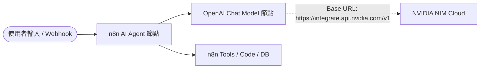

# NVIDIA NIM (Inference Microservice) 整合與設定指南 🟢

**NVIDIA NIM**（NVIDIA 推論微服務）是 NVIDIA 官方提供的企業級 AI 推論平台，整合了全球領先的開源與專有大型語言模型（LLM）。透過 [NVIDIA Models Catalog (build.nvidia.com/models)](https://build.nvidia.com/models)，開發者與政府機構可以在註冊後獲得**免費推論額度（Free API Credits / Free Endpoints）**，並透過標準 **OpenAI 相容 API** 格式，將頂級歐美 AI 模型無縫串接至 n8n 自動化流程中。

---

## 🏛️ 政府機關資通安全合規說明

> [!IMPORTANT]
> **遵循行政院「各機關使用生成式 AI 參考指引」與資安政策**  
> 依據我國資通安全法規與公務機關資訊使用規範，公務環境**嚴禁使用大陸廠牌、陸資背景或伺服器位於受限制區域之 AI 服務與模型**（如 DeepSeek、Qwen 通義千問、Yi 零一萬物、ChatGLM、Moonshot Kimi、MiniMax 等）。

本教學所推薦之 NVIDIA NIM 模型具備以下合規優勢：
1. **原廠與發布者皆為歐美頂尖科技團隊**：包含 NVIDIA（美商輝達）、Meta（美商）、Poolside（美法合資）、Mistral AI（法國）等。
2. **推論服務由 NVIDIA 美國雲端官方節點代管**：保證 API 傳輸具備企業級 TLS/SSL 加密。
3. **支援 Agent 工具調用（Tool Calling）**：完全適配 n8n AI Agent 節點架構。

---

## 📋 目錄

- [1. 註冊 NVIDIA 帳號與取得 API Key 🔑](#1-註冊-nvidia-帳號與取得-api-key-)
  - [如何手動前往「API Keys」管理頁面？](#-如何手動前往api-keys管理頁面)
  - [什麼是 RPM（API Rate Limit 速率限制）？](#️-什麼是-rpmapi-rate-limit-速率限制)
- [2. 適合政府機關之非中國推薦模型清單](#2-適合政府機關之非中國推薦模型清單)
- [3. 在 n8n 中串接 NVIDIA NIM 模型](#3-在-n8n-中串接-nvidia-nim-模型)
  - [步驟一：建立 OpenAI Credential 憑證](#步驟一建立-openai-credential-憑證)
  - [步驟二：在工作流中加入 OpenAI Chat Model 節點](#步驟二在工作流中加入-openai-chat-model-節點)
- [4. API 終端機連線驗證 (cURL)](#4-api-終端機連線驗證-curl)
- [5. 常見問題與排錯指南 (FAQ)](#5-常見問題與排錯指南-faq)

---

## 1. 註冊 NVIDIA 帳號與取得 API Key 🔑

1. **前往官網模型庫**：進入 [NVIDIA Models 目錄 (https://build.nvidia.com/models)](https://build.nvidia.com/models)。
2. **登入 / 註冊**：點擊右上角 **Sign In / Join**，可使用公務 Email 或 Google / GitHub 帳號註冊登入。
3. **篩選免費模型 (Free Endpoints)**：
   - 進入頁面後，請在**左側邊欄（Left Sidebar）篩選選單中勾選「Free Endpoints」**。
   - 系統會自動過濾出所有由 NVIDIA 官方雲端免費託管、可直接取得 API Key 即時調用的模型。
4. **進入模型體驗區**：從篩選結果中點選任一推薦模型（例如 [nemotron-3.5-lightning-30b-a3b](https://build.nvidia.com/nvidia/nemotron-3.5-lightning-30b-a3b)）。
5. **生成 API Key**：
   - 點擊頁面上的 **Get API Key** 或 **Generate Key** 按鈕。
   - 系統將生成以 `nvapi-` 開頭的專屬 API Key。
   - 複製並安全妥善保存該金鑰。

### 📌 如何手動前往「API Keys」管理頁面？
若在按下 **Generate Key** 之後不小心關閉彈跳視窗，或者日後需要建立新金鑰或檢視現有憑證，請依以下步驟手動進入管理頁面：
1. 點擊頁面**右上角的個人頭像／姓名縮寫圖示**（例如右上角的圓形綠色頭像）。
2. 在下拉選單中點選 **`🔑 API Keys`**。
3. 即可進入 API Keys 管理中心（`View and manage the API Keys`），在此處可查看所有金鑰清單（包含 Key ID、Key Name、Key Value、到期日 Expiration 與 Active 啟用狀態），亦可隨時新增或撤銷金鑰。

---

### ⏱️ 什麼是 RPM（API Rate Limit 速率限制）？

在右上角個人選單中，您會看到系統標註 **`Your API Rate Limit: Up to 40 rpm`**：

#### 1. RPM 定義
- **RPM** 為 **Requests Per Minute**（**每分鐘請求次數**）的縮寫。
- **40 RPM 的含意**：代表您的帳號每 **60 秒內最多可向 NVIDIA API 發出 40 次請求**。
- 若短時間內發送請求過於頻繁（例如 1 分鐘內超過 40 次），NVIDIA 伺服器將會回傳 `HTTP 429 (Too Many Requests)` 速率限制錯誤。

#### 2. 常見 AI 速率限制名詞比較
| 限制指標 | 英文全名 | 中文定義 | 說明與公務應用情境 |
| :--- | :--- | :--- | :--- |
| **RPM** | Requests Per Minute | **每分鐘請求數** | 控制呼叫次數頻率（NVIDIA 免費層提供 **40 RPM**，對話與單筆公文處理非常充裕）。 |
| **TPM** | Tokens Per Minute | **每分鐘 Token 數** | 控制每分鐘處理的文字字元/Token 總量，防止超長文件瞬間塞爆伺服器。 |
| **RPD** | Requests Per Day | **每日請求數** | 單日累計允許呼叫的總次數上限。 |

#### 3. 在 n8n 自動化流程中的實戰建議
> [!TIP]
> - **一般即時互動（LINE / Webhook / Chatbot）**：民眾或同仁單筆發問頻率通常不高，40 RPM 完全綽綽有餘。
> - **批次處理大量資料（Batch Loop）**：若工作流需從 Google Sheets 或資料庫一次讀取上百筆公文並透過迴圈逐筆進行 AI 分析，請務必在 Loop 迴圈節點之間加入 **Wait 節點**（例如暫停 `1.5 ~ 2 秒`），以確保平穩在 40 RPM 之內安全運行！

> [!NOTE]
> **NVIDIA 官方最新免費政策說明**：  
> NVIDIA 目前已將過去的「1,000 Credits 點數扣抵制」全面升級改版為 **「Rate-Limit（速率限制）免費試用模式」**。  
> 現在系統**不再扣除點數**，也不會顯示剩餘點數餘額；只要呼叫頻率維持在您的帳號速率限制內（如右上角顯示的 **`Up to 40 rpm`**），即可持續免費調用 API Catalog 上的所有支援模型進行開發、測試與教學！

---

## 2. 適合政府機關之非中國推薦模型清單

以下精選符合**非中國製造、歐美團隊研發、具備高安全性與強大 Agent 能力**的精選模型：

| 模型名稱 (Model ID) | 發布團隊 / 國別 | 架構 / 特性 | 適用場景與優勢 |
| :--- | :--- | :--- | :--- |
| **`nvidia/nemotron-3.5-lightning-30b-a3b`** *(首選推薦)* | NVIDIA（美國） | 30B MoE（啟用 3B） | **極速對話、低延遲、Agent 流程**<br>專為工具調用 (Tool Calling) 最佳化，適合 n8n 即時客服與多步驟工作流。 |
| **`meta/muse-glimmer-30b`** | Meta（美國） | 30B 多模態視覺與推理 | **多模態圖文分析、獨立 Reasoning 推理**<br>支援圖片輸入與公文/圖表解析，具備原生 Tool Calling。 |
| **`nvidia/nemotron-3-ultra-550b-a55b`** | NVIDIA（美國） | 550B MoE 巨型旗艦 | **深度邏輯推理、超長上下文 (1M context)**<br>適合長篇公文比對、複雜規劃、全域程式碼分析等高難度任務。 |
| **`poolside/laguna-xs-2.1`** | Poolside（美法合資） | 33B MoE 軟體工程專用 | **程式碼撰寫、終端指令執行與自動化腳本**<br>專為 Code 邏輯與技術支援自動化 Agent 設計。 |
| **`meta/llama-3.3-70b-instruct`** | Meta（美國） | 70B Dense 開源標竿 | **高品質繁體中文公文撰寫、摘要與語意理解**<br>開源界評測表現優異，對話流暢且邏輯嚴謹。 |
| **`mistralai/mistral-large-2-instruct`** | Mistral AI（法國） | 123B 歐洲旗艦模型 | **跨語言公文翻譯、進階推理、多語言指令遵循**<br>歐洲代表性開源先驅，符合 GDPR 最高隱私標準。 |

---

## 3. 在 n8n 中串接 NVIDIA NIM 模型

NVIDIA NIM 完全相容於 **OpenAI API 規範**，因此在 n8n 中直接使用內建的 **OpenAI Chat Model** 或 **OpenAI Node** 即可直接連線！

### 步驟一：建立 OpenAI Credential 憑證

1. 開啟 n8n 管理後台，點擊左側導覽列的 **Credentials** ➔ **Add Credential**。
2. 搜尋並選擇 **OpenAI API**。
3. 填入以下連線資訊：
   - **Credential Name**：`NVIDIA NIM API`（自訂便於識別的名稱）
   - **API Key**：貼上以 `nvapi-...` 開頭的 NVIDIA API Key。
4. 點擊 **Save** 儲存憑證。

---

### 步驟二：在工作流中加入 OpenAI Chat Model 節點

1. 在工作流程中新增 **AI Agent** 或 **Basic LLM Chain** 節點。
2. 在 Model 連接端點點擊 `+` 號，搜尋並新增 **OpenAI Chat Model** 節點。
3. 節點參數配置如下：
   - **Credential for OpenAI**：選擇剛剛建立的 `NVIDIA NIM API`。
   - **Model**：選擇 `Custom Model Name`，手動輸入模型 ID（例如 `nvidia/nemotron-3.5-lightning-30b-a3b` 或 `meta/llama-3.3-70b-instruct`）。
   - **Base URL (重要)**：展開下方 **Options** ➔ 勾選 **Base URL**，輸入：
     ```text
     https://integrate.api.nvidia.com/v1
     ```
   - **Temperature**：建議設定為 `0.2` ~ `0.7`（公文處理與格式轉換建議 `0.2`，創意生成建議 `0.7`）。



---

## 4. API 終端機連線驗證 (cURL)

若要在本機終端機快速驗證 NVIDIA NIM API Key 與模型是否正常運作，可複製並執行以下指令（請將 `YOUR_NVIDIA_API_KEY` 替換為您的金鑰）：

```bash
curl -X POST "https://integrate.api.nvidia.com/v1/chat/completions" \
  -H "Authorization: Bearer YOUR_NVIDIA_API_KEY" \
  -H "Content-Type: application/json" \
  -d '{
    "model": "nvidia/nemotron-3.5-lightning-30b-a3b",
    "messages": [
      {
        "role": "user",
        "content": "請用繁體中文以公務簡報風格介紹你自己。"
      }
    ],
    "temperature": 0.5,
    "max_tokens": 512
  }'
```

---

## 5. 常見問題與排錯指南 (FAQ)

### Q1：呼叫時出現 `401 Unauthorized` 錯誤？
- **原因**：API Key 錯誤或未完整複製。
- **排查方式**：請確認金鑰開頭為 `nvapi-`，且前後沒有多餘空格。若過期或失效，請至 [build.nvidia.com](https://build.nvidia.com/) 重新生成。

### Q2：出現 `404 Model Not Found` 錯誤？
- **原因**：模型名稱拼寫錯誤或未加上發布者命名空間（Namespace）。
- **排查方式**：模型名稱必須包含前綴，例如正確格式為 `nvidia/nemotron-3.5-lightning-30b-a3b`，請勿只輸入 `nemotron-3.5-lightning-30b-a3b`。

### Q3：n8n 提示連線超時 (Timeout) 或無法解析網址？
- **原因**：Base URL 未設定正確。
- **排查方式**：請確認 Base URL 為 `https://integrate.api.nvidia.com/v1`（結尾包含 `/v1`，且末尾不要有斜線 `/`）。
