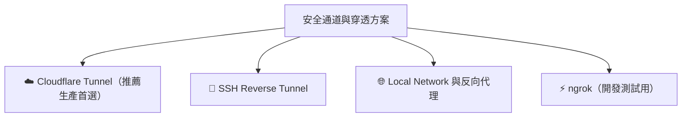

# 🚇 生產級安全通道與穿透方案 (Production Tunnel)

在將 n8n、自建 API 或 AI 服務部署於地端（Local）、家用伺服器或 Raspberry Pi 時，為了讓外部網路能 7x24 小時安全且穩定地存取（如接收 LINE Webhook、Google OAuth 回調、遠端 AI 控制），需要具備固定網域與安全通道。

本目錄提供了各種在**生產環境（Production）**中推薦的安全穿透與固定網址設定方案：

---

## 🧭 方案指南導覽

### 1. [☁️ Cloudflare Tunnel 設定指南](./cloudflare_tunnel.md) ⭐️ **(生產環境首選)**
* **優點**：
  - 完全免費、無連線數量限制。
  - 支援綁定自有自訂頂級網域（如 `n8n.yourdomain.com`）。
  - 自動享有 Cloudflare 全球 CDN 快取、免費 SSL 證書與 DDoS 防禦。
  - 不需要開啟路由器連接埠轉發（No Port Forwarding），支援 Raspberry Pi 與 Docker 背景常駐執行。
* **延伸閱讀**：
  - [Cloudflare DNS 與 GitHub Page 綁定教學](./cloudflare_dns_github_page.md)
  - [Docker Compose 部署範本](./docker-compose.yml)

### 2. [🔐 SSH 反向通道設定 (SSH Reverse Tunnel)](./ssh_tunnel.md)
* **適用情境**：擁有自己的 VPS 雲端主機（如 AWS EC2、GCP、DigitalOcean），透過 SSH 將雲端主機連接埠映射至本機內網服務。

### 3. [🌐 區域網路與反向代理 (Local Network)](./local_network.md)
* **適用情境**：企業內網或家庭網路環境中的 IP 規劃與 Nginx / Caddy 反向代理架構。

### 4. [⚡ ngrok 通道設定指南](./ngrok_tunnel.md)
* **適用情境**：快速開發與臨時除錯（免費用戶限單一通道）。

---

## 📊 開發測試 (ngrok) vs 生產環境 (Cloudflare Tunnel) 比較

| 評估維度 | ⚡ ngrok（適合開發階段） | ☁️ Cloudflare Tunnel（適合正式上線） |
| :--- | :--- | :--- |
| **主要定位** | 快速本機除錯、測試 Webhook | 7x24 小時常駐運行、正式生產環境 |
| **通道數量限制** | 免費版限 **1 個 Tunnel** | **完全無通道數量限制** |
| **自訂獨立網域** | 免費版使用隨機子網域（重啟可能變動） | 支援**自有頂級網域**（如 `n8n.mydomain.com`） |
| **背景常駐服務** | 關閉終端機即中斷（需付費或自行寫 service） | 原生支援 systemd 服務與 Docker 背景常駐 |
| **成本** | 免費版功能受限，進階需月費 | **完全免費** |
