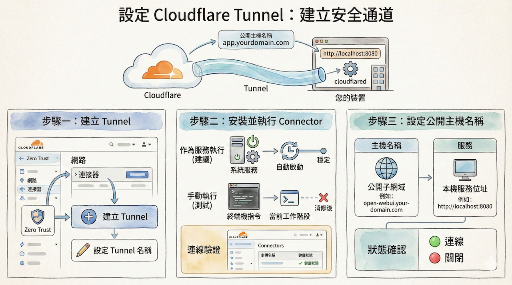
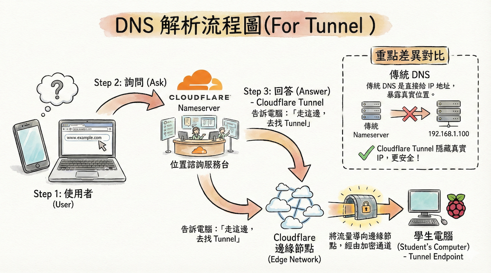
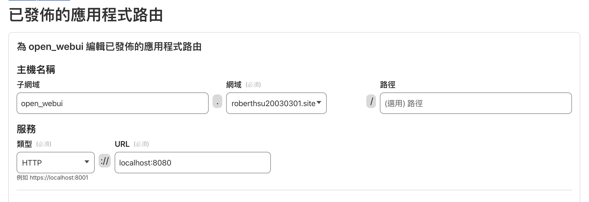
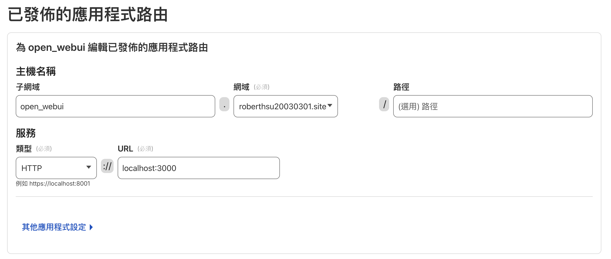

# Cloudflare Tunnel

## 目錄

- [什麼是 Cloudflare Tunnel？](#什麼是-cloudflare-tunnel)
- [快速開始](#快速開始)
  - [前置需求](#前置需求)
  - [選擇部署方式](#選擇部署方式)
- [方式一：在 Raspberry Pi OS 上設定（推薦初學者）](#方式一在-raspberry-pi-os-上設定推薦初學者)
  - [步驟一：設定個人網域](#步驟一設定個人網域)
  - [步驟二：建立 Tunnel](#步驟二建立-tunnel)
  - [步驟三：整合 DNS](#步驟三整合-dns)
  - [步驟四：驗證與檢查](#步驟四驗證與檢查)
- [方式二：使用 Docker 部署（進階使用者）](#方式二使用-docker-部署進階使用者)
  - [使用 docker run 指令 -> network:host](#使用-docker-run-指令--networkhost)
  - [使用 docker run 指令 -> network:bridge](#使用-docker-run-指令--networkbridge)
  

---

## 什麼是 Cloudflare Tunnel？

Cloudflare Tunnel 是一種能夠安全地將您的內部服務連接到 Cloudflare 全球網路的工具，而無需對外暴露公開的 IP 位址。它透過在您的伺服器上運行的輕量級代理程式 `cloudflared`，建立一個僅限對外的安全連線，讓內外部流量可以雙向傳輸。

### 核心觀念

> **建立一個 Tunnel 通道，並在您的裝置上執行 `cloudflared` 程式來連接它。接著，設定一個公開的主機名稱 (例如 `app.yourdomain.com`)，並將其對應到您本機的服務 (例如 `http://localhost:8080`)。**



**Tunnel vs 傳統的 Port Forwarding**

> [Tunnel vs 傳統的port Forwarding的關念圖](./images/tunnel_portForwarding.png)

---

## 快速開始

### 前置需求

在開始設定 Cloudflare Tunnel 之前，您需要：

1. **一個個人網域**（可在 [GoDaddy](https://godaddy.com) 或其他註冊商購買）
2. **Cloudflare 帳號**（免費版即可）
3. **Raspberry Pi** 或已安裝 Docker 的伺服器
4. **已運行的本機服務**（例如 Open WebUI、n8n 等）

### 選擇部署方式

根據您的使用情境選擇適合的部署方式：

| 部署方式 | 適用對象 | 優點 |
|---------|---------|------|
| **Raspberry Pi OS** | 初學者、單一服務 | 設定簡單、易於理解 |
| **Docker (docker run)** | 熟悉 Docker 的使用者 | 快速部署、易於管理 |
| **Docker Compose** | 多服務管理、進階使用者 | 統一管理、配置清晰 |

> 💡 **建議**：初學者先在 Raspberry Pi OS 上測試，熟悉流程後再使用 Docker 部署。

---

## 方式一：在 Raspberry Pi OS 上設定（推薦初學者）

### 步驟一：設定個人網域

> **核心觀念**：一旦將網域的名稱伺服器 (Nameserver) 指向 Cloudflare，DNS 的管理權限即由 Cloudflare 接管，而非原註冊商（如 GoDaddy）。


#### 1. 註冊網域並更新名稱伺服器

1. **註冊網域**：於網域註冊商（如 [GoDaddy](https://godaddy.com)）申請一個個人網域。
2. **新增網站至 Cloudflare**：
   * 登入 [Cloudflare](https://cloudflare.com)
   * 將您剛申請的網域新增為一個站點
   * 進入該站點的 DNS 設定頁面
   * Cloudflare 會提供兩組專屬的名稱伺服器 (Nameserver) 位址
3. **更新名稱伺服器**：
   * 回到 GoDaddy 的 DNS 管理頁面
   * 找到「名稱伺服器 (Nameservers)」設定
   * 將其從 GoDaddy 預設值更改為 Cloudflare 提供的那兩組位址

#### 2. 驗證網域設定

**圖形化介面 (GUI) 驗證**

1. 登入 Cloudflare，檢查您網域專案的狀態是否顯示為 **`使用中 (Active)`**
2. 導覽至專案內的 **`DNS > 記錄 (Records)`** 頁面，確認您有權限新增或編輯 DNS 記錄

**命令列介面 (CLI) 驗證**

若您的系統（如 Raspberry Pi）尚未安裝 DNS 查詢工具，請執行：

```bash
sudo apt update
sudo apt install dnsutils
```

接著，查詢您網域的 NS (Name Server) 記錄：

```bash
# 使用 nslookup
nslookup -type=NS your-domain.com

# 或使用 dig
dig NS your-domain.com
```

如果回傳的結果是 Cloudflare 提供的那兩組伺服器位址，即代表設定正確。



---

### 步驟二：建立 Tunnel

#### 1. 進入 Cloudflare Zero Trust 儀表板

1. 在 Cloudflare 儀表板中，導覽至 **`Zero Trust`**
2. 在左側選單中，選擇 **`網路 (Network) > 連接器`**
3. 點擊 **`建立 Tunnel (Create a Tunnel)`**

#### 2. 選擇通道類型

* 通道類型選擇 **Cloudflared**

  > Cloudflared 是 Cloudflare 提供的官方連接器，用來在本機與 Cloudflare 之間建立安全通道。

#### 3. 為通道命名

* 輸入通道名稱，例如：`web`、`app`、`n8n`
* 此名稱僅用於管理與識別，不影響實際對外網址

#### 4. 選擇執行環境

* 依實際主機作業系統選擇，例如：**Debian**、**Ubuntu**、**Raspberry Pi OS**

#### 5. 安裝 cloudflared 應用程式

* 依照 Cloudflare 提供的指令，在終端機中下載並安裝 `cloudflared`
* 安裝完成後，即可使用 `cloudflared` 指令

#### 6. （建議）測試與服務安裝

* 可先手動執行 Tunnel，確認可正常連線
* 接著可將 `cloudflared` 安裝成系統服務（service），讓電腦或伺服器開機時自動啟動 Tunnel

#### 7. 確認連線狀態

* 回到 Dashboard 確認連線狀態
* 若連線成功，下方 **Connectors** 區域會顯示該主機為 **已連線（Connected）**

#### 8. 進入下一步

* 確認無誤後，點選 **「下一步（Next）」**

---

### 步驟三：整合 DNS

此步驟的目的，是將自己的網域名稱（DNS）指向剛建立的 Tunnel。

#### 1. 進入 DNS 整合設定

* 進入 **整合 DNS（Route Tunnel / Publish Application）** 步驟

#### 2. 選擇應用程式類型

* 選擇 **為 Web 新增已發佈的應用程式路由**

  > 代表透過 Tunnel，將外部網域的請求安全地轉送到內部服務。

#### 3. 設定主機名稱（Hostname）

* **子網域（Subdomain）**：例如 `www`、`app`、`n8n`
* **網域（Domain）**：選擇已加入 Cloudflare 並由其管理 DNS 的網域
* 組合後的對外網址例如：`app.example.com`

#### 4. （選擇性）設定路徑（Path）

* 若只想讓特定路徑走此 Tunnel，可設定如：`/api`
* 若整個網站或服務都使用 Tunnel，可留空

#### 5. 設定服務（Service）

* **類型（Type）**：通常選擇 `HTTP` 或 `HTTPS`
* **URL**：輸入內部服務位址，例如：
  * `http://localhost:3000`
  * `http://127.0.0.1:5678`

#### 6. （進階）其他應用程式設定

* 可依需求調整逾時、HTTP Host Header、TLS 等進階選項
* 教學或初學情境可先維持預設值

#### 7. 完成設定

* 點選 **「完成設定（Finish）」**
* Cloudflare 會自動建立對應的 DNS 紀錄，並將流量導向 Tunnel

---

### 步驟四：驗證與檢查

#### 驗證設定結果

1. 在瀏覽器輸入設定的網域名稱
2. 若內部服務畫面可正常顯示，表示：
   * DNS 設定成功
   * Tunnel 連線成功
   * 本機服務運作正常


#### 檢查連線狀態

之後，您可以在 Cloudflare 的 Tunnel 設定頁面，透過 **通道名稱** 區塊的狀態來判斷連線是否成功：

* 正常連線時會顯示 **`連線`**
* 若中斷則會顯示 **`關閉`**

---

## 方式二：使用 Docker 部署（進階使用者）

本節說明如何在 Docker 環境中設定 Cloudflare Tunnel，適用於已使用 Docker 部署服務的場景。

### 使用 docker run 指令 -> network:host

#### 步驟一：部署 Open WebUI 容器

首先，建立 Open WebUI 服務容器：

```docker
docker run -d \
  --network=host \
  -v open-webui:/app/backend/data \
  -e OLLAMA_BASE_URL=http://127.0.0.1:11434 \
  --name open-webui \
  --restart always \
  ghcr.io/open-webui/open-webui:main
```

#### 步驟二：部署 Cloudflare Tunnel 容器

##### ⚠️ 重要提醒

**請勿直接使用 Cloudflare 官方文件建議的 Docker 指令**，否則會出現連線問題。

##### 為什麼會出錯？

此指令缺少以下關鍵參數，會導致連線失敗：

1. **缺少 `--network=host` 參數**
   * 容器無法正常連線到本機服務（如 `localhost:3000`）
   * Tunnel 無法將外部請求轉送到內部服務

2. **缺少 `-d` 參數**
   * 容器以前景模式執行，終端機關閉後容器也會停止
   * 無法在背景持續運行

##### ✅ 正確的 Docker 指令

使用以下指令可確保 Tunnel 正常運作：

```docker
docker run -d \
  --name cloudflared \
  --network=host \
  --restart unless-stopped \
  cloudflare/cloudflared:latest \
  tunnel run --token <TOKEN>
```

##### 指令參數說明

* `-d`：以後台模式（detached mode）執行容器
* `--name cloudflared`：為容器命名，方便後續管理與操作
* `--network=host`：使用主機網路模式，讓容器可以直接存取 `localhost` 服務
* `--restart unless-stopped`：設定容器自動重啟策略，除非手動停止否則會自動重啟
* `<TOKEN>`：請替換為您在 Cloudflare Dashboard 中取得的 Tunnel Token


#### 步驟三：確認雲端Cloudflare Tunnel 已發佈的應用程式路由

**服務設定為:http://localhost:8080**



---

### 使用 docker run 指令 -> network:bridge

#### 步驟一：部署 Open WebUI 容器

首先，建立 Open WebUI 服務容器：

```docker
docker run -d \
-p 3000:8080 \
-v open-webui:/app/backend/data \
-e OLLAMA_BASE_URL=http://pi4Robert0301:11434 \
--name open-webui \
--restart always \
ghcr.io/open-webui/open-webui:main
```

#### 步驟二：部署 Cloudflare Tunnel 容器


##### ✅ 正確的 Docker 指令

使用以下指令可確保 Tunnel 正常運作：

```docker
docker run -d \
  --name cloudflared \
  --network=host \
  --restart unless-stopped \
  cloudflare/cloudflared:latest \
  tunnel run --token <TOKEN>
```

##### 指令參數說明

* `-d`：以後台模式（detached mode）執行容器
* `--name cloudflared`：為容器命名，方便後續管理與操作
* `--network=host`：使用主機網路模式，讓容器可以直接存取 `localhost` 服務
* `--restart unless-stopped`：設定容器自動重啟策略，除非手動停止否則會自動重啟
* `<TOKEN>`：請替換為您在 Cloudflare Dashboard 中取得的 Tunnel Token


#### 步驟三：確認雲端Cloudflare Tunnel 已發佈的應用程式路由

**服務設定為:http://localhost:3000**



---


