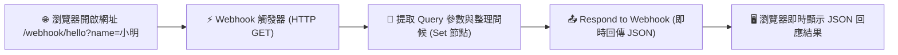

# Webhook 實作
## 範例 1：GET 請求與瀏覽器即時問候（零門檻快速入門）

### 📚 工作流程說明

這個 n8n 工作流程是專為初學者設計的第一個 Webhook 範例。您**完全不需要安裝 Postman 或撰寫任何程式碼**，只要將瀏覽器當作測試客戶端，在網址列輸入網址與參數（例如 `?name=小明`），就能立刻觸發 n8n 工作流程，並在瀏覽器畫面上即時看到 n8n 處理並回傳的結構化 JSON 問候資料！這能幫助您秒懂 Webhook 觸發、網址參數（Query Parameters）與即時回應的基本運作原理。

---

### 流程架構圖



---

### 工作流程樣版下載

- [📥 GET 請求與瀏覽器即時問候樣版 (get_hello_workflow.json)](./get_hello_workflow.json)

---

#### 📋 節點詳細說明

1. **📝 流程說明（Sticky Note）**
   - **功能**：畫布備忘錄，標記 Webhook 端點設定與資料提取步驟。

2. **⚡ 接收 GET Webhook 請求（Webhook Node）**
   - **功能**：監聽外部 HTTP GET 請求。
   - **設定要點**：
     - **HTTP Method**：`GET`（瀏覽器網址列預設使用的請求方式）
     - **Path**：`hello`
     - **Response Mode**：`Using 'Respond to Webhook' Node`（等待流程處理完畢後回傳自訂內容）

3. **📝 整理問候資料（Edit Fields / Set Node）**
   - **功能**：從網址查詢參數（Query）中取得訪客姓名與伺服器當前資訊：
     - `userName`：`={{ $json.query.name || '親愛的朋友' }}`
     - `welcomeMessage`：`=👋 哈囉 {{ $json.query.name || '親愛的朋友' }}！恭喜您成功觸發第一個 n8n Webhook！`
     - `serverTime`：`={{ $now.format('yyyy-MM-dd HH:mm:ss') }}`
     - `clientIp`：`={{ $json.headers['x-forwarded-for'] || $json.headers['host'] }}`

4. **📤 即時回傳 JSON 結果（Respond to Webhook Node）**
   - **功能**：將整理好的問候訊息與時間戳記組合成 JSON 格式回傳給瀏覽器。
   - **設定要點**：
     - **Respond With**：`JSON`
     - **Response Body**：回傳包含 `status`、`message`、`visitor`、`server_time` 的結構化物件。

---

#### 🧪 測試與驗證方法

##### 方式一：直接使用瀏覽器網址列（推薦，超直覺！）

1. 將 n8n 右上角開關切換為 **Active（已啟用）**。
2. 點開 Webhook 節點，複製 **Production URL**（例如：`https://<你的網域>/webhook/hello`）。
3. 打開瀏覽器分頁，在網址列貼上並附加 `?name=小明`：
   ```text
   https://<你的網域>/webhook/hello?name=小明
   ```
4. 按下 Enter，瀏覽器畫面將立即出現：
   ```json
   {
     "status": "success",
     "message": "👋 哈囉 小明！恭喜您成功觸發第一個 n8n Webhook！",
     "visitor": "小明",
     "server_time": "2026-08-30 20:30:00",
     "tip": "🎉 您可以直接在網址列修改 ?name=您的名字 來測試不同的問候！"
   }
   ```
5. 試著把網址改為 `?name=王老師` 或 `?name=Alice`，觀察網頁畫面的即時變化！

##### 方式二：使用 curl 指令測試

```bash
curl -X GET "https://<你的網域>/webhook/hello?name=小明"
```

---

#### 🎯 學習重點

- **Webhook GET 方法應用**：理解 GET 請求如何透過 URL 查詢字串傳遞資料。
- **Query 參數解析**：學會使用 `{{ $json.query.參數名 }}` 提取網址上的變數。
- **Respond to Webhook 即時回傳**：掌握讓調用端同步收到運算結果的配置方式。
- **預設值保護（Fallback）**：使用 `|| '預設值'` 避免用戶未傳入參數時發生錯誤。

---

#### 💡 實際應用場景

- **健康檢查端點 (Health Check API)**：提供外部監控服務定時發送 GET 請求檢查 n8n 與伺服器是否正常運行。
- **簡單資料查詢 API**：透過 GET 參數傳入產品編號或學號，即時回傳資料庫查詢結果。
- **驗證碼與啟用連結**：使用者在 Email 中點擊啟用連結時，透過 GET Webhook 自動完成帳號開通。

---

<details>
<summary>🤖 <strong>AI 賦能延伸實作（附 Prompt 提詞）</strong></summary>

> 💡 **任務目標**：透過 MCP 連線，讓 AI 擴充此流程，依據傳入的城市名稱自動查詢並回傳當地天氣問候。

**可直接複製給 AI 的 Prompt 提詞**：
```text
請幫我在目前的「GET 請求與即時問候」工作流程中進行延伸升級：
1. 保持 Webhook 觸發器（GET /hello），允許接收 city 參數（如 ?name=小明&city=taipei）。
2. 在「整理問候資料」後串接一個 HTTP Request 節點，呼叫公開天氣 API（或模擬天氣資料）取得該城市的即時氣溫與天氣狀態。
3. 將問候訊息擴充為：「哈囉 {{ $json.userName }}！目前 {{ $json.cityName }} 的天氣是 {{ $json.weather }}，氣溫 {{ $json.temp }}°C，祝您有美好的一天！」。
4. 最後透過 Respond to Webhook 回傳完整的 JSON 資料。
請幫我配置相關節點與表達式！
```
</details>
