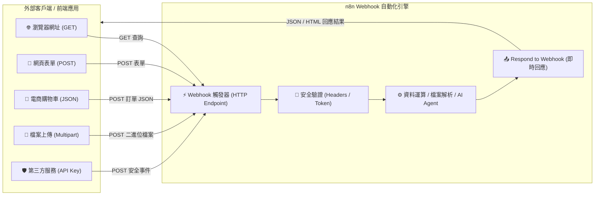

# 🔗 整合 Webhook 的實作

Webhook 是現代自動化系統的核心樞紐技術，它允許外部應用程式（如前端網頁、電商金流、GitHub、IoT 裝置或其他雲端服務）透過 HTTP 請求來即時觸發 n8n 工作流程。透過 Webhook，您可以將 n8n 當作自己的**專屬 API 伺服器**，實現零延遲的事件驅動自動化。

> 💡 **AI 協作時代學習法**：在學習完基礎節點操作並透過 MCP 連線 AI（Gemini、ChatGPT 或 Claude）後，您可以直接複製每個範例下方的 **「AI 賦能延伸實作」** 折疊區塊（`<details>`）內的 Prompt，交由 AI 助理替您在畫布上全自動建構與擴充進階邏輯！

---

## 📚 什麼是 Webhook？

Webhook 是一種「反向 API (Reverse API)」或「事件驅動推播」的機制：

- **傳統 API 輪詢（Pull）**：您的應用程式必須每隔幾秒主動發送請求「拉取」是否有新資料，耗費網路頻寬且有延遲。
- **Webhook 即時推播（Push）**：當外部事件發生時（如用戶提交表單、購物車結帳、檔案上傳、收到客訴），外部服務會自動發送 HTTP 請求「推送」資料到您的 n8n 端點，實現真正的零延遲即時自動化。

---

## 🧭 Webhook 核心架構



---

## 📚 實作範例導覽（由淺至深）

本教學規劃了六個循序漸進、讓學生動手超有感的實作範例，從瀏覽器網址列直接測試、互動式網頁表單，到電商運算、實體檔案上傳、生產級安全閘道以及 AI 微服務 API：

---

### 1. [範例 1：GET 請求與瀏覽器即時問候（零門檻快速入門）](./GET請求與瀏覽器即時問候/README.md)

**難度**：入門級 🟢 ｜ **亮點**：免安裝任何工具，瀏覽器輸入網址即可立即看到 JSON 回應！

學習如何使用 Webhook 接收 GET 請求，解析網址上的查詢參數（Query Parameters）並即時回傳個人化歡迎訊息。

**學習重點**：
- Webhook 觸發器的 GET 方法設定
- 解析網址查詢參數：`{{ $json.query.name }}`
- 使用 Set 節點組裝伺服器時間與 Client IP
- 使用 Respond to Webhook 節點即時回傳 JSON

- **附帶樣版**：[`get_hello_workflow.json`](./GET請求與瀏覽器即時問候/get_hello_workflow.json)

<details>
<summary>🤖 <strong>AI 賦能延伸實作（附 Prompt 提詞）</strong></summary>

> 💡 **任務目標**：透過 MCP 連線，讓 AI 擴充此流程，依據傳入的城市名稱自動查詢並回傳當地天氣問候。

**可直接複製給 AI 的 Prompt 提詞**：
```text
請幫我在目前的「GET 請求與即時問候」工作流程中進行延伸升級：
1. 保持 Webhook 觸發器（GET /hello），允許接收 city 參數（如 ?name=小明&city=taipei）。
2. 在「整理問候資料」後串接一個 HTTP Request 節點，呼叫公開天氣 API 取得該城市的即時氣溫與天氣狀態。
3. 將問候訊息擴充為：「哈囉 {{ $json.userName }}！目前 {{ $json.cityName }} 的天氣是 {{ $json.weather }}，氣溫 {{ $json.temp }}°C，祝您有美好的一天！」。
4. 最後透過 Respond to Webhook 回傳完整的 JSON 資料。
請幫我配置相關節點與表達式！
```
</details>

---

### 2. [範例 2：互動式網頁表單與個人化問候系統（POST 與前端互動串接）](./自動化問候系統/README.md)

**難度**：初級 🟢 ｜ **亮點**：附帶完整 HTML5/CSS3 網頁介面，點擊按鈕即時體驗動態反饋！

透過 Webhook 接收前端網頁表單提交的 POST 請求，驗證使用者資料並回傳結構化問候卡片。

**學習重點**：
- Webhook 接收 POST 請求與 JSON Body（`{{ $json.body.name }}`）
- IF 節點的條件判斷（檢查姓名是否存在）
- Set 節點分別設定成功問候與錯誤提示訊息
- 前端網頁 fetch API 與 n8n Webhook 串接

- **附帶樣版**：[`教學範例_自動化問候系統.json`](./自動化問候系統/教學範例_自動化問候系統.json)
- **網頁原始碼**：[website/ 前端介面原始碼](./自動化問候系統/website/)

<details>
<summary>🤖 <strong>AI 賦能延伸實作（附 Prompt 提詞）</strong></summary>

> 💡 **任務目標**：透過 MCP 連線，讓 AI 依據當前伺服器時間（早安/午安/晚安）與性別動態生成客製化問候語。

**可直接複製給 AI 的 Prompt 提詞**：
```text
請幫我在目前的「自動化問候系統」工作流程中進行延伸升級：
1. 保持原本的 Webhook 觸發器（POST /greeting）。
2. 在「檢查姓名」後，加入 Code 節點判斷當前伺服器時間：
   - 早上 (05:00 - 11:59)：早安
   - 下午 (12:00 - 17:59)：午安
   - 晚上 (18:00 - 04:59)：晚安
3. 若輸入資料包含 gender: "male" 或 "female"，問候語分別加上「先生」或「小姐」。
4. 整理輸出為：greeting（問候語）、client_ip（來自 headers 的 IP）、timestamp。
5. 最後透過 Respond to Webhook 回傳 200 JSON 結果。
請幫我建立相關節點與運算邏輯！
```
</details>

---

### 3. [範例 3：電商購物車即時結帳與計算（JSON 陣列與電子收據）](./即時訂單接收與計算/README.md)

**難度**：初中級 🟡 ｜ **亮點**：模擬電商結帳！自動運算 VIP 9 折、滿千免運並產出電子收據！

模擬購物車結帳事件，接收包含多筆商品的 JSON 訂單，由 Code 節點自動計算小計、折扣與運費並即時回傳收據。

**學習重點**：
- 接收巢狀 JSON 結構（含品項清單陣列 `items`）
- 使用 JavaScript Code 節點進行商業運算（單項小計、全單總計、VIP 折扣、滿額免運）
- 動態產生自訂訂單編號（`ORD-1718000000000`）與時間戳記
- 即時回傳標準 JSON 訂單確認收據

- **附帶樣版**：[`即時訂單接收與計算.json`](./即時訂單接收與計算/即時訂單接收與計算.json)

<details>
<summary>🤖 <strong>AI 賦能延伸實作（附 Prompt 提詞）</strong></summary>

> 💡 **任務目標**：透過 MCP 連線，讓 AI 在訂單成立後自動過濾大額訂單，發送警示通知並記錄至 Google Sheets / DataTable。

**可直接複製給 AI 的 Prompt 提詞**：
```text
請幫我在目前的「即時訂單接收與計算」工作流程中進行延伸升級：
1. 在「運算金額與折扣」節點之後，新增一個條件判斷（IF 節點）。
2. 若 final_amount >= 2000，將該筆大額訂單標記為 priority: "high"，並呼叫通知節點（或發送電子郵件至主管信箱）。
3. 同時將訂單編號、顧客姓名、實付金額與下單時間追加記錄到 Google Sheets 或 DataTable 中。
4. 最後確保「回傳訂單確認」節點依然能順利回傳 200 JSON 收據給前端。
請幫我建立相關節點並完成連線配置！
```
</details>

---

### 4. [範例 4：檔案上傳與自動解析處理（二進位檔案與 CSV 資料統計）](./檔案上傳與自動處理/README.md)

**難度**：中級 🟡 ｜ **亮點**：上傳實體 CSV 檔案，n8n 自動解析並生成統計摘要報表！

學習如何透過 Webhook 接收外部上傳的實體二進位檔案（`multipart/form-data`），並自動解析檔案內容。

**學習重點**：
- Webhook 接收二進位檔案資料 (Binary Property `data`)
- 使用 Extract from File 節點自動將上傳的 CSV 轉為 JSON
- 統計資料總列數與抽取前 3 筆資料預覽
- 使用 curl 命令列工具進行檔案上傳測試

- **附帶樣版**：[`檔案上傳與自動處理.json`](./檔案上傳與自動處理/檔案上傳與自動處理.json)

<details>
<summary>🤖 <strong>AI 賦能延伸實作（附 Prompt 提詞）</strong></summary>

> 💡 **任務目標**：透過 MCP 連線，讓 AI 為上傳的 CSV 資料自動批次寫入 DataTable，若發現異常資料自動發送警示。

**可直接複製給 AI 的 Prompt 提詞**：
```text
請幫我擴充目前的「檔案上傳與自動處理」工作流程：
1. 在 Extract from File 解析出 CSV 的每筆資料後，新增一個 DataTable 節點，將所有資料批次寫入「學生成績單」表格中。
2. 加入資料檢查邏輯：若任何學生成績欄位為空或非數字，收集這些異常名單。
3. 在 Respond to Webhook 回應中，額外回傳匯入成功筆數 (success_count) 與異常資料清單 (invalid_records)。
請直接幫我規劃並配置這些節點！
```
</details>

---

### 5. [範例 5：API 金鑰安全驗證與多事件分流（生產級安全閘道）](./多事件分流與安全驗證/README.md)

**難度**：中高級 🟠 ｜ **亮點**：建立具備 Header API Key 認證與 Switch 多路分流的生產級 API Gateway！

建立具備生產級安全認證與多事件路由的 Webhook API，支援 Header Token 檢查與 Switch 分流。

**學習重點**：
- 檢查 HTTP Header 自訂金鑰 (`x-api-key`)
- 驗證失敗時直接回傳 `401 Unauthorized` 狀態碼阻斷
- 使用 Switch 節點根據 `event_type` 進行多路事件分流（新會員註冊、訂單付款、未知事件）
- 多分支處理後匯流至統一的 Respond to Webhook

- **附帶樣版**：[`多事件分流與安全驗證.json`](./多事件分流與安全驗證/多事件分流與安全驗證.json)

<details>
<summary>🤖 <strong>AI 賦能延伸實作（附 Prompt 提詞）</strong></summary>

> 💡 **任務目標**：透過 MCP 連線，讓 AI 增加退款申請事件分支，並依金額自動判斷是否由系統直接核准。

**可直接複製給 AI 的 Prompt 提詞**：
```text
請幫我在「多事件分流與安全驗證」工作流程中加入進階功能：
1. 擴充 Switch 節點，增加第 3 個事件分支：refund_requested（退款申請事件）。
2. 在 refund_requested 分支中，新增一個 Code 節點，檢查退款金額是否小於 1000 元（若是則自動批准並設定 status: "auto_approved"；若否則標記需人工審核 status: "manual_review"）。
3. 同樣匯流至「回傳處理結果」節點回傳給調用端。
請直接幫我更新 Switch 規則並新增處理節點與連線！
```
</details>

---

### 6. [範例 6：Webhook 整合 AI 智慧分析微服務（打造專屬 AI API）](./Webhook整合AI文字分析微服務/README.md)

**難度**：高級 🔴 ｜ **亮點**：將 n8n 封裝為自訂 AI 微服務 API，自動評估情緒、產出摘要與客服回信建議！

將 n8n 打造為對外公開的 AI 分析 API。外部系統傳入顧客留言，AI 自動評估情緒、評分、摘要與建議回信，並以結構化 JSON 即時回傳。

**學習重點**：
- Webhook 與 LangChain AI Agent 深度整合架構
- 引導 LLM 輸出精準合法的結構化 JSON 物件
- 使用 JavaScript Code 節點進行防禦性資料清洗與容錯
- 打造企業級客服負評即時預警與智慧回覆微服務

- **附帶樣版**：[`ai_webhook_service.json`](./Webhook整合AI文字分析微服務/ai_webhook_service.json)

<details>
<summary>🤖 <strong>AI 賦能延伸實作（附 Prompt 提詞）</strong></summary>

> 💡 **任務目標**：透過 MCP 連線，當 AI 分析結果為「負面且緊急度為高」時，自動推播警報至主管 LINE 或 Telegram 群組。

**可直接複製給 AI 的 Prompt 提詞**：
```text
請幫我在目前的「Webhook 整合 AI 文字分析」工作流程中加入高風險警報推播：
1. 在「解析與組裝結構化結果」節點後，接續一個 IF 條件節點。
2. 判斷條件：analysis.sentiment === "負面" 且 analysis.urgency === "高"。
3. 在 True 分支連接 Telegram 節點（或 LINE Push 節點），發送緊急通知：「🚨 收到來自 {{ $json.customer_name }} 的高風險客訴！摘要：{{ $json.analysis.summary }}，請立即處理！」。
4. 無論是否觸發警報，最後皆連接至 Respond to Webhook 正常回傳 200 JSON 給呼叫端。
請幫我建立相關節點與條件連線！
```
</details>

---

## 🔧 Webhook 核心觀念與設定重點

### 1. Test URL vs Production URL
* **Test URL (`/webhook-test/...`)**：當在 n8n 點擊「Listen for test event」時專用，只會接收單次請求，適合開發除錯。
* **Production URL (`/webhook/...`)**：必須將右上角切換為 **Active（已啟用）** 才會 7x24 常駐監聽外部請求。

### 2. 資料存取路徑差異
* **GET 查詢參數**：參數包裝在 `query` 物件內，表達式為 `{{ $json.query.參數名稱 }}`。
* **POST / PUT Body 資料**：資料包裝在 `body` 物件內，表達式為 `{{ $json.body.欄位名稱 }}`。
* **Headers 請求標頭**：標頭存在於 `headers` 物件內，例如 `{{ $json.headers['x-api-key'] }}`。

### 3. Response Mode（回應模式）
* **On received (預設)**：接收到請求立刻回傳 200 OK，後續節點非同步執行（適合耗時較長的背景任務）。
* **Using 'Respond to Webhook' Node**：等待流程處理完畢後，由 Respond to Webhook 節點回傳運算結果與指定狀態碼（適合即時查詢、收據產出與 API 微服務）。

