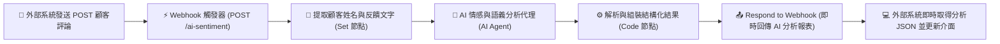

# Webhook 實作
## 範例 6：Webhook 整合 AI 智慧分析微服務（打造專屬 AI API）

### 📚 工作流程說明

這個 n8n 工作流程示範如何將 n8n 當作一個**對外公開的「AI 微服務 API 伺服器 (AI Microservice)」**。外部應用程式（如電商網站、社群留言板、顧客反饋表單）只要發送 HTTP POST 請求將顧客留言傳入 n8n，n8n 會透過 **AI Agent** 搭配大型語言模型（OpenAI GPT-4o-mini / Gemini / Ollama）自動進行**情緒傾向評估（正面/負面/中立）**、**滿意度評分（1~5分）**、**核心重點摘要**與**客服回信建議**，並將結果即時以標準 JSON 格式回傳給呼叫端！

---

### 流程架構圖



---

### 工作流程樣版下載

- [📥 Webhook 整合 AI 文字分析微服務樣版 (ai_webhook_service.json)](./ai_webhook_service.json)

---

#### 📋 節點詳細說明

1. **📝 流程說明（Sticky Note）**
   - **功能**：說明如何將 Webhook 與 LangChain AI Agent 結合成可即時呼叫的 AI API。

2. **⚡ 接收評論 Webhook（Webhook Node）**
   - **功能**：接收外部系統發送的 POST 請求。
   - **設定要點**：
     - **HTTP Method**：`POST`
     - **Path**：`ai-sentiment`
     - **Response Mode**：`Using 'Respond to Webhook' Node`

3. **📝 提取評論內容（Edit Fields / Set Node）**
   - **功能**：取得顧客姓名 `customerName` 與評論文字 `feedbackText`。

4. **🤖 AI 情感與語義分析代理（AI Agent Node）**
   - **功能**：調用語言模型進行深度語意分析。
   - **提示詞設計**：要求 AI 評估 `sentiment`（正面/負面/中立）、`sentiment_score`（1~5）、`summary`（25字以內摘要）、`urgency`（高/中/低）與 `suggested_reply`（親切回覆建議）。

5. **🧠 語言模型（OpenAI Chat Model / Gemini / Ollama）**
   - **功能**：提供推論算力（可選用 OpenAI `gpt-4o-mini` 或本機免費的 `gemma4:cloud` / `llama3`）。

6. **⚙️ 解析與組裝結構化結果（Code Node）**
   - **功能**：將 AI 生成的文字清洗並解析為標準 JSON 物件，附加分析時間戳記。

7. **📤 即時回傳 AI 分析報表（Respond to Webhook Node）**
   - **功能**：以 HTTP 200 即時將 AI 分析報表回傳給外部客戶端。

---

#### 🧪 測試與驗證方法

##### 使用 curl 進行測試（模擬顧客負面評論）：

```bash
curl -X POST https://<你的n8n網址>/webhook/ai-sentiment \
  -H "Content-Type: application/json" \
  -d '{
    "customer_name": "陳小姐",
    "feedback": "包裹等了一整週才收到，外包裝都壓爛了，裡面的商品表面還有刮痕，真的非常失望，要求立即換貨！"
  }'
```

**預期 JSON 回應 (`200 OK`)**：
```json
{
  "status": "success",
  "customer_name": "陳小姐",
  "original_feedback": "包裹等了一整週才收到，外包裝都壓爛了，裡面的商品表面還有刮痕，真的非常失望，要求立即換貨！",
  "analysis": {
    "sentiment": "負面",
    "sentiment_score": 1,
    "summary": "物流延誤且商品包裝破損有刮痕，要求換貨",
    "urgency": "高",
    "suggested_reply": "陳小姐您好，非常抱歉造成您的不便！我們已立即為您安排全新商品的急件補寄，並將派物流專人收回受損商品，感謝您的耐心包容！"
  },
  "analyzed_at": "2026-08-30T12:40:00.000Z"
}
```

---

#### 🎯 學習重點

- **Webhook 作為 AI 微服務架構**：學會將 n8n 包裝為能提供外部應用的自訂 AI API。
- **結構化 JSON 提示詞工程**：掌握如何引導 LLM 輸出精確無雜質的結構化 JSON 物件。
- **後處理與容錯處理**：使用 JavaScript Code 節點防範 AI 回傳 Markdown 代碼區塊時的 JSON 解析異常。
- **商業價值落地**：理解自動化客服分流、差評優先預警與智慧回信的實務流程。

---

#### 💡 實際應用場景

- **Google 商家 / 購物平台評論自動分析**：定時接收顧客新評論，自動標註負評並發送 Telegram/LINE 警報給店長。
- **客服工單智能分流**：依據 AI 評估的 `urgency: "高"` 自動將工單分派給資深主管。
- **社群媒體貼文輿情監測**：接收論壇或社群留言，即時分析品牌好感度趨勢。

---

<details>
<summary>🤖 <strong>AI 賦能延伸實作（附 Prompt 提詞）</strong></summary>

> 💡 **任務目標**：透過 MCP 連線，當 AI 分析結果為「負面且緊急度為高」時，自動推播警報至主管 LINE 或 Telegram 群組。

**可直接複製給 AI 的 Prompt 提詞**：
```text
請幫我在目前的「Webhook 整合 AI 文字分析」工作流程中加入高風險警報推播：
1. 在「解析與組裝結構化結果」節點後，接續一個 IF 條件節點。
2. 判斷條件：analysis.sentiment === "負面" 且 analysis.urgency === "高"。
3. 在 True 分支連接 Telegram 節點（或 LINE Push 節點），發送緊急通知：「🚨 收到來自 {{ $json.customer_name }} 的高風險客訴！摘要：{{ $json.analysis.summary }}，請立即處理！」。
4. 無論是否觸發警報，最後皆連接至 Respond to Webhook 正常回傳 200 JSON 給呼叫端。
請幫我建立相關節點與條件連線！
```
</details>
