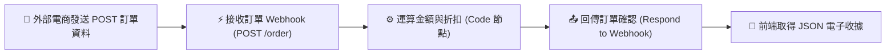

# Webhook 實作範例
## 即時訂單接收與計算

### 📚 工作流程說明

這個工作流程模擬電商結帳或購物網站發送的 Webhook 事件。外部系統透過 POST 請求將顧客資訊與購物車商品清單送入 n8n，n8n 透過 JavaScript 運算節點自動計算商品小計、檢查 VIP 會員折扣（9折）與滿額免運門檻（滿 1,000 元免運），最後產生結構化的訂單收據並以 JSON 即時回傳給前端系統。

### 流程架構圖



---

### 工作流程樣版下載

- [📥 即時訂單接收與計算工作流程樣版 (即時訂單接收與計算.json)](./即時訂單接收與計算.json)

---

### 📋 節點詳細說明

1. **🔗 Webhook 觸發器 (`接收訂單 Webhook`)**
   - **HTTP Method**：`POST`
   - **Path**：`order`
   - **Response Mode**：`Using 'Respond to Webhook' Node`（由後續節點決定回傳內容與狀態碼）
   - **接收資料**：包含顧客姓名 (`customer_name`)、VIP 狀態 (`is_vip`) 與購買品項陣列 (`items`)。

2. **⚙️ Code 節點 (`運算金額與折扣`)**
   - **功能**：以 JavaScript 自動處理訂單運算：
     - 自動計算每項商品的單項總計與全單小計 (`subtotal`)。
     - 檢查是否為 VIP，套用 10% 折扣額 (`discount_amount`)。
     - 檢查是否達滿額免運門檻（滿 1000 元免運，未滿加收 60 元運費）。
     - 自動產生訂單編號（如 `ORD-1718000000000`）與時間戳記。

3. **📤 Respond to Webhook 節點 (`回傳訂單確認`)**
   - **功能**：將處理好的完整訂單收據以 JSON 格式即時回傳給發起請求的外部系統。
   - **HTTP Status**：`200 OK`

---

### 🧪 測試與驗證方法

#### 1. 成功下單測試（VIP 會員 + 滿額免運）

```bash
curl -X POST https://<你的n8n網址>/webhook/order \
  -H "Content-Type: application/json" \
  -d '{
    "customer_name": "王小明",
    "is_vip": true,
    "items": [
      { "name": "機械鍵盤", "price": 1200, "quantity": 1 },
      { "name": "滑鼠墊", "price": 300, "quantity": 1 }
    ]
  }'
```

**預期 JSON 回應**：
```json
{
  "order_id": "ORD-1718123456789",
  "customer_name": "王小明",
  "is_vip": true,
  "item_count": 2,
  "items": [
    { "name": "機械鍵盤", "price": 1200, "quantity": 1, "total": 1200 },
    { "name": "滑鼠墊", "price": 300, "quantity": 1, "total": 300 }
  ],
  "subtotal": 1500,
  "discount_amount": 150,
  "shipping_fee": 0,
  "final_amount": 1350,
  "status": "confirmed",
  "created_at": "2026-08-20T14:30:00.000Z"
}
```

---

<details>
<summary>🤖 <strong>AI 賦能延伸實作（附 Prompt 提詞）</strong></summary>

> 💡 **任務目標**：透過 MCP 連線，讓 AI 在訂單成立後自動發送 LINE / 郵件通知，或整合 Google Sheets 記錄每一筆訂單。

**可直接複製給 AI 的 Prompt 提詞**：
```text
請幫我在目前的「即時訂單接收與計算」工作流程中進行延伸升級：
1. 在「運算金額與折扣」節點之後，新增一個條件判斷（IF 節點）。
2. 若 final_amount >= 2000，將該筆大額訂單標記為 priority: "high"，並呼叫通知節點（或發送電子郵件至主管信箱）。
3. 同時將訂單編號、顧客姓名、實付金額與下單時間追加記錄到 Google Sheets 或 DataTable 中。
4. 最後確保「回傳訂單確認」節點依然能順利回傳 200 JSON 收據給前端。
請幫我建立相關節點並完成連線配置！
```
</details>
