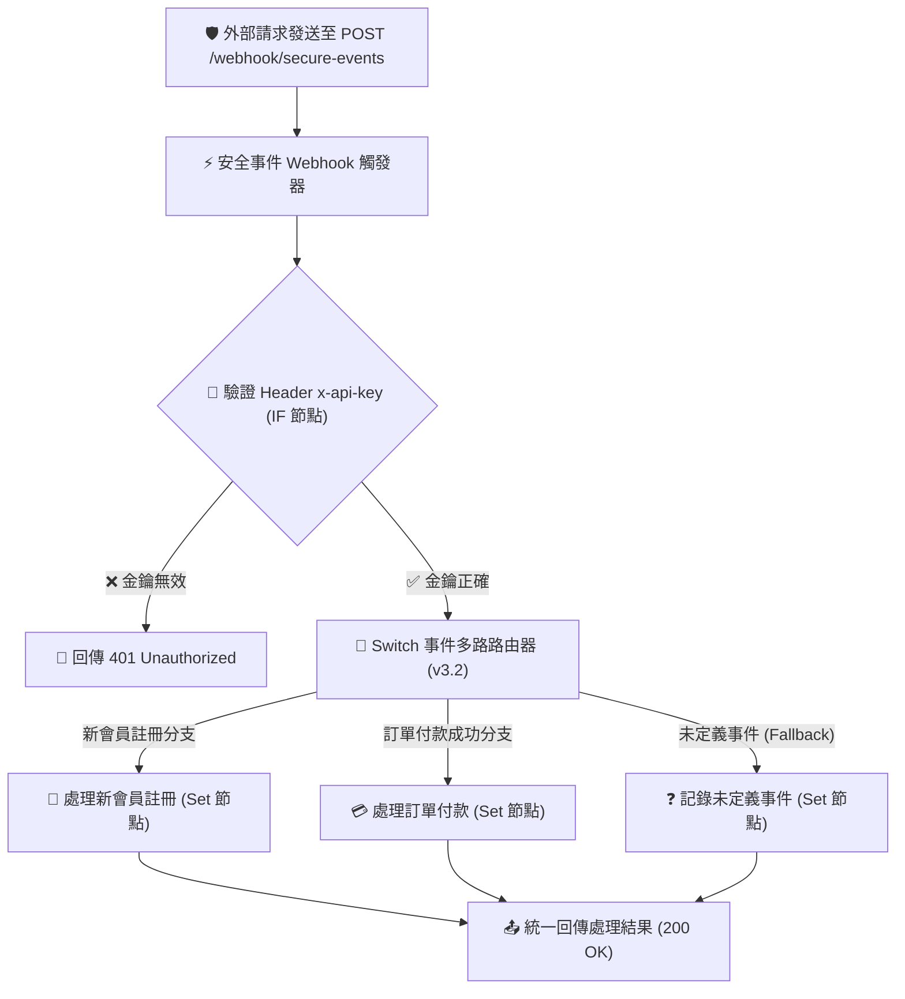

# Webhook 實作範例
## 範例 5：API 金鑰安全驗證與多事件分流（生產級安全閘道）

### 📚 工作流程說明

在生產環境中，Webhook 端點必須具備安全性（避免惡意請求偽造）與多事件支援。本範例展示：
1. **Header 金鑰驗證**：使用 **IF 節點（v2.2）** 檢查請求 Header 中的 `x-api-key`，若金鑰錯誤則直接阻斷並回傳 `401 Unauthorized`。
2. **Switch 事件多路分流**：使用 **Switch 節點（v3.2）** 根據 Payload 中的 `event_type`（如 `user_signup` 新會員註冊、`order_paid` 訂單付款或未定義事件），自動分派到專屬的處理分支。
3. **統一回應格式**：各分支由 **Set 節點（v3.4）** 處理完畢後，由統一的 **Respond to Webhook（v1.1）** 節點回傳標準 JSON 回應。

---

### 流程架構圖



---

### 工作流程樣版下載

- [📥 多事件分流與安全驗證工作流程樣版 (多事件分流與安全驗證.json)](./多事件分流與安全驗證.json)

---

### 📋 節點詳細說明

1. **🛡️ Webhook 觸發器 (`安全事件 Webhook`)**
   - **HTTP Method**：`POST`
   - **Path**：`secure-events`
   - **Response Mode**：`Using 'Respond to Webhook' Node`

2. **🔐 IF 節點 (`驗證 API Key` - v2.2)**
   - **條件**：`{{ $json.headers['x-api-key'] }} == "secret-token-12345"`
   - **False 分支**：連接至 `回傳 401 未授權` 節點。

3. **🔀 Switch 節點 (`分流事件類型` - v3.2)**
   - **比對規則 1**：`{{ $json.body.event_type }} == "user_signup"` ➔ 分流至「處理新會員註冊」
   - **比對規則 2**：`{{ $json.body.event_type }} == "order_paid"` ➔ 分流至「處理訂單付款」
   - **Fallback Output** ➔ 捕捉未定義的事件類型並記錄 Warning Log。

4. **📤 Respond to Webhook 節點**
   - **成功回應**：`200 OK`
   - **驗證失敗回應**：`401 Unauthorized`

---

### 🧪 測試與驗證方法

#### 1. 成功案例一：新會員註冊事件（帶正確金鑰）

```bash
curl -X POST http://localhost:5678/webhook/secure-events \
  -H "Content-Type: application/json" \
  -H "x-api-key: secret-token-12345" \
  -d '{
    "event_type": "user_signup",
    "user_id": "U9876",
    "email": "user@example.com"
  }'
```

**預期 JSON 回應 (`200 OK`)**：
```json
{
  "status": "success",
  "event": "user_signup",
  "user_id": "U9876",
  "action": "新會員歡迎信已排程發送，已指派新手引導任務",
  "processed_at": "2026-09-01 22:40:00"
}
```

#### 2. 成功案例二：訂單付款成功事件

```bash
curl -X POST http://localhost:5678/webhook/secure-events \
  -H "Content-Type: application/json" \
  -H "x-api-key: secret-token-12345" \
  -d '{
    "event_type": "order_paid",
    "order_id": "ORD-20260901-888",
    "amount": 1980
  }'
```

**預期 JSON 回應 (`200 OK`)**：
```json
{
  "status": "success",
  "event": "order_paid",
  "order_id": "ORD-20260901-888",
  "action": "訂單付款驗證成功，已開立電子發票並通知倉庫撿貨",
  "processed_at": "2026-09-01 22:40:00"
}
```

#### 3. 失敗案例：金鑰錯誤或未帶金鑰

```bash
curl -X POST http://localhost:5678/webhook/secure-events \
  -H "Content-Type: application/json" \
  -H "x-api-key: wrong-key" \
  -d '{ "event_type": "user_signup" }'
```

**預期 JSON 回應 (`401 Unauthorized`)**：
```json
{
  "status": "error",
  "error": "Unauthorized",
  "message": "無效的 API Key，請在 Request Header 帶入正確的 x-api-key",
  "timestamp": "2026-09-01 22:40:00"
}
```

---

<details>
<summary>🤖 <strong>AI 賦能延伸實作（附 Prompt 提詞）</strong></summary>

> 💡 **任務目標**：透過 MCP 連線，讓 AI 增加 HMAC-SHA256 簽名驗證（如 Stripe / GitHub Webhook 規格），並擴充更多業務事件分支。

**可直接複製給 AI 的 Prompt 提詞**：
```text
請幫我在「多事件分流與安全驗證」工作流程中加入進階功能：
1. 擴充 Switch 節點，增加第 3 個事件分支：refund_requested（退款申請事件）。
2. 在 refund_requested 分支中，新增一個 Code 節點，檢查退款金額是否小於 1000 元（若是則自動批准並設定 status: "auto_approved"；若否則標記需人工審核 status: "manual_review"）。
3. 同樣匯流至「回傳處理結果」節點回傳給調用端。
請直接幫我更新 Switch 規則並新增處理節點與連線！
```
</details>

---

**適用對象**：中高級 / 生產環境架構實戰  
**預計教學時間**：50 - 60 分鐘
