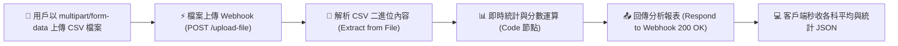

# Webhook 實作範例
## 範例 4：檔案上傳與自動處理（二進位檔案與 CSV 資料統計）

### 📚 工作流程說明

這個工作流程示範如何透過 Webhook 接收外部系統上傳的實體檔案（如 `multipart/form-data` 格式的 CSV 檔案）。n8n 接收到二進位檔案後，利用 **Extract from File 節點** 自動解析其內部資料列，並由 **JavaScript Code 節點** 進行即時統計運算（總人數、各科平均分、班級總平均分與前三筆成績預覽），最後即時回傳專業的統計分析 JSON 報表給上傳者。

---

### 流程架構圖



---

### 工作流程樣版下載

- [📥 檔案上傳與自動處理工作流程樣版 (檔案上傳與自動處理.json)](./檔案上傳與自動處理.json)

---

### 📋 節點詳細說明

1. **📁 Webhook 觸發器 (`檔案上傳 Webhook`)**
   - **HTTP Method**：`POST`
   - **Path**：`upload-file`
   - **Response Mode**：`Using 'Respond to Webhook' Node`
   - **特性**：可接收帶有二進位檔案（Binary File `data`）的表單上傳。

2. **📄 Extract from File 節點 (`解析 CSV 內容`)**
   - **Operation**：`CSV`
   - **Binary Property**：`data`
   - **Header Row**：`true`（自動將第一列視為欄位名稱）
   - **功能**：將二進位 CSV 檔案轉換為多筆結構化 JSON 物件。

3. **📊 Code 節點 (`生成處理摘要`)**
   - **功能**：自動進行商業/學務統計運算：
     - 統計資料總筆數 (`total_records`)。
     - 自動計算國文、英文、數學的平均分數 (`avg_chinese`, `avg_english`, `avg_math`)。
     - 計算全班總平均分數 (`class_average`)。
     - 擷取前 3 筆成績資料作為即時範例預覽。

4. **📤 Respond to Webhook 節點 (`回傳解析結果`)**
   - **功能**：回傳 `200 OK` 及結構化統計報表。

---

### 🧪 測試與驗證方法

#### 步驟 1：建立測試 CSV 檔案（`students.csv`）
在您的電腦終端機中建立一個名為 `students.csv` 的檔案：
```csv
name,chinese,english,math
王小明,88,92,95
李小美,76,85,80
張大同,90,70,88
林小華,95,98,92
陳志強,60,75,70
```

#### 步驟 2：使用 curl 指令上傳檔案
```bash
curl -X POST http://localhost:5678/webhook/upload-file \
  -F "data=@students.csv"
```

**預期 JSON 回應 (`200 OK`)**：
```json
{
  "status": "success",
  "message": "🎉 CSV 檔案已成功解析並完成統計運算！",
  "total_records": 5,
  "statistics": {
    "avg_chinese": 81.8,
    "avg_english": 84,
    "avg_math": 85,
    "class_average": 83.6
  },
  "sample_preview": [
    { "name": "王小明", "chinese": "88", "english": "92", "math": "95", "total_score": 275, "average_score": 91.7 },
    { "name": "李小美", "chinese": "76", "english": "85", "math": "80", "total_score": 241, "average_score": 80.3 },
    { "name": "張大同", "chinese": "90", "english": "70", "math": "88", "total_score": 248, "average_score": 82.7 }
  ],
  "processed_at": "2026-09-01T22:35:00.000Z"
}
```

---

<details>
<summary>🤖 <strong>AI 賦能延伸實作（附 Prompt 提詞）</strong></summary>

> 💡 **任務目標**：透過 MCP 連線，讓 AI 為上傳的 CSV 成績單自動找出不及格學生，發送郵件預警並匯入 Google Sheets。

**可直接複製給 AI 的 Prompt 提詞**：
```text
請幫我擴充目前的「檔案上傳與自動處理」工作流程：
1. 在 Extract from File 解析出 CSV 的每筆資料後，新增一個 Code 節點，過濾出任一科分數小於 60 分的「不及格名單」。
2. 若不及格名單大於 0 筆，串接通知節點（或發送 Email 至導師信箱）標註需要課後輔導的學生。
3. 同時將所有學生成績與總分批次追加寫入 Google Sheets「學期成績冊」工作表中。
4. 最後在 Respond to Webhook 回應中，額外回傳不及格人數 (fail_count) 與及格率 (pass_rate)。
請直接幫我規劃並配置這些節點與連線！
```
</details>

---

**適用對象**：初中級 / 檔案自動化實戰  
**預計教學時間**：40 - 50 分鐘
