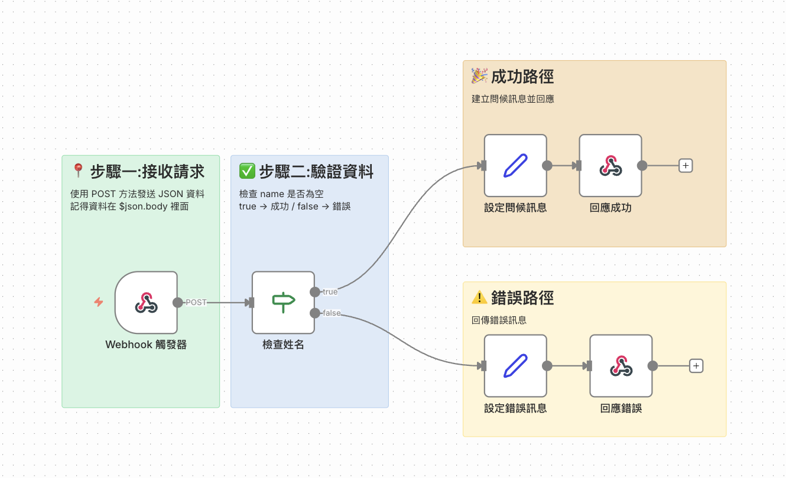

# n8n 教學工作流程說明

## 工作流程名稱:自動化問候系統

## 流程圖



## 流程圖下載

[自動化問候系統.json](./教學範例_自動化問候系統.json)

### 🎯 學習目標
這個簡單的工作流程可以幫助學生理解:
1. Webhook 觸發器的使用
2. 條件判斷(IF節點)
3. 資料處理(Set節點)
4. 回應處理

### 📋 工作流程說明

#### 節點流程:
1. **Webhook 觸發器** → 接收外部請求
2. **檢查姓名** → 判斷是否提供姓名
3. **設定問候訊息** → 處理有效資料
4. **設定錯誤訊息** → 處理無效資料
5. **回應** → 返回結果給使用者

### 🔧 如何使用

#### 步驟一:匯入工作流程
1. 登入 n8n
2. 點擊「新增工作流程」
3. 點擊右上角的「...」選單
4. 選擇「匯入自檔案」
5. 上傳 `教學範例_自動化問候系統.json`

#### 步驟二:啟動工作流程
1. 點擊右上角的「啟用」按鈕
2. 點擊「Webhook 觸發器」節點
3. 複製「測試 URL」或「生產 URL」

#### 步驟三:測試工作流程

**測試指令 1 - 成功案例:**
```bash
curl -X POST https://你的n8n網址/webhook/greeting \
  -H "Content-Type: application/json" \
  -d '{"name": "小明", "age": 25}'
```

例如:
```bash
curl -X POST https://localhost:5678/webhook/greeting \
  -H "Content-Type: application/json" \
  -d '{"name": "小明", "age": 25}'
```

**預期回應:**
```json
{
  "greeting": "你好,小明!你今年25歲,歡迎來到自動化世界!",
  "time": "2024-12-09 14:30:00"
}
```

**測試指令 2 - 錯誤案例:**
```bash
curl -X POST https://你的n8n網址/webhook/greeting \
  -H "Content-Type: application/json" \
  -d '{}'
```

#### 步驟四:使用網頁介面測試 (推薦) 🌟
 
 我們準備了一個精美的網頁介面，讓您不用輸入指令也能測試！
 
 1. 進入 `website` 資料夾
 2. 使用文字編輯器打開 `script.js`
 3. 找到第 10 行的 `const WEBHOOK_URL`，將其修改為您的 n8n Webhook URL
    ```javascript
    // 例如:
    const WEBHOOK_URL = 'https://您的網址/webhook/greeting';
    ```
 4. 用瀏覽器打開 `index.html`
 5. 輸入姓名與年齡，點擊 **發送 Webhook**
 6. 畫面將會顯示 n8n 回傳的問候語與時間
 
 > **提示**: 若網頁出現 CORS 錯誤，請確保您使用 `webhook-test` 結尾的 URL 進行測試，或者在啟動 n8n 時設定允許跨域環境變數 (通常測試環境較寬鬆)。


### 📚 教學重點

#### 1. Webhook 節點
- 這是工作流程的入口點
- 可以接收來自外部的 HTTP 請求
- 支援 GET、POST 等不同方法

**🔑 重要:理解 Webhook 的資料結構**

當 Webhook 接收到請求時,n8n 會將所有資訊包裝成一個完整的物件:

```json
{
  "headers": { ... },      // HTTP 標頭資訊
  "params": { ... },       // URL 參數
  "query": { ... },        // 查詢字串
  "body": {                // ⭐ 這裡才是我們發送的資料!
    "name": "小明",
    "age": 25
  },
  "webhookUrl": "...",     // Webhook 網址
  "executionMode": "..."   // 執行模式
}
```

**為什麼要用 `$json.body.name` 而不是 `$json.name`?**

1. **`$json`** = Webhook 節點接收到的整個資料物件
2. **`$json.body`** = 我們實際發送的 JSON 資料
3. **`$json.body.name`** = 取得 body 中的 name 欄位

舉例說明:
- ❌ **錯誤寫法:** `$json.name` → 找不到,因為 name 不在最外層
- ✅ **正確寫法:** `$json.body.name` → 正確,因為 name 在 body 裡面

**實際範例對照:**

當你執行:
```bash
curl -X POST https://網址/webhook/greeting \
  -H "Content-Type: application/json" \
  -d '{"name": "小紅", "age": 25}'
```

n8n 實際收到的完整結構:
```
$json = {
  headers: {...},
  body: {           ← 你的資料在這裡!
    name: "小紅",
    age: 25
  }
}
```

所以:
- `$json.body.name` → 得到 "小紅" ✅
- `$json.name` → undefined ❌

**💡 教學提示:**
可以在工作流程中加入一個 Set 節點來顯示完整的 `$json` 內容,讓學生清楚看到資料結構!

#### 2. IF 節點(條件判斷)
- 檢查資料是否符合條件
- 有兩個輸出:true(條件成立)和 false(條件不成立)
- 本例中檢查姓名欄位是否為空

#### 3. Set 節點(資料設定)
- 用來建立、修改資料
- 可以使用表達式(Expression)動態產生內容
- `{{ }}` 是 n8n 的表達式語法
- 必須使用正確的資料路徑,例如 `$json.body.name` 而非 `$json.name`

**表達式範例:**
```javascript
// 基本字串組合
{{ '你好,' + $json.body.name }}

// 包含數字
{{ '你今年' + $json.body.age + '歲' }}

// 使用內建函數
{{ $now.toFormat('yyyy-MM-dd HH:mm:ss') }}
```

#### 4. Respond to Webhook 節點
- 將處理結果回傳給呼叫者
- 可以回傳 JSON、文字等不同格式

### 💡 延伸練習

**練習 1:增加年齡驗證**
- 檢查年齡是否大於 18 歲
- 對成年人和未成年人顯示不同的問候語
- 提示:在「檢查姓名」後新增一個 IF 節點

**練習 2:增加時段判斷**
- 根據當前時間(早上/下午/晚上)顯示不同問候語
- 提示:使用 `$now.hour` 取得小時數
- 早上(6-12):「早安」,下午(12-18):「午安」,晚上(18-6):「晚安」

**練習 3:加入記錄功能**
- 新增 Google Sheets 節點
- 將每次的訪問記錄(姓名、年齡、時間)寫入試算表

**練習 4:串接多個 API**
- 新增 HTTP Request 節點
- 查詢天氣 API,在問候語中加入天氣資訊

**練習 5:資料驗證**
- 檢查年齡是否為有效數字(1-150 之間)
- 檢查姓名長度是否合理(2-20 個字)
- 對不合理的輸入回傳友善的錯誤訊息

### 🎓 課堂討論問題

1. 為什麼需要檢查姓名是否為空?
2. 如果不使用 IF 節點會發生什麼事?
3. 表達式 `{{ }}` 的用途是什麼?
4. **為什麼要用 `$json.body.name` 而不是 `$json.name`?** ⭐
5. **如何查看 Webhook 接收到的完整資料結構?** ⭐
6. 這個工作流程可以應用在哪些實際場景?
7. 如何保護 Webhook 避免被濫用?

### 🔍 除錯技巧

1. **查看執行歷史**:點擊左側「執行」查看每次運行記錄
2. **節點測試**:點擊節點後按「執行節點」單獨測試
3. **檢查資料**:點擊節點查看輸入/輸出資料
4. **使用 Debug 模式**:可以在 Set 節點中輸出除錯資訊

### ⚠️ 常見問題

**Q: Webhook URL 無法訪問?**
A: 確認工作流程已啟用,且 n8n 伺服器正在運行

**Q: 回應顯示「請提供您的姓名」但我明明有發送 name?**
A: 這是最常見的錯誤!檢查你的表達式是否使用 `$json.body.name` 而不是 `$json.name`。Webhook 接收的資料會被包在 `body` 物件裡面。

**Q: 回應顯示錯誤?**
A: 檢查 JSON 格式是否正確,Content-Type 是否設定為 application/json

**Q: 表達式不工作?**
A: 確認使用 `{{ }}` 包圍表達式,並檢查欄位路徑是否正確(記得要用 `$json.body.欄位名稱`)

**Q: 如何查看 Webhook 收到的完整資料?**
A: 
1. 執行工作流程後,點擊 Webhook 節點
2. 查看「輸出」標籤
3. 可以看到完整的資料結構,包括 headers、body、query 等

**Q: 為什麼有時候資料在 $json.body,有時候直接在 $json?**
A: 這取決於節點類型。Webhook 節點會將 POST 資料放在 body 中,但其他節點(如 Set 節點)的輸出就直接在 $json 層級。

---

**製作日期:** 2024年12月
**適用對象:** 初學者/自動化入門課程
**預計教學時間:** 45-60分鐘
