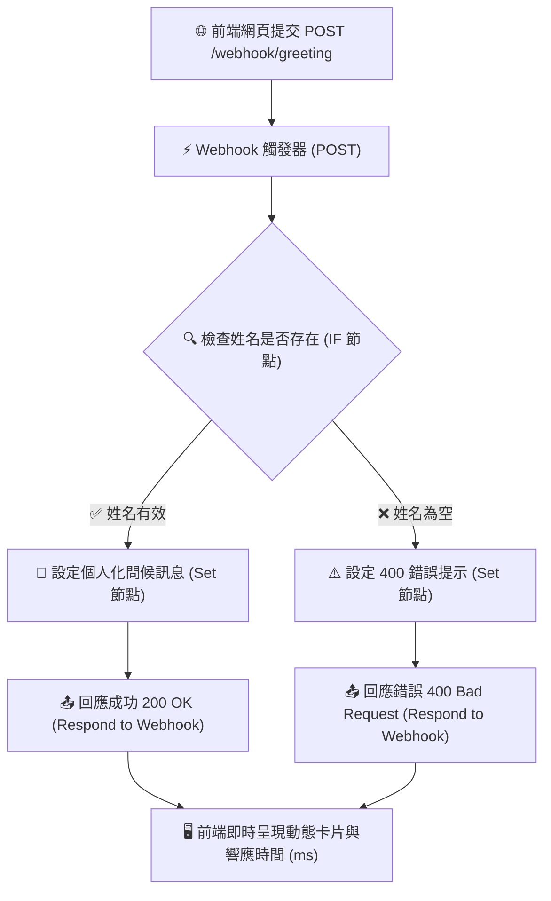

# Webhook 實作
## 範例 2：互動式網頁表單與個人化問候系統（POST 與前端互動串接）

### 📚 工作流程說明

這個工作流程示範如何透過 **Webhook (POST 方法)** 接收現代前端網頁表單提交的使用者資料（姓名、年齡等），在 n8n 中使用 **IF 條件節點（v2.2）** 驗證資料完整性，根據輸入動態生成富有溫度的個人化問候，並透過 **Respond to Webhook（v1.1）** 即時回傳標準 RESTful JSON 結果（成功 `200 OK` / 錯誤 `400 Bad Request`），讓前端網頁能無縫展示歡迎卡片與毫秒級響應數據。

---

### 流程架構圖


```mermaid
flowchart TD
    A["🌐 前端網頁提交 POST /webhook/greeting"] --> B["⚡ Webhook 觸發器 (POST)"]
    B --> C{"🔍 檢查姓名是否存在 (IF 節點)"}
    C -->|"✅ 姓名有效"| D1["📝 設定個人化問候訊息 (Set 節點)"]
    C -->|"❌ 姓名為空"| D2["⚠️ 設定 400 錯誤提示 (Set 節點)"]
    D1 --> E1["📤 回應成功 200 OK (Respond to Webhook)"]
    D2 --> E2["📤 回應錯誤 400 Bad Request (Respond to Webhook)"]
    E1 --> F["🖥️ 前端即時呈現動態卡片與響應時間 (ms)"]
    E2 --> F
```

---

### 工作流程樣版下載

- [📥 自動化問候系統工作流程樣版 (教學範例_自動化問候系統.json)](./教學範例_自動化問候系統.json)
- [🌐 前端網頁實戰測試台原始碼 (HTML/CSS/JS)](./website/)

---

### 🎯 學習目標

透過本實作，學生將掌握：
1. **Webhook POST 方法**：理解 HTTP POST 與 Request Body 的傳輸機制。
2. **條件判斷防護（IF 節點）**：學會 API 入口參數檢查，區分成功路徑與錯誤路徑。
3. **資料處理與組裝（Set 節點 v3.4）**：使用表達式動態組合字串、伺服器時間與 IP 資訊。
4. **標準 RESTful 狀態碼**：掌握 `200 OK` 與 `400 Bad Request` 的區隔與回應設定。
5. **前後端全端串接體驗**：透過內建的 Dark Glassmorphism 網頁介面，親手體驗 API 呼叫的完整生命週期。

---

### 📋 節點詳細說明

1. **⚡ Webhook 觸發器 (`Webhook 觸發器`)**
   - **HTTP Method**：`POST`
   - **Path**：`greeting`
   - **Response Mode**：`Using 'Respond to Webhook' Node`（等待流程執行完畢後自訂回傳內容）

2. **🔍 檢查姓名 (`檢查姓名` - IF 節點 v2.2)**
   - **條件規則**：`{{ $json.body.name }}` ➔ **Is Not Empty**（不為空）
   - **True 分支**：姓名存在，進入成功問候設定。
   - **False 分支**：姓名為空，進入 400 錯誤攔截設定。

3. **📝 設定問候訊息 (`設定問候訊息` - Set 節點 v3.4)**
   - **設定欄位**：
     - `status`: `"success"`
     - `greeting`: `=👋 你好，{{ $json.body.name }}！你今年 {{ $json.body.age || '未知' }} 歲，歡迎來到 n8n 自動化世界！🎉`
     - `userName`: `={{ $json.body.name }}`
     - `userAge`: `={{ $json.body.age }}`
     - `time`: `={{ $now.format('yyyy-MM-dd HH:mm:ss') }}`
     - `clientIp`: `={{ $json.headers['x-forwarded-for'] || $json.headers['host'] || '127.0.0.1' }}`

4. **⚠️ 設定錯誤訊息 (`設定錯誤訊息` - Set 節點 v3.4)**
   - **設定欄位**：
     - `status`: `"error"`
     - `error`: `"請提供您的姓名 (name 欄位不可為空)"`
     - `hint`: `"請檢查 POST JSON Body 是否包含 { \"name\": \"您的名字\", \"age\": 25 }"`
     - `time`: `={{ $now.format('yyyy-MM-dd HH:mm:ss') }}`

5. **📤 回應成功 / 回應錯誤 (Respond to Webhook 節點 v1.1)**
   - 成功節點回傳 `200 OK` 與完整問候 JSON 物件。
   - 錯誤節點回傳 `400 Bad Request` 與錯誤排查提示。

---

### 🔧 快速開始與實作步驟

#### 步驟一：匯入工作流程
1. 登入 n8n 畫布。
2. 點擊右上角「`...`」選單 ➔ 選擇「**Import from File**（從檔案匯入）」。
3. 選擇本目錄下的 [`教學範例_自動化問候系統.json`](./教學範例_自動化問候系統.json)。

#### 步驟二：啟用或監聽測試事件
- **方式 A（課堂快速測試）**：點開「Webhook 觸發器」節點 ➔ 點擊「**Listen for test event / Test step**」。
- **方式 B（正式持續運行）**：將工作流程右上角開關切換為 **Active（已啟用）**。

#### 步驟三：打開專屬網頁測試台（超有感體驗！🌟）

我們為學生準備了現代暗黑玻璃擬態（Glassmorphism）的 Webhook 互動測試台：

1. 用瀏覽器直接開啟 [`website/index.html`](./website/index.html)。
2. 在頂部「**Webhook 端點設定**」確認或貼上您的 n8n Webhook 網址（預設為 `http://localhost:5678/webhook-test/greeting`）。
3. 點擊「**👦 小明 (25歲)**」或「**🌸 小美 (18歲)**」快捷按鈕填入資料。
4. 點擊「**⚡ 發送 Webhook 請求**」，您將即時看到：
   - 綠色 `200 OK` 狀態徽章
   - 精確的 API 響應耗時（如 `⏱️ 28 ms`）
   - 動態問候卡片與原始 JSON 檢視切換！
5. 點擊「**⚠️ 留空 (測400錯誤)**」按鈕發送，即可體驗當參數不全時，n8n 如何自動切換到 400 Bad Request 錯誤防護分支！

---

### 🧪 命令列 curl 測試指令

#### 1. 成功案例（200 OK）：
```bash
curl -X POST http://localhost:5678/webhook/greeting \
  -H "Content-Type: application/json" \
  -d '{
    "name": "王小明",
    "age": 25
  }'
```

**預期 JSON 回應**：
```json
{
  "status": "success",
  "greeting": "👋 你好，王小明！你今年 25 歲，歡迎來到 n8n 自動化世界！🎉",
  "userName": "王小明",
  "userAge": 25,
  "time": "2026-09-01 22:30:00",
  "clientIp": "127.0.0.1"
}
```

#### 2. 錯誤案例（400 Bad Request）：
```bash
curl -X POST http://localhost:5678/webhook/greeting \
  -H "Content-Type: application/json" \
  -d '{
    "age": 25
  }'
```

**預期 JSON 回應**：
```json
{
  "status": "error",
  "error": "請提供您的姓名 (name 欄位不可為空)",
  "hint": "請檢查 POST JSON Body 是否包含 { \"name\": \"您的名字\", \"age\": 25 }",
  "time": "2026-09-01 22:30:00"
}
```

---

### 💡 核心避坑指南：為什麼要用 `$json.body.name`？

這是新手在 Webhook 實作中最常見的疑問：

| 寫法 | 是否正確 | 原因說明 |
| :--- | :---: | :--- |
| **`$json.body.name`** | ✅ **正確** | Webhook 接收到的 POST JSON 資料會被封裝在 `body` 物件內。 |
| **`$json.name`** | ❌ **錯誤** | `$json` 頂層代表整筆 Webhook 封包（包含 headers, params, query 等），找不到直接的 `name`。 |
| **`$json.headers['host']`** | ✅ **正確** | 用於提取 HTTP Request Header 中的主機名稱或 Client IP。 |

---

<details>
<summary>🤖 <strong>AI 賦能延伸實作（附 Prompt 提詞）</strong></summary>

> 💡 **任務目標**：透過 MCP 連線，讓 AI 依據當前伺服器時間（早安/午安/晚安）與性別動態生成客製化問候語。

**可直接複製給 AI 的 Prompt 提詞**：
```text
請幫我在目前的「自動化問候系統」工作流程中進行延伸升級：
1. 保持原本的 Webhook 觸發器（POST /greeting）。
2. 在「檢查姓名」後，加入 Code 節點判斷當前伺服器時間：
   - 早上 (05:00 - 11:59)：早安
   - 下午 (12:00 - 17:59)：午安
   - 晚上 (18:00 - 04:59)：晚安
3. 若輸入資料包含 gender: "male" 或 "female"，問候語分別加上「先生」或「小姐」。
4. 整理輸出為：greeting（問候語）、client_ip（來自 headers 的 IP）、timestamp。
5. 最後透過 Respond to Webhook 回傳 200 JSON 結果。
請幫我建立相關節點與運算邏輯！
```
</details>

---

**適用對象**：初學者 / 自動化入門實戰課程  
**預計教學時間**：45 - 60 分鐘
