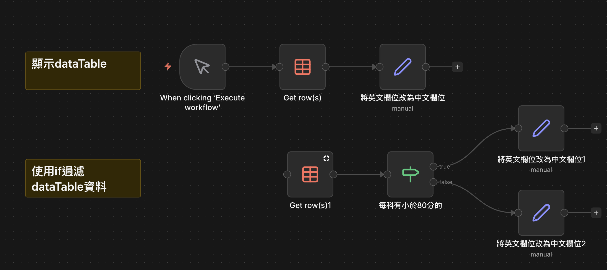

# DataTable 簡單操作教學

## 📋 DataTable 基本概念

DataTable 是 n8n 中用於儲存永久性資料的內建功能，具有以下特點：

- ✅ **永久性儲存**：資料會持續保留在 n8n 系統中
- ✅ **多種建立方式**：支援手動建立或 CSV 檔案匯入
- ✅ **即時查詢**：可隨時讀取、過濾和操作資料

## 🚀 建立 DataTable 教學

> **重要提醒**：DataTable 必須在 n8n 的 Overview 頁面中建立

### 方法一：手動建立

1. 在 Overview 頁面點選「Create DataTable」
2. **表格名稱**：`學生成績單`
3. **欄位設定**（僅支援英文欄位名稱）：
   - `name`：姓名
   - `chinese`：國文成績
   - `english`：英文成績
   - `math`：數學成績

### 方法二：CSV 檔案匯入

1. 準備 CSV 檔案（**欄位名稱必須為英文**）
2. 在 DataTable 建立頁面選擇「Import from CSV」
3. 上傳準備好的 CSV 檔案

#### 📥 範例 CSV 檔案下載
[📄 學生成績單.csv](./學生成績單.csv)

> **檔案格式說明**：
> - 第一行為欄位標題（英文）
> - 後續行為資料內容
> - 支援中文字元內容

## 🔍 DataTable 操作範例

下圖展示如何讀取和過濾 DataTable 中的資料：

## ⚠️ 使用前準備

> **注意**：要使用本範例工作流，請務必先在 n8n 中建立名為 `學生成績單` 的 DataTable

## 📥 工作流程下載

[🚀 下載完整工作流](./DataTable簡單操作.json)

---

**💡 小提示**：建立 DataTable 後，你可以在任何工作流中透過「DataTable」節點來讀取、新增、更新或刪除資料。
