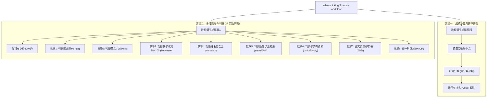
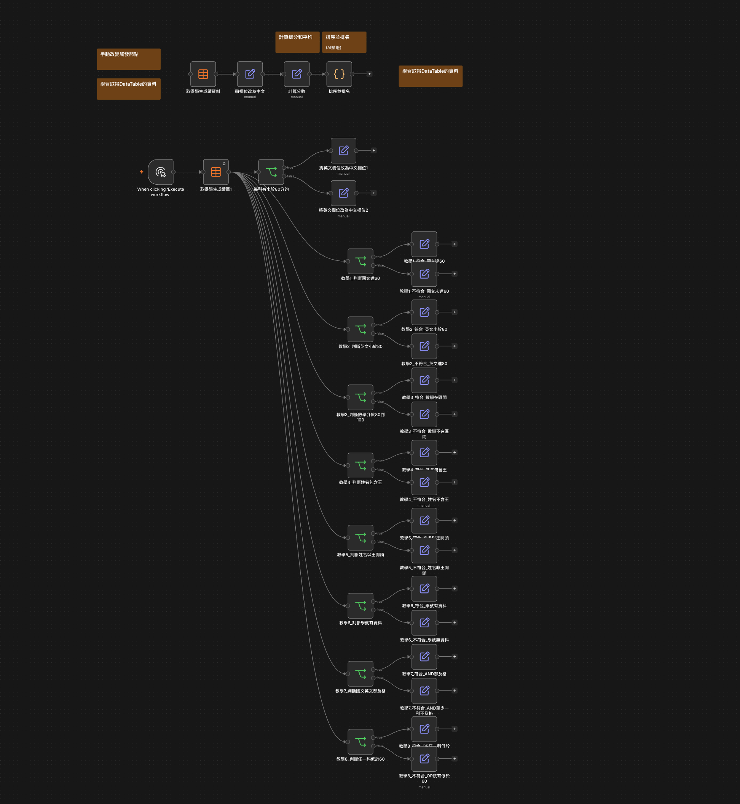

# DataTable 簡單操作教學

本教學專案示範如何在 n8n 中使用 **DataTable** 進行資料存取，並結合 **Edit Fields (Set)**、**Code** 與 **IF (條件判斷)** 節點完成成績計算、自動排名以及多種常見的條件邏輯篩選。

---

## 📋 DataTable 基本概念

DataTable 是 n8n 中用於儲存永久性資料的內建資料庫功能，具備以下特點：

- ✅ **永久性儲存**：資料獨立保存在 n8n 系統中，工作流執行結束後依然保留。
- ✅ **多種建立方式**：支援手動建立欄位與資料，或直接由 CSV 檔案批次匯入。
- ✅ **靈活讀取與操作**：可透過 DataTable 節點即時讀取、過濾、更新、新增與刪除資料。

---

## 🚀 建立 DataTable 教學

> **重要提醒**：DataTable 需在 n8n 側邊欄或 Overview 頁面中的 **Data tables** 進行建立。

### 方法一：手動建立

1. 在 n8n 主選單點選 **Data tables** -> **Create table**
2. **表格名稱**：`學生成績` 或 `學生成績單`
3. **欄位設定**（建議使用英文欄位名稱）：
   - `name` (String)：學生姓名
   - `student_id` / `sn` (String 或 Number)：學號
   - `chinese` (Number)：國文成績
   - `english` (Number)：英文成績
   - `math` (Number)：數學成績

### 方法二：CSV 檔案匯入

1. 準備 CSV 檔案（首行欄位標題建議為英文）
2. 在建立 DataTable 時選擇 **Import CSV**
3. 上傳準備好的 CSV 檔案即可快速建立結構與填入資料

#### 📥 範例 CSV 檔案下載
- [📄 學生成績單.csv](./學生成績單.csv)

---

## 🏗️ 工作流程架構解析

本範例工作流（[DataTable簡單操作.json](./DataTable簡單操作.json)）主要包含兩大核心應用情境：

```mermaid
graph TD
    Trigger["When clicking 'Execute workflow'"] --> Get1["取得學生成績單1"]
    Trigger --> Get2["取得學生成績資料"]
    
    subgraph Flow1 ["流程一：成績計算與排序排名"]
        Get2 --> Rename["將欄位改為中文"]
        Rename --> Calc["計算分數 (總分與平均)"]
        Calc --> Rank["排序並排名 (Code 節點)"]
    end

    subgraph Flow2 ["流程二：多情境條件判斷 (IF 節點示範)"]
        Get1 --> IF0["每科有小於80分的"]
        Get1 --> IF1["教學1: 判斷國文達60 (gte)"]
        Get1 --> IF2["教學2: 判斷英文小於80 (lt)"]
        Get1 --> IF3["教學3: 判斷數學介於80~100 (between)"]
        Get1 --> IF4["教學4: 判斷姓名包含王 (contains)"]
        Get1 --> IF5["教學5: 判斷姓名以王開頭 (startsWith)"]
        Get1 --> IF6["教學6: 判斷學號有資料 (isNotEmpty)"]
        Get1 --> IF7["教學7: 國文英文都及格 (AND)"]
        Get1 --> IF8["教學8: 任一科低於60 (OR)"]
    end
```

---

### 1️⃣ 流程一：成績統計與排名計算

1. **取得學生成績資料 (DataTable 節點)**：讀取 DataTable 內的全部學生資料。
2. **將欄位改為中文 (Edit Fields / Set 節點)**：
   - 將 `name` 轉為 `姓名`
   - 將 `sn` / `student_id` 轉為 `學號`
   - 將 `chinese`、`english`、`math` 轉為 `國文`、`英文`、`數學`
3. **計算分數 (Edit Fields / Set 節點)**：
   - **總分**：`={{ $json.國文 + $json.英文 + $json.數學 }}`
   - **平均**：`={{ (($json.國文 + $json.英文 + $json.數學) / 3).toFixed(2) }}`
4. **排序並排名 (Code 節點)**：
   - 依照平均分數從高到低進行排序。
   - 自動賦予名次（`排名`），並正確處理同分同名次邏輯。

---

### 2️⃣ 流程二：8 種實用條件判斷教學 (IF 節點)

本範例展示了 n8n IF 節點最常用的 8 種條件判斷方式，並在 True / False 分支附加 `判斷結果` 標籤：

| 編號 | 教學主題 | 運算子 / 規則 | 條件設定說明 | 符合 (True) 輸出 | 不符合 (False) 輸出 |
| :--- | :--- | :--- | :--- | :--- | :--- |
| **教學 1** | 數值大於等於 | `>=` (gte) | `chinese >= 60` | 國文達到60分以上 | 國文未達60分 |
| **教學 2** | 數值小於 | `<` (lt) | `english < 80` | 英文小於80分 | 英文大於等於80分 |
| **教學 3** | 數值區間範圍 | `between` | `math between 80 and 100` | 數學介於80到100分 | 數學不在80到100分之間 |
| **教學 4** | 字串包含 | `contains` | `name contains '王'` | 姓名包含王 | 姓名不包含王 |
| **教學 5** | 字串開頭比對 | `startsWith` | `name startsWith '王'` | 姓名以王開頭 | 姓名不是以王開頭 |
| **教學 6** | 欄位非空判斷 | `isNotEmpty` | `student_id isNotEmpty` | 學號欄位有資料 | 學號欄位沒有資料 |
| **教學 7** | 多條件 AND | `AND` 全部符合 | `chinese >= 60 AND english >= 60` | 國文與英文都及格 | 至少一科不及格 |
| **教學 8** | 多條件 OR | `OR` 任一符合 | `chinese < 60 OR english < 60 OR math < 60` | 至少一科低於60分 | 每一科都達到60分 |

---

## 🔍 DataTable 節點操作截圖

---

## ⚠️ 使用前準備

1. **建立 DataTable**：在 n8n 中建立名為 `學生成績`（或 `學生成績單`）的 DataTable，並確認包含 `name`、`chinese`、`english`、`math`（可選 `student_id` / `sn`）欄位。
2. **匯入工作流**：將 [DataTable簡單操作.json](./DataTable簡單操作.json) 匯入至 n8n。
3. **檢查 DataTable 節點綁定**：開啟工作流中的 DataTable 節點（例如 `取得學生成績資料`、`取得學生成績單1`），在 **Data Table** 下拉選單中選取您建立好的 DataTable。
4. **執行測試**：點選 **Test step** 或 **Execute workflow** 即可看到所有分支的運算結果。

---

## 📥 相關檔案下載

- [🚀 下載完整工作流 (JSON)](./DataTable簡單操作.json)
- [📄 下載範例成績單 (CSV)](./學生成績單.csv)

