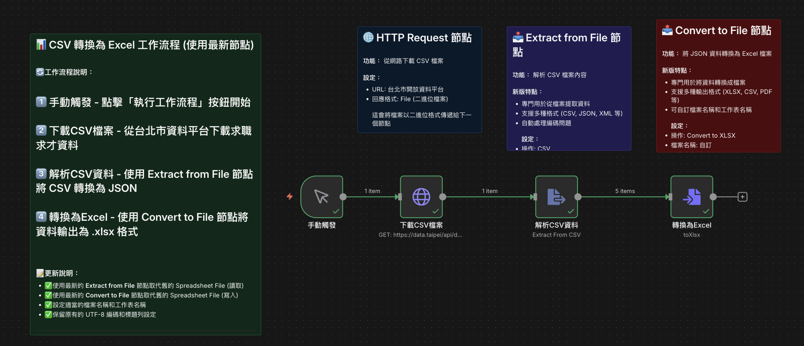

# CSV 轉換為 Excel 教學

本教學示範如何使用 n8n 的現代化檔案處理節點（**Extract from File** 與 **Convert to File**），從網路下載 CSV 開放資料並將其轉換為 Excel (.xlsx) 檔案。

---

## 🏗️ 工作流程架構

---

## 📋 核心節點設定說明

| 步驟 / 節點 | 節點類型 | 關鍵設定說明 |
| :--- | :--- | :--- |
| **1. 觸發執行** | Manual Trigger | 手動點擊「Execute workflow」啟動流程 |
| **2. 下載 CSV** | HTTP Request | • **Method**：`GET` • **URL**：臺北市就業服務處職缺開放資料網址 • **Response Format**：`File`（以二進位傳遞檔案） |
| **3. 解析 CSV** | Extract from File | • **Operation**：`CSV` • 自動將二進位 CSV 解析為結構化 JSON 資料陣列 |
| **4. 轉為 Excel** | Convert to File | • **Operation**：`Convert to XLSX` • 將 JSON 資料打包為標準 Excel (.xlsx) 檔案 |

> 🌐 **範例資料來源**：[臺北市資料大平台－求職求才職缺資訊](https://data.taipei/api/dataset/9cb8ebf1-8d21-4523-908c-af853867eea1/resource/cec51213-9585-4b4a-ae18-5c9309ddf453/download)

---

## 📸 工作流程截圖

---

## 🚀 快速操作指南

1. **匯入工作流**：下載 [CSV轉換為Excel.json](./CSV轉換為Excel.json) 並匯入至 n8n。
2. **執行工作流程**：點選右上角 **Execute workflow** 執行流程。
3. **下載 Excel 檔案**：點擊最後一個 **Convert to File** 節點，切換至 **Binary** 標籤頁即可點擊下載生成的 `.xlsx` 試算表。

---

## 📥 相關檔案下載

- [🚀 下載完整工作流 (JSON)](./CSV轉換為Excel.json)
