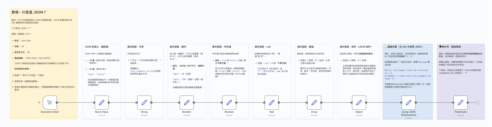

# 初階範例
## 透過互動式逐步教程學習 JSON 基礎（適合初學者）

### 📚 工作流程說明

這個 n8n 工作流程是一個互動式的教學指南，專門為了幫助初學者理解 JSON (JavaScript Object Notation) 的基礎概念而設計。透過視覺化的節點操作，你將一步步學習 JSON 的核心結構（鍵與值）、各種資料型態（字串、數字、布林值、陣列、物件、Null），以及如何在 n8n 中透過表達式（Expressions）來靈活運用這些資料。這不需要任何程式設計背景，只需跟隨流程中的便利貼（Sticky Notes）指引即可輕鬆上手。

### 參考影片和template

[透過互動式逐步教程學習JSON基礎-樣版下載](./透過互動式逐步教程學習JSON基礎.json)

### 預覽圖




#### 📋 節點詳細說明

1. **👆 Execute to Start (Manual Trigger)**
   - **功能**：流程的起點。
   - **操作**：點擊「Execute Workflow」按鈕來啟動整個教學流程。

2. **🔑 Key & Value (Set)**
   - **功能**：介紹 JSON 的基本單位。
   - **概念**：展示「鍵 (Key)」與「值 (Value)」的配對關係。

3. **🔡 String (Set)**
   - **功能**：介紹字串型態。
   - **概念**：文字資料，必須使用雙引號 `""` 包圍。

4. **🔢 Number (Set)**
   - **功能**：介紹數字型態。
   - **概念**：整數或浮點數，不需要引號。

5. **✅ Boolean (Set)**
   - **功能**：介紹布林值。
   - **概念**：只有 `true` (真) 或 `false` (假) 兩種狀態，適合用於邏輯判斷。

6. **🚫 Null (Set)**
   - **功能**：介紹空值。
   - **概念**：代表「無」或「空」，與 0 或空字串不同。

7. **qh Array (Set)**
   - **功能**：介紹陣列。
   - **概念**：有序的資料列表，使用方括號 `[]` 包圍。

8. **📦 Object (Set)**
   - **功能**：介紹物件。
   - **概念**：複雜的資料結構，包含多個鍵值對，使用大括號 `{}` 包圍。

9. **⚡ Using JSON (Expressions)**
   - **功能**：學習資料引用。
   - **操作**：展示如何使用 n8n 的表達式 `{{ ... }}` 來讀取前面節點產生的資料。

10. **🎓 Final Exam (Set)**
    - **功能**：綜合練習。
    - **內容**：彙整所有學到的資料型態，建立一個完整的 JSON 摘要。

#### 🎯 學習重點

- **JSON 語法基礎**：掌握引號、括號與逗號的正確使用方式。
- **資料型態辨識**：能夠區分並正確使用六種基本的 JSON 資料型態。
- **n8n 表達式**：學會如何在後續節點中引用前序節點的 JSON 資料（Data Mapping）。
- **資料結構化**：理解如何利用 Array 和 Object 來組織複雜的資訊。

#### 💡 實際應用場景

- **API 串接**：理解並處理 RESTful API 回傳的 JSON 格式資料。
- **資料轉換**：將不同來源的資料整理成統一的 JSON 格式。
- **設定檔管理**：讀取或產生 JSON 格式的設定檔。

#### ⚙️ 設定步驟

---

### 🤖 AI 賦能延伸實作（附 Prompt 提詞）

<details>
<summary>👉 點擊展開可直接複製給 AI 助理的 Prompt 提詞（含陣列拆解實戰）</summary>

> 💡 **任務目標**：透過 MCP 連線，讓 AI 助理自動從零建立「JSON 巢狀陣列拆解」實戰工作流。

#### 提詞 1：從零建立「進階 JSON 巢狀資料處理」工作流
```text
請在 n8n 替我從無到有建立一個全新的「進階 JSON 巢狀資料處理」工作流程：
1. 建立一個全新的空白工作流，命名為「進階 JSON 巢狀資料實戰」。
2. 起點使用 Manual Trigger 節點。
3. 串接一個 Code 節點或 Set 節點，生成一組包含會員與訂單資訊的巢狀 JSON 物件（例如：customer_name: "王小明"、is_vip: true、items 陣列：包含多筆商品名稱、單價與數量）。
4. 接續新增一個 Set (Edit Fields) 節點，使用 n8n 表達式提取出：
   - 購買總品項數量 (items.length)
   - 第一個購買的商品名稱 (items[0].name)
   - 判斷是否為 VIP 並回傳折扣文字（如「享 VIP 9折優惠」）
5. 請直接幫我在畫布上建立所有節點、配置好表達式語法並完成連線！
```

---

#### 提詞 2：進階陣列拆解實戰（使用 Item Lists 節點將陣列拆解為單筆資料）
> 📌 **核心原理**：
> 當來源資料是一筆訂單且內部包含多筆商品（`order_items` 陣列）時，若要將商品逐筆寫入資料庫/DataTable，必須使用 **`Item Lists (Split Out Items)`** 節點將陣列拆解為多筆獨立的 n8n Items。
>
> ```mermaid
> flowchart LR
>     A["📦 1 筆訂單<br/>(含 2 樣商品陣列)"] --> B["✂️ Item Lists (Split Out)"]
>     B --> C["📄 明細 1：高山茶"]
>     B --> D["📄 明細 2：紅茶"]
> ```

```text
請在 n8n 替我建立一個「JSON 巢狀陣列拆解與逐筆資料處理」工作流程：
1. 建立一個全新的空白工作流，命名為「JSON 陣列拆解與批次寫入實戰」。
2. 起點使用 Manual Trigger 節點。
3. 串接一個 Set (Edit Fields) 節點，生成包含商品清單陣列的訂購資料：
   - customer_name: "王小明"
   - phone: "0912-345-678"
   - order_items (Array):
     - [0] item_name: "阿里山高山茶", quantity: 2, unit_price: 600
     - [1] item_name: "日月潭紅茶", quantity: 1, unit_price: 450
4. 串接一個 Item Lists 節點（Operation: Split Out Items）：
   - Field to Split Out: order_items
   - Include: other fields（保留顧客姓名與電話）
   - 將原本 1 筆訂單拆解為 2 筆獨立的商品項目。
5. 串接 Set (Edit Fields) 節點整理每筆明細欄位：
   - 「顧客姓名」：{{ $json.customer_name }}
   - 「商品名稱」：{{ $json.item_name }}
   - 「購買數量」：{{ $json.quantity }}
   - 「小計金額」：{{ $json.quantity * $json.unit_price }}
6. 請幫我在畫布上建立所有節點、設定好欄位表達式並完成連線！
```
</details>


