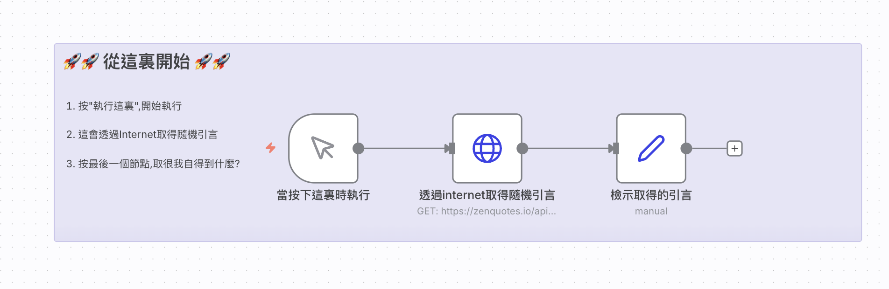

# 初階範例
## 取得網站引言

### 📚 工作流程說明

這個 n8n 工作流程示範如何從網際網路上的 API 取得隨機引言（Quote），並整理成容易閱讀的格式。

### 預覽圖



#### 🔄 工作流程圖

```
[便利貼說明] → [手動觸發] → [HTTP 請求取得引言] → [整理並重新命名欄位]
```

#### 📋 節點詳細說明

1. **📝 Sticky Note（便利貼）**
   - **功能**：顯示使用說明，幫助使用者了解如何操作這個工作流程
   - **內容**：告訴使用者如何開始執行、會發生什麼事，以及如何查看結果

2. **▶️ Manual Trigger（手動觸發節點）**
   - **功能**：工作流程的起點
   - **操作方式**：點擊這個節點上的「執行」按鈕，即可開始執行整個工作流程
   - **為什麼需要它**：n8n 的每個工作流程都需要一個觸發節點來啟動

3. **🌐 HTTP Request（HTTP 請求節點）**
   - **功能**：向外部 API 發送 HTTP 請求，取得資料
   - **API 網址**：`https://zenquotes.io/api/random`
   - **請求方式**：GET（取得資料）
   - **會得到的資料**：一個包含引言資訊的 JSON 陣列，每個引言包含：
     - `q`：引言內容（quote）
     - `a`：作者名稱（author）
     - `h`：HTML 格式的引言

4. **🔄 Set（設定節點）**
   - **功能**：重新整理和命名資料欄位，讓資料更容易閱讀
   - **處理方式**：
     - 將 `q` 欄位重新命名為「問題」
     - 將 `a` 欄位重新命名為「作者」
     - 將 `h` 欄位重新命名為「回覆」
   - **使用的語法**：`={{ $json.q }}` 這是一種 n8n 的表達式語法，用來取得前一個節點傳來的 JSON 資料

#### 🎯 學習重點

- **API 概念**：了解如何透過 HTTP 請求從網路上取得資料
- **資料處理**：學習如何重新整理和命名資料欄位
- **工作流程設計**：理解如何將多個節點串聯起來完成一個任務
- **n8n 表達式**：認識 `={{ $json.欄位名稱 }}` 的用法

#### 💡 實際應用場景

這個範例可以延伸應用到：
- 每日自動取得勵志引言並發送到通知
- 收集多個引言並儲存到資料庫
- 將引言格式化後發送到電子郵件或社群媒體

---
