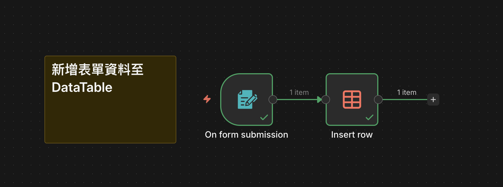

# n8n 內建表單節點完整教學

## 📋 表單觸發器 (Form Trigger) 介紹

n8n 內建的表單節點讓你可以快速建立網頁表單，無需額外的前端開發。當使用者填寫並提交表單後，資料會自動觸發工作流程執行。

### 🎯 本範例功能

本範例展示如何建立一個**學生成績輸入表單**，並將提交的資料自動儲存到 DataTable 中：

- ✅ **表單欄位**：學號、姓名、國文、英文、數學成績
- ✅ **資料驗證**：所有欄位皆為必填，分數欄位預設為 0
- ✅ **自動儲存**：提交後自動新增至「學生成績單」DataTable

## 🚀 工作流程架構

### 節點說明

#### 1. **On Form Submission** - 表單觸發器
- **表單標題**：學生成績輸入
- **表單描述**：每個欄位必需填寫
- **欄位設定**：
  - `學號`：數字類型，必填
  - `姓名`：文字類型，必填
  - `國文`：數字類型，0-100分，必填
  - `英文`：數字類型，0-100分，必填
  - `數學`：數字類型，0-100分，必填

#### 2. **Insert Row** - DataTable 新增
- **目標表格**：學生成績單
- **欄位對應**：
  - 表單 `姓名` → DataTable `name`
  - 表單 `學號` → DataTable `student_id`
  - 表單 `國文` → DataTable `chinese`
  - 表單 `英文` → DataTable `english`
  - 表單 `數學` → DataTable `math`

## 📸 工作流程圖

## ⚙️ 使用前準備

> **重要提醒**：使用本範例前，請務必先建立名為 `學生成績單` 的 DataTable，並包含以下欄位：
> - `name` (文字)
> - `student_id` (數字)
> - `chinese` (數字)
> - `english` (數字)
> - `math` (數字)

## 📥 工作流程下載

[🚀 下載完整工作流](./表單節點.json)

---

**💡 進階應用**：
- 可在表單提交後新增 Email 通知節點
- 可加入資料驗證邏輯（如分數範圍檢查）
- 可整合外部 API 進行資料處理或分析
