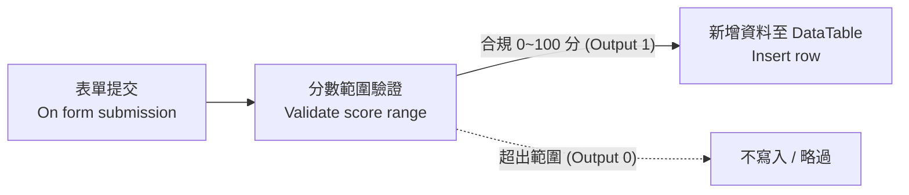
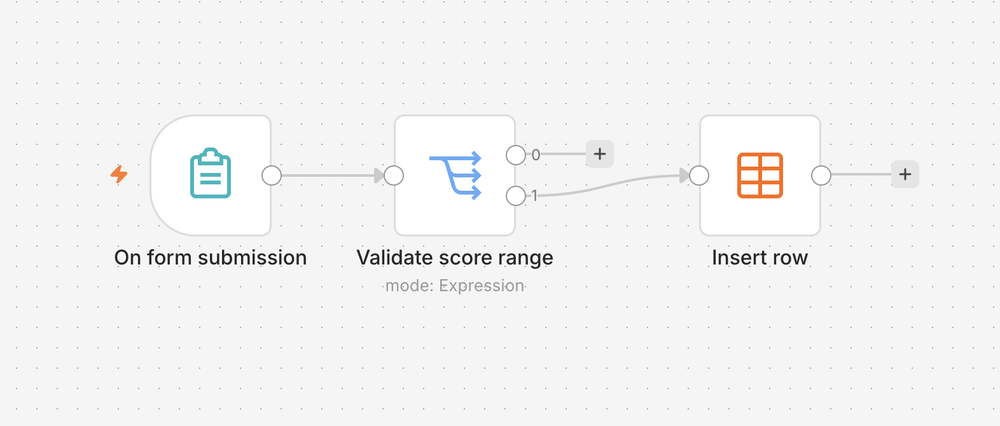

# n8n 內建表單節點完整教學

## 📋 表單觸發器 (Form Trigger) 介紹

n8n 內建的表單節點讓你可以快速建立網頁表單，無需額外的前端開發。當使用者填寫並提交表單後，資料會自動觸發工作流程執行。

### 🎯 本範例功能

本範例展示如何建立一個**學生成績輸入表單**，透過條件節點進行分數範圍檢查，並將合規資料自動儲存到 DataTable 中：

- ✅ **表單欄位**：學號、姓名、國文、英文、數學成績
- ✅ **資料驗證**：前端必填檢查與後端分數範圍驗證（0~100 分）
- ✅ **自動儲存**：驗證通過後自動新增至「學生成績表格」DataTable

## 🚀 工作流程架構


```mermaid
graph LR
    A[表單提交<br/>On form submission] --> B[分數範圍驗證<br/>Validate score range]
    B -- 合規 0~100 分 (Output 1) --> C[新增資料至 DataTable<br/>Insert row]
    B -. 超出範圍 (Output 0) .-> D[不寫入 / 略過]
```

### 節點說明

#### 1. **On form submission** - 表單觸發器
- **表單標題**：學生成績輸入
- **表單描述**：每個欄位必需填寫
- **回應模式**：以最後一個節點的結果回應 (`lastNode`)
- **按鈕文字**：送出
- **欄位設定**：
  - `學號`：數字類型 (Number)，預設提示 `20230517`，必填
  - `姓名`：文字類型 (String)，必填
  - `國文`：數字類型 (Number)，預設值 `0`，預設提示 `0~100分`，必填
  - `英文`：數字類型 (Number)，預設值 `0`，預設提示 `0~100分`，必填
  - `數學`：數字類型 (Number)，預設值 `0`，預設提示 `0~100`，必填

#### 2. **Validate score range** - 分數範圍驗證 (Switch 節點)
- **判定模式**：運算式 (Expression)
- **判斷式**：
  ```javascript
  ={{ ($json['國文'] < 0 || $json['國文'] > 100 || $json['英文'] < 0 || $json['英文'] > 100 || $json['數學'] < 0 || $json['數學'] > 100) ? 0 : 1 }}
  ```
- **輸出邏輯**：
  - `Output 0`：任一科目分數小於 0 或大於 100，判定為不合法，流程結束不進行儲存。
  - `Output 1`：所有科目分數皆在 0~100 分之間，判定為合法，接續至 `Insert row` 寫入資料庫。

#### 3. **Insert row** - DataTable 新增
- **目標表格**：學生成績表格
- **欄位對應**：
  - 表單 `姓名` → DataTable `name` (String)
  - 表單 `學號` → DataTable `class_id` (Number)
  - 表單 `國文` → DataTable `chinese` (Number)
  - 表單 `英文` → DataTable `english` (Number)
  - 表單 `數學` → DataTable `math` (Number)

## 📸 工作流程圖



## ⚙️ 使用前準備

> **重要提醒**：使用本範例前，請務必先在 n8n 中建立名為 `學生成績表格` 的 DataTable，並包含以下欄位：
> - `name` (文字 String)
> - `class_id` (數字 Number)
> - `chinese` (數字 Number)
> - `english` (數字 Number)
> - `math` (數字 Number)

## 📥 工作流程下載

[🚀 下載完整工作流](./表單節點.json)

---

**💡 進階應用**：
- 可在表單提交後新增 Email 或 LINE 通知節點
- 可在驗證失敗（Output 0）分支加入錯誤提示回應或記錄日誌
- 可整合外部 API 進行自動成績分析、排名或產生報表

<details>
<summary>🤖 <strong>AI 賦能延伸實作（附 Prompt 提詞）</strong></summary>

> 💡 **任務目標**：結合表單驗證分流，當成績合規寫入 DataTable「學生成績表格」後，由 AI 自動生成「個人化學習診斷與建議評語」並即時顯示於完成頁面；若成績超出範圍則回傳錯誤提示。

**可直接複製給 AI 的 Prompt 提詞**：
```text
請幫我升級「學生成績輸入表單」工作流程：
1. 目前流程架構：
   - 使用者透過 Form Trigger（On form submission）提交學生姓名與各科成績（學號、姓名、國文、英文、數學）。
   - 透過 Switch 節點（Validate score range）檢查各科成績是否介於 0~100 分。
   - 合規（Output 1）串接 DataTable 節點（Insert row）將資料寫入「學生成績表格」（欄位：name, class_id, chinese, english, math）。
2. 請幫我延伸實作：
   - 【合規成功分支】：在「Insert row」之後串接 AI 生成節點（或 AI Agent / Basic LLM Chain），根據學生的國文、英文、數學成績表現，自動產生一段約 100 字的「個人化學習診斷與鼓勵評語」（如強弱科分析與改善建議），並將評語動態顯示於表單提交完成回應頁面（Respond to Webhook / Form Response）。
   - 【超出範圍分支（Output 0）】：串接 Respond to Webhook 節點，回傳「⚠️ 成績輸入錯誤：國文、英文與數學分數皆需介於 0 至 100 分之間，請返回重新填寫！」。
3. 請幫我在畫布上建立所需節點、配置好表達式語法並完成連線！
```
</details>


