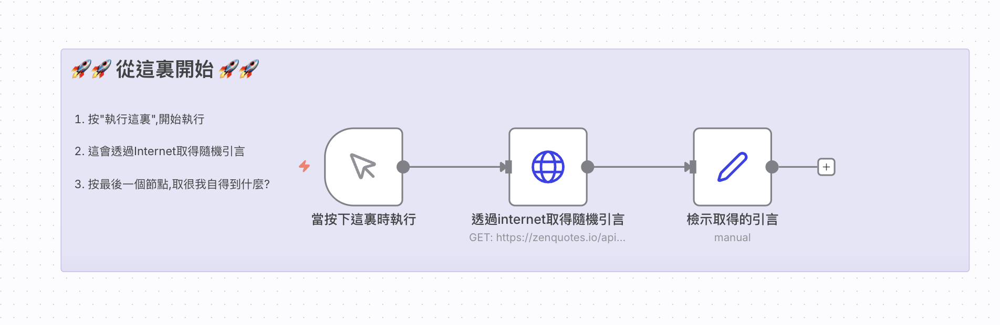

# 初階範例
## 取得網站引言

### 📚 工作流程說明

這個 n8n 工作流程示範如何從網際網路上的 API 取得隨機引言（Quote），並整理成容易閱讀的格式。

### 預覽圖



### 影片和template

[youtube](https://www.youtube.com/watch?v=dKTcAfBfFLU&t=11s)

[範例_透過網站取得引言-樣版下載](./範例_透過網站取得引言.json)

#### 📋 節點詳細說明

1. **📝 Sticky Note（便利貼）**
   - **功能**：顯示使用說明，幫助使用者了解如何操作這個工作流程
   - **內容**：告訴使用者如何開始執行、會發生什麼事，以及如何查看結果

2. **▶️ Manual Trigger（手動觸發節點）**
   - **功能**：工作流程的起點
   - **操作方式**：點擊這個節點上的「執行」按鈕，即可開始執行整個工作流程
   - **為什麼需要它**：n8n 的每個工作流程都需要一個觸發節點來啟動

3. **🌐 HTTP Request（HTTP 請求節點）**
   - **功能**：向外部 API 發送 HTTP 請求，取得資料
   - **API 網址**：`https://zenquotes.io/api/random`
   - **請求方式**：GET（取得資料）
   - **會得到的資料**：一個包含引言資訊的 JSON 陣列，每個引言包含：
     - `q`：引言內容（quote）
     - `a`：作者名稱（author）
     - `h`：HTML 格式的引言

4. **🔄 Set（設定節點）**
   - **功能**：重新整理和命名資料欄位，讓資料更容易閱讀
   - **處理方式**：
     - 將 `q` 欄位重新命名為「問題」
     - 將 `a` 欄位重新命名為「作者」
     - 將 `h` 欄位重新命名為「回覆」
   - **使用的語法**：`={{ $json.q }}` 這是一種 n8n 的表達式語法，用來取得前一個節點傳來的 JSON 資料

#### 🎯 學習重點

- **API 概念**：了解如何透過 HTTP 請求從網路上取得資料
- **資料處理**：學習如何重新整理和命名資料欄位
- **工作流程設計**：理解如何將多個節點串聯起來完成一個任務
- **n8n 表達式**：認識 `={{ $json.欄位名稱 }}` 的用法

#### 💡 實際應用場景

這個範例可以延伸應用到：
- 每日自動取得勵志引言並發送到通知
- 收集多個引言並儲存到資料庫
- 將引言格式化後發送到電子郵件或社群媒體

---

<details>
<summary>🤖 <strong>AI 賦能延伸實作（串接本地 Ollama 模型 Prompt）</strong></summary>

> 💡 **任務目標**：抓取英文名言後，由 **Ollama** 雲端模型（`gemma4:31b-cloud`）自動翻譯為繁體中文，並生成 30 字的今日行動啟發建議。

> ⚠️ **執行前準備（註冊與建立 Ollama Credentials 必做步驟）**：
> 1. **本機安裝 Ollama**：至 [Ollama 官網](https://ollama.com/) 下載並安裝。
> 2. **註冊 Ollama 帳號並建立 API Key**：
>    - 登入 [Ollama 官方網站](https://ollama.com/)。
>    - 進入個人設定頁面點選 **Keys**（或 **Settings > API keys**）。
>    - 點擊 **`Add API Key`**，建立並複製產生的 API Key。
> 3. **終端機下載並啟動模型**：
>    - 開啟終端機執行指令登入並啟動模型：
>      ```bash
>      ollama run gemma4:31b-cloud
>      ```
> 4. **在 n8n 建立 Ollama Credentials（憑證）**：
>    - 在 n8n 左側選單點選 **Credentials** ➔ **Add Credential** ➔ 選擇 **Ollama**。
>    - **Base URL**：
>      - Docker 容器環境填入：`http://host.docker.internal:11434`
>      - 本機 npm 運行環境填入：`http://localhost:11434`
>    - **API Key**：貼上剛才在 Ollama 網站產生的 API Key。
>    - 點擊 **Save**，確認上方出現 **`Connection tested successfully`**（綠色連線成功提示）。

**可直接複製給 AI 的 Prompt 提詞**：
```text
我想將「取得隨機引言」工作流程升級為「每日 AI 哲理金句機器人」：
1. 保留原本的 HTTP Request 節點（向 https://zenquotes.io/api/random 抓取引言）。
2. 在後面串接 Basic LLM Chain（或 AI Agent）節點，並連接「Ollama Chat Model」模型節點。
3. 憑證請選擇已建立好的 Ollama Account，模型指定使用 `gemma4:31b-cloud`。
4. 設定 AI Prompt 提詞：將抓到的英文名言（{{ $json.q }}）與作者（{{ $json.a }}）翻譯為優美的繁體中文，並自動生成一句 30 字以內的「今日行動建議與啟發」。
5. 最後將英文原文、中文翻譯與行動啟發整理為結構化的 JSON 輸出。
請直接幫我在工作流中新增、設定好這些節點並完成連線！
```
</details>
