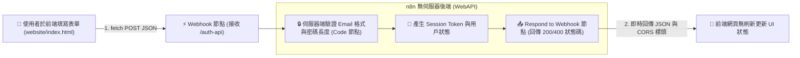

# 🌐 前端網頁與 WebAPI 整合
## 範例 1：即時會員註冊與登入驗證 API（n8n 作為 Auth 後端）

### 📚 工作流程說明

當您在開發前端網站（HTML/CSS/JS、Vue、React、Next.js）時，不需要專門架設 Node.js Express 或 Python FastAPI 伺服器，**直接使用 n8n 就能成為全功能後端 Web API（Backend-as-a-Service）**！

本範例展示：
1. **極致美觀的前端介面**：提供開箱即用的玻璃擬態（Glassmorphism）會員註冊與登入網頁。
2. **前端異步呼叫**：使用原生 JavaScript `fetch()` 發送 POST 請求至 n8n Webhook。
3. **後端安全驗證**：n8n 進行 Email 格式校驗、密碼長度檢查，產生 Session Token，並透過 **Respond to Webhook 節點** 回傳標準 HTTP 200 OK 或 400 Bad Request 狀態碼與 JSON 資料。

---

### 流程架構圖



---

### 工作流程與前端檔案下載

- [📥 n8n WebAPI 工作流程樣版 (01_auth_webapi_workflow.json)](./01_auth_webapi_workflow.json)
- [💻 前端登入/註冊網頁原始碼 (website/index.html)](./website/index.html)

---

#### 📋 節點詳細說明

1. **📝 流程說明（Sticky Note）**
   - **功能**：介紹 WebAPI 端點設計、`Response Mode: Using 'Respond to Webhook' Node` 與 CORS 跨域設定。

2. **⚡ 接收前端 Auth 請求 (POST)（Webhook Node）**
   - **HTTP Method**：`POST`
   - **Path**：`auth-api`
   - **Response Mode**：`Using 'Respond to Webhook' Node`（必須開啟此選項，才能自訂回傳內容與 HTTP Status Code）
   - **Allowed Origins (CORS)**：`*`

3. **🔒 伺服器端驗證與 Token 生成（Code Node）**
   - **功能**：後端嚴格校驗資料，防止惡意請求與格式錯誤。

4. **📤 即時回傳 JSON 給前端網頁（Respond to Webhook Node）**
   - **Response Code**：`={{ $json.statusCode }}`（動態回傳 200 或 400）
   - **Response Body**：`={{ JSON.stringify($json.response) }}`
   - **Headers**：`Access-Control-Allow-Origin: *`

---

#### 🧪 測試與驗證方法

1. **使用瀏覽器直接體驗**：
   - 使用瀏覽器直接打開 `website/index.html`。
   - 在輸入框填入您的 n8n Webhook URL（例如：`http://localhost:5678/webhook-test/auth-api`）。
   - 點擊「立即註冊」或「登入系統」，即可在網頁上看到毫秒級即時回傳的 Token 與成功訊息！

2. **使用 curl 命令行測試**：
   ```bash
   curl -X POST http://localhost:5678/webhook/auth-api \
     -H "Content-Type: application/json" \
     -d '{
       "action": "register",
       "name": "王小明",
       "email": "ming@example.com",
       "password": "password123"
     }'
   ```

---

#### 🎯 學習重點

- **`Respond to Webhook` 節點的重要性**：若未搭配此節點，Webhook 預設只會回傳固定的 `Workflow got started`，無法回傳自訂 JSON 給前端網頁。
- **跨來源資源共用 (CORS)**：在 Webhook 與 Respond 節點中加入 `Access-Control-Allow-Origin: *`，防止前端 JavaScript 發生 CORS 跨域阻擋錯誤。

---

<details>
<summary>🤖 <strong>AI 賦能延伸實作（附 Prompt 提詞）</strong></summary>

> 💡 **任務目標**：透過 MCP 連線，讓 AI 將會員資料真正寫入 Supabase 資料庫。

**可直接複製給 AI 的 Prompt 提詞**：
```text
請幫我在「即時會員註冊 WebAPI」流程中串接 Supabase：
1. 在 Code 節點驗證通過後，若 action 為 'register'，串接 Supabase 節點將 email, name 寫入 customers 資料表。
2. 若 action 為 'login'，串接 Supabase 節點查詢該 email 是否存在。
3. 根據資料庫查詢結果組裝 response 並透過 Respond to Webhook 節點回傳給前端。
請幫我配置好節點與錯誤處理邏輯！
```
</details>
