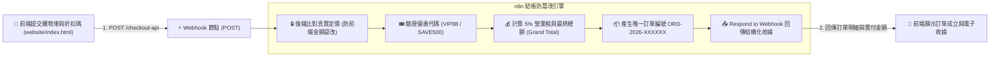

# 🌐 前端網頁與 WebAPI 整合
## 範例 3：電商購物車結帳與折扣碼計算 API（後端防篡改與訂單生成）

### 📚 工作流程說明

在電子商務系統中，**結帳與金額計算絕對不能只依賴前端 JavaScript**（因為惡意使用者可隨意竄改網頁上的金額發送給後端）。必須由後端根據商品 ID 重新查詢官方定價、核算折扣券代碼、計算 5% 營業稅，並產生正式訂單編號。

本範例展示：
1. **前端購物車介面**：提供商品數量增減、優惠券代碼輸入與客戶收件資訊填寫。
2. **n8n 後端安全驗證與計價**：Webhook 接收訂購明細，後端 Code 節點依據商品真實定價核算小計，驗證 `VIP88`（88 折優惠）或 `SAVE500` 折扣碼，並計算稅額與 Grand Total。
3. **訂單建立與收據回傳**：透過 **Respond to Webhook 節點** 回傳訂單編號與完整收據明細，前端即時呈現核算成果。

---

### 流程架構圖



---

### 工作流程與前端檔案下載

- [📥 n8n WebAPI 工作流程樣版 (03_checkout_coupon_api_workflow.json)](./03_checkout_coupon_api_workflow.json)
- [💻 前端購物車結帳網頁原始碼 (website/index.html)](./website/index.html)

---

#### 📋 節點詳細說明

1. **📝 流程說明（Sticky Note）**
   - **功能**：說明電商結帳安全原則（Trust No Client）、後端二次算價與優惠券狀態機。

2. **⚡ 接收前端結帳請求 (POST)（Webhook Node）**
   - **HTTP Method**：`POST`
   - **Path**：`checkout-api`
   - **Response Mode**：`Using 'Respond to Webhook' Node`

3. **🔒 防篡改驗證與折扣計算（Code Node）**
   - **安全核心**：前端只傳送 `{ id: "prod_1", qty: 1 }`，由後端字典 `priceBook` 決定價格，杜絕用戶修改單價。
   - **折扣碼規則**：
     - `VIP88`：88 折優惠（折抵 12%）
     - `SAVE500`：滿額現折 $500
     - `WELCOME`：迎賓折抵 $200

4. **📤 回傳結帳收據與訂單編號（Respond to Webhook Node）**
   - **回傳內容**：包含 `orderNumber`、客戶資訊與各品項計算後的收據。

---

#### 🧪 測試與驗證方法

1. **瀏覽器介面體驗**：
   - 開啟 `website/index.html`。
   - 調整購買數量，在折扣碼欄位輸入 `VIP88` 或 `SAVE500`。
   - 點擊「立即確認送出訂單」，觀察畫面如何即時帶出後端算出的折扣金額與訂單編號！

2. **curl 命令行測試**：
   ```bash
   curl -X POST http://localhost:5678/webhook/checkout-api \
     -H "Content-Type: application/json" \
     -d '{
       "customer": { "name": "李美麗", "email": "mary@example.com" },
       "items": [{ "id": "prod_1", "qty": 2 }],
       "couponCode": "VIP88"
     }'
   ```

---

#### 🎯 學習重點

- **電子商務安全性**：絕不在前端計算最終結帳金額，所有金額、稅金與優惠折抵必須在 n8n 後端強制核算。
- **訂單唯一編號生成**：掌握時間戳與隨機亂數的訂單序號格式化技巧。

---

<details>
<summary>🤖 <strong>AI 賦能延伸實作（附 Prompt 提詞）</strong></summary>

> 💡 **任務目標**：透過 MCP 連線，讓 AI 將結帳成功的訂單寫入 Supabase `orders` 資料表並發送 LINE 推播。

**可直接複製給 AI 的 Prompt 提詞**：
```text
請幫我在「購物車結帳 WebAPI」流程中加入資料庫儲存與通知：
1. 在 Code 節點產出訂單後，串接 Postgres / Supabase 節點，將 orderNumber, customer, grandTotal 寫入 orders 資料表。
2. 串接 Telegram 節點發送「收到新訂單 ORD-XXXXX，金額 $XX,XXX」推播通知。
3. 最後透過 Respond to Webhook 節點回傳給前端。
請幫我配置好資料庫寫入與通知節點！
```
</details>
