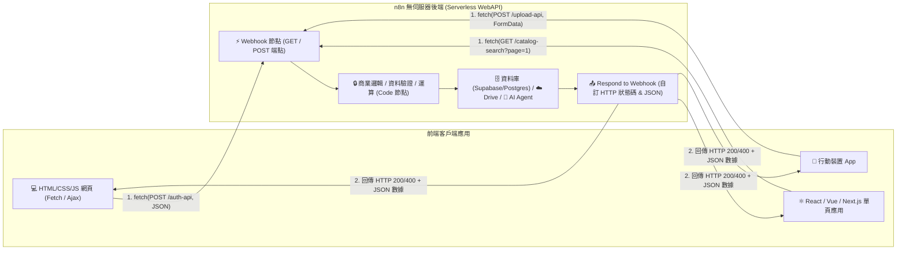

# 🌐 前端網頁與 WebAPI 整合（n8n 作為無伺服器後端網站）

歡迎來到 **n8n 前端網頁與 WebAPI 整合實戰教學**！

在傳統全端開發中，要為前端網頁（HTML/CSS/JS、Vue、React、Next.js）建置後端功能，通常需要使用 Node.js Express 或 Python FastAPI 架設伺服器、設定路由、處理資料庫連線與部屬維運。

透過 n8n，您可以直接將 **n8n 作為強大且彈性的無伺服器後端網站 Web API（Backend-as-a-Service / BaaS）**！前端只需透過標準的 `fetch()` 或 AJAX 發送 HTTP 請求給 n8n Webhook，n8n 就會在背景執行商業邏輯、存取資料庫、呼叫 AI 模型，並透過 **Respond to Webhook 節點** 回傳結構化 JSON 資料與 HTTP 狀態碼！

> 💡 **AI 協作時代學習法**：在完成基礎節點設定並透過 MCP 連線 AI（Gemini、ChatGPT 或 Claude）後，您可以直接複製各範例中的 **「AI 賦能延伸實作」** 折疊區塊（`<details>`）內的 Prompt 提詞，由 AI 助理替您在畫布上全自動建構與擴充進階邏輯！

---

## 🧭 n8n 作為後端 WebAPI 核心架構



---

## 📚 實作範例導覽（由淺至深）

本教學規劃了五個具備完整前端網頁介面與開箱即用工作流程的實作範例：

---

### 1. [範例 1：即時會員註冊與登入驗證 API（n8n 作為 Auth 後端）](./01_即時會員註冊與驗證API/README.md)

**難度**：入門 🟢 ｜ **核心技術**：Webhook (POST) + Code 驗證 + Respond to Webhook

提供極具科技感的玻璃擬態前端註冊登入頁面，由 n8n 擔任身分驗證伺服器，負責 Email 格式驗證、密碼檢查、Session Token 簽發與 HTTP 狀態碼回傳。

**學習重點**：
- 前端 `fetch()` 與 n8n Webhook POST 連線
- `Response Mode: Using 'Respond to Webhook' Node` 配置
- CORS 跨來源共用標頭設定（`Access-Control-Allow-Origin: *`）

- **附帶資源**：[`01_auth_webapi_workflow.json`](./01_即時會員註冊與驗證API/01_auth_webapi_workflow.json)、[`website/index.html`](./01_即時會員註冊與驗證API/website/index.html)

<details>
<summary>🤖 <strong>AI 賦能延伸實作（附 Prompt 提詞）</strong></summary>

> 💡 **任務目標**：透過 MCP 連線，讓 AI 將會員資料真正寫入 Supabase 資料庫。

**可直接複製給 AI 的 Prompt 提詞**：
```text
請幫我在「即時會員註冊 WebAPI」流程中串接 Supabase：
1. 在 Code 節點驗證通過後，若 action 為 'register'，串接 Supabase 節點將 email, name 寫入 customers 資料表。
2. 若 action 為 'login'，串接 Supabase 節點查詢該 email 是否存在。
3. 根據資料庫查詢結果組裝 response 並透過 Respond to Webhook 節點回傳給前端。
請幫我配置好節點與錯誤處理邏輯！
```
</details>

---

### 2. [範例 2：動態商品型錄分頁與即時搜尋 API（GET 查詢參數與防抖搜尋）](./02_商品型錄分頁與即時搜尋API/README.md)

**難度**：初級 🟢 ｜ **核心技術**：Webhook (GET) + Query Params + 伺服器端分頁

現代電商卡片商品型錄！前端採用 300ms 防抖搜尋與分類切換，由 n8n 接收 Query 參數進行伺服器端過濾、切片與分頁元數據（Total Pages/Items）計算。

**學習重點**：
- RESTful GET 請求與 `$json.query` 參數解析
- 前端輸入防抖（Debounce）減輕伺服器壓力
- 伺服器端多條件過濾與分頁陣列切片演算法

- **附帶資源**：[`02_catalog_search_api_workflow.json`](./02_商品型錄分頁與即時搜尋API/02_catalog_search_api_workflow.json)、[`website/index.html`](./02_商品型錄分頁與即時搜尋API/website/index.html)

<details>
<summary>🤖 <strong>AI 賦能延伸實作（附 Prompt 提詞）</strong></summary>

> 💡 **任務目標**：透過 MCP 連線，讓 AI 將商品資料來源改為從 Supabase `products` 資料表動態 SQL 查詢。

**可直接複製給 AI 的 Prompt 提詞**：
```text
請幫我將「商品型錄搜尋 API」的資料來源改接 Supabase 資料庫：
1. 接收前端傳入的 search 與 category 參數。
2. 串接 Postgres 節點執行 SQL：SELECT * FROM products WHERE (category = $1 OR $1 = 'all') AND (name ILIKE '%' || $2 || '%') ORDER BY id DESC LIMIT $3 OFFSET $4;
3. 額外執行 COUNT 查詢計算總筆數。
4. 組裝分頁資料並透過 Respond to Webhook 回傳給前端。
請幫我配置好 SQL 語句與節點連線！
```
</details>

---

### 3. [範例 3：電商購物車結帳與折扣碼計算 API（後端防篡改與訂單生成）](./03_購物車結帳與折扣碼計算API/README.md)

**難度**：中級 🟡 ｜ **核心技術**：後端強制定價 + 折扣碼狀態機 + 5% 稅金計算

電商結帳安全實戰！前端購物車傳入商品 ID 與優惠券代碼，後端強制以官方定價重新核算、驗證優惠代碼（`VIP88` / `SAVE500`），計算稅額並產出唯一訂單序號。

**學習重點**：
- 電商後端安全原則（Trust No Client，防前端篡改金額）
- 促銷折扣券（百分比折抵 / 固定金額折抵）邏輯
- 產出正式訂單收據與唯一訂單編號

- **附帶資源**：[`03_checkout_coupon_api_workflow.json`](./03_購物車結帳與折扣碼計算API/03_checkout_coupon_api_workflow.json)、[`website/index.html`](./03_購物車結帳與折扣碼計算API/website/index.html)

<details>
<summary>🤖 <strong>AI 賦能延伸實作（附 Prompt 提詞）</strong></summary>

> 💡 **任務目標**：透過 MCP 連線，讓 AI 將結帳成功的訂單寫入 Supabase `orders` 資料表並發送 LINE 推播。

**可直接複製給 AI 的 Prompt 提詞**：
```text
請幫我在「購物車結帳 WebAPI」流程中加入資料庫儲存與通知：
1. 在 Code 節點產出訂單後，串接 Postgres / Supabase 節點，將 orderNumber, customer, grandTotal 寫入 orders 資料表。
2. 串接 Telegram 節點發送「收到新訂單 ORD-XXXXX，金額 $XX,XXX」推播通知。
3. 最後透過 Respond to Webhook 節點回傳給前端。
請幫我配置好資料庫寫入與通知節點！
```
</details>

---

### 4. [範例 4：大檔/圖片上傳與自動雲端託管 API（Multipart FormData 與 Google Drive 轉存）](./04_檔案上傳與自動雲端託管API/README.md)

**難度**：中高級 🟡 ｜ **核心技術**：Multipart Webhook + `$binary` 二進位處理 + 雲端儲存

拖曳上傳前端！支援 Drag & Drop 拖放檔案、進度條動畫，由 n8n 接收 `multipart/form-data` 二進位檔案流，自動上傳至 Google 雲端硬碟並回傳公開檢視網址。

**學習重點**：
- 前端 `FormData` 檔案封裝發送
- n8n `$binary` 二進位資料管道與中繼資料解析
- 雲端硬碟檔案自動上傳與權限設定

- **附帶資源**：[`04_file_upload_api_workflow.json`](./04_檔案上傳與自動雲端託管API/04_file_upload_api_workflow.json)、[`website/index.html`](./04_檔案上傳與自動雲端託管API/website/index.html)

<details>
<summary>🤖 <strong>AI 賦能延伸實作（附 Prompt 提詞）</strong></summary>

> 💡 **任務目標**：透過 MCP 連線，讓 AI 串接 Google Drive 節點將檔案實際存入指定資料夾，並設定公開共用。

**可直接複製給 AI 的 Prompt 提詞**：
```text
請幫我在「檔案上傳 WebAPI」流程中真正串接 Google Drive：
1. 在 Code 節點後，串接 Google Drive 節點（Operation: Upload File），將 $binary.data 寫入名為「網站用戶上傳」的資料夾。
2. 串接 Google Drive 節點（Operation: Share File），將權限設為 Anyone with link can view。
3. 取得 webViewLink 與 webContentLink，透過 Respond to Webhook 節點回傳給前端。
請幫我配置好 Google Drive 節點與連線！
```
</details>

---

### 5. [範例 5：AI 智慧客服浮動對話視窗 API（即時語意對話與 RAG 串接）](./05_AI智慧客服對話視窗API/README.md)

**難度**：進階旗艦 🔴 ｜ **核心技術**：AI Agent + Session Memory + 浮動客服 Widget

為任何官方網站一鍵嵌入智能客服！提供網站右下角可展開/收合的對話 Widget，n8n 後端結合 AI Agent 與語言模型，依 `sessionId` 隔離訪客對話歷史並即時應答。

**學習重點**：
- 網站浮動 Chat Widget 前端實作
- 依 `sessionId` 隔離獨立訪客的對話記憶
- 結合語言模型（OpenAI / Gemini）實現 7x24 小時智慧客服

- **附帶資源**：[`05_ai_chat_widget_api_workflow.json`](./05_AI智慧客服對話視窗API/05_ai_chat_widget_api_workflow.json)、[`website/index.html`](./05_AI智慧客服對話視窗API/website/index.html)

<details>
<summary>🤖 <strong>AI 賦能延伸實作（附 Prompt 提詞）</strong></summary>

> 💡 **任務目標**：透過 MCP 連線，讓 AI 為客服代理掛載 Supabase / Pinecone 向量知識庫工具，回答私有產品文件。

**可直接複製給 AI 的 Prompt 提詞**：
```text
請幫我在「網站 AI 客服 WebAPI」流程中掛載向量知識庫檢索工具：
1. 新增 Vector Store Tool 節點，連接 Supabase / Pinecone 向量資料庫。
2. 串接 OpenAI Embeddings 模型。
3. 將工具連接至 AI Agent 的 Tools 輸入端。
4. 更新 System Message 要求 AI 優先查閱知識庫內容回覆。
請幫我配置好節點與連線！
```
</details>

---

## 🏆 為什麼使用 n8n 作為後端 WebAPI？

| 比較項目 | 傳統自建後端 (Node.js / FastAPI) | ⚡ n8n 作為無伺服器 WebAPI |
| :--- | :--- | :--- |
| **開發速度** | 需要編寫大量路由、中介軟體與配置檔案 | **可視化畫布，拖曳即可完成 API 設計** |
| **第三方串接** | 每個服務需手動安裝 SDK 與閱讀 API 文件 | **內建 400+ 原生節點，一鍵直連 Google/LINE/DB/AI** |
| **除錯與日誌** | 需手動埋點 `console.log` 或搭建 ELK 日誌系統 | **內建每筆執行歷史（Executions），視覺化重播每一筆請求** |
| **伺服器維運** | 需維護多個微服務容器、PM2 與反向代理 | **單一 n8n 執行個體即可託管所有 WebAPI 端點** |

---

## 🎯 學習路徑建議

```
[基礎入門]
1. 即時會員註冊與驗證 API ➔ 掌握 Webhook POST、CORS 與 Token 簽發
2. 商品型錄分頁與即時搜尋 API ➔ 掌握 GET 查詢參數、防抖與分頁

[業務邏輯]
3. 購物車結帳與折扣碼計算 API ➔ 掌握後端防篡改算價與訂單建立
4. 檔案上傳與雲端託管 API ➔ 掌握 Multipart FormData 與二進位流處理

[旗艦 AI 應用]
5. AI 智慧客服對話視窗 API ➔ 掌握前端浮動 Widget 與 AI Agent 語意串接
```

