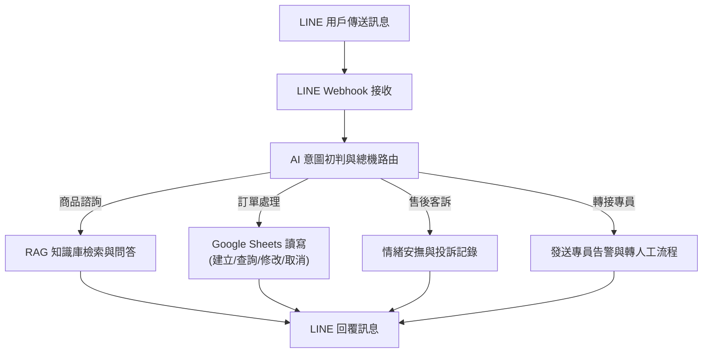

# LINE 智慧客服總機

> **作者**：葉正義  
> **專案類型**：n8n 自動化應用 + LINE Messaging API + Google Sheets + Gemini / OpenRouter AI  
> **相關文件**：[`LINE_智慧客服總機_完整操作手冊.pdf`](./LINE_智慧客服總機_完整操作手冊.pdf)｜[`LINE智慧客服測試知識庫範例.docx`](./LINE智慧客服測試知識庫範例.docx)

---

## 專案簡介

本專案為一套企業級的 **LINE 智慧客服總機** 自動化解決方案，整合 **n8n**、**LINE Messaging API**、**Google Sheets** 以及大語言模型（Gemini / OpenRouter）。

以「好日家電生活館」作為實戰情境，實現意圖辨識、商品諮詢、訂單建立與查詢、售後客訴處理以及真人客服轉接通知等全方位自動化客服服務。

系統特色：
1. **多意圖智慧路由**：自動將顧客諮詢分流至商品問答、訂單處理、售後投訴與真人客服。
2. **Google Sheets 雙向串接**：支援即時訂單建立、訂單編號查詢、收件資訊修改與訂單取消。
3. **RAG 知識庫問答**：串接商品知識庫，提供精準、擬真的真人風格商品推薦與售後說明。
4. **高標準 UAT 驗收**：內附完整 UAT 驗收表、操作手冊與測試資料，具備高穩定度與容錯機制。

---

## 系統架構流程圖

---

## 相關專案資料與文件清單

- **操作手冊**：[`LINE_智慧客服總機_完整操作手冊.pdf`](./LINE_智慧客服總機_完整操作手冊.pdf)（詳細架構、日常操作與排錯說明）
- **測試知識庫**：[`LINE智慧客服測試知識庫範例.docx`](./LINE智慧客服測試知識庫範例.docx)（好日家電生活館知識庫問答）
- **UAT 驗收表**：[`LINE_智慧客服_UAT驗收表_已驗收.xlsx`](./LINE_智慧客服_UAT驗收表_已驗收.xlsx)
- **試算表資料**：[`LINE客服總機紀錄.xlsx`](./LINE客服總機紀錄.xlsx) 與 [`訂單明細.xlsx`](./訂單明細.xlsx)
