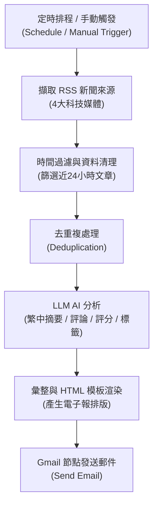

# 每日 AI 新聞摘要至 Gmail

> **作者**：陳俊宇  
> **專案類型**：n8n 自動化應用 + AI 新聞整理 + HTML 電子報與 Gmail 自動派送  
> **工作流程檔案**：[`每日AI新聞摘要至gmail.json`](./每日AI新聞摘要至gmail.json)  
> **成果報告**：[`每日AI新聞摘要至Gmail_n8n成果報告.pdf`](./每日AI新聞摘要至Gmail_n8n成果報告.pdf)

---

## 專案簡介

本專案使用 **n8n** 建立了一套高自動化的 **AI 新聞蒐集、智慧摘要與電子報派送系統**。

系統會定時監控多個科技媒體的 RSS 來源，自動篩選 24 小時內發布的最新科技動態，進行去重複與資料整理，接著利用 LLM 產生繁體中文核心摘要、專業點評與重要性評分，最終編排為響應式 HTML 電子報自動寄發至指定 Gmail 信箱。

系統核心特色：
1. **多來源聚合與去重**：整合 4 大科技 RSS 來源，支援時間區間過濾與重複文章清除。
2. **AI 結構化分析**：以 LLM 生成繁中重點摘要、商業/技術影響評論與重要度標籤。
3. **客製化 HTML 電子報**：動態排版美觀易讀的卡片式新聞列表，一目了然。
4. **排程與手動雙觸發**：支援每日定時排程自動執行，亦可隨時手動觸發立即產報。

---

## 系統架構流程圖

---

## 快速上手與操作指南

1. 將 [`每日AI新聞摘要至gmail.json`](./每日AI新聞摘要至gmail.json) 匯入至 n8n。
2. 設定 Gmail OAuth2 憑證與目標收件人電子郵件地址。
3. 設定 AI 模型（如 OpenAI 或 Google Gemini）憑證。
4. 點擊測試執行或啟用 Schedule Trigger，每日定時接收最新科技新聞摘要。
