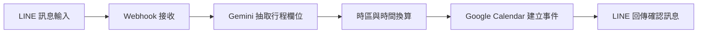
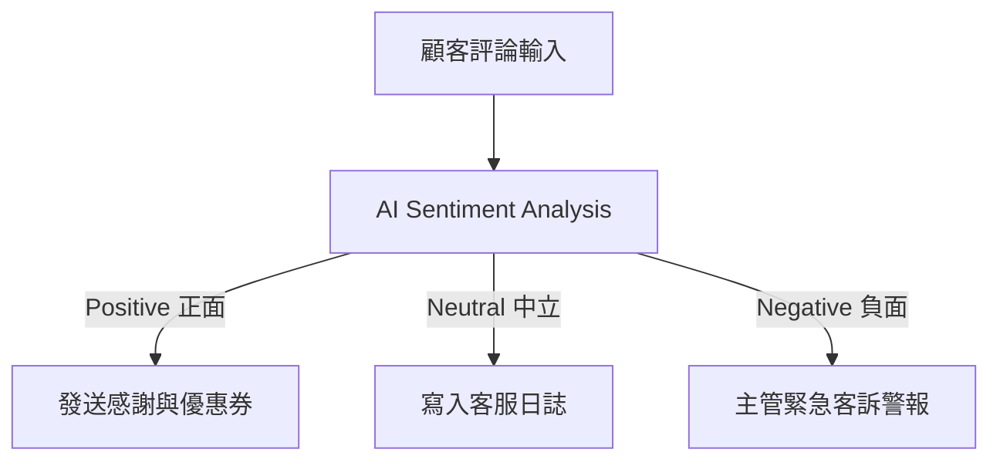

# 陳佩欣 - n8n 自動化作品集

> **作者**：陳佩欣  
> **作品數量**：2 項專案  
> **專案包含**：LINE 排 Calendar 行程、Sentiment Analysis 情緒分析工作流

---

## 專案一：LINE 排 Calendar 行程

> **說明文件**：[`LINE排Calendar行程_使用說明書.md`](./LINE排Calendar行程_使用說明書.md)  
> **展示截圖**：[`截圖 2026-09-15 下午2.08.53.png`](./截圖%202026-09-15%20下午2.08.53.png)

### 專案簡介
使用者在 LINE 聊天室中傳送自然語言行程描述（如「明天早上十點和廠商開會，在會議室A，大概一小時」），系統透過 Google Gemini 模型即時抽取活動標題、開始時間、結束時間與地點，換算為正確的台北時區時間，並自動新增至 Google Calendar，最後回傳確認訊息給使用者。

---

## 專案二：Sentiment Analysis 情緒分析工作流

> **說明文件**：[`n8n 基礎｜Sentiment Analysis 情緒分析工作流使用說明書.pdf`](./n8n%20基礎｜Sentiment%20Analysis%20情緒分析工作流使用說明書.pdf)

### 專案簡介
本專案模擬電商或客服情境，自動分析顧客留言與評論的情緒傾向，並依照正面（Positive）、中立（Neutral）、負面（Negative）進行智慧分流：
- **正面評論**：自動發送感謝訊息與回購優惠券。
- **中立評論**：記錄至一般客服日誌。
- **負面評論**：立即觸發緊急客訴警報，通知主管優先介入處理。

