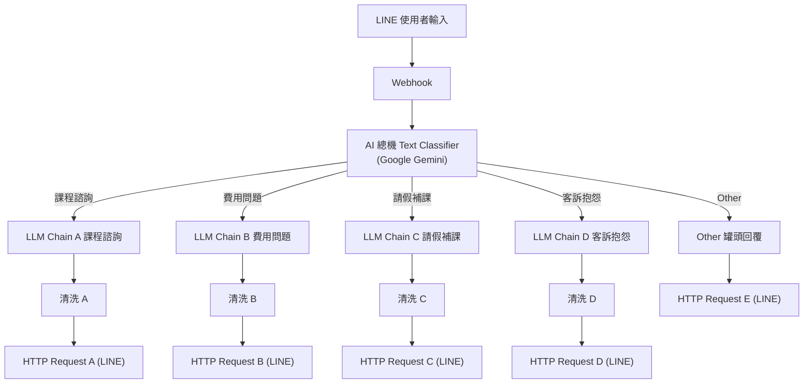

# LINE 智慧客服總機

> **作者**：陳怡人  
> **專案類型**：n8n 自動化應用 + LINE Messaging API + Google Gemini + 智慧客服分類路由  
> **架構截圖**：[`1789461514846.jpg`](./1789461514846.jpg)

---

## 專案簡介

本專案建置了一個基於 **LINE Messaging API** 與 **Google Gemini** 的教育機構客服機器人。

透過 n8n 的 `AI 總機 Text Classifier` 節點對進線訊息進行多維度意圖分類，並分派至專屬的 LLM Chain 進行回應生成與格式清洗，最終回覆使用者。

系統分類路由包含：
1. **課程諮詢**：說明課程內容、師資與開課進度。
2. **費用問題**：解答學費、繳費方式與優惠方案。
3. **請假補課**：處理學員請假規定與錄影補課指引。
4. **客訴抱怨**：啟動同理心安撫模式，記錄抱怨並提供補救措施。
5. **Other 其他**：針對未明確匹配意圖提供友善罐頭導引訊息。

---

## 系統架構流程圖

