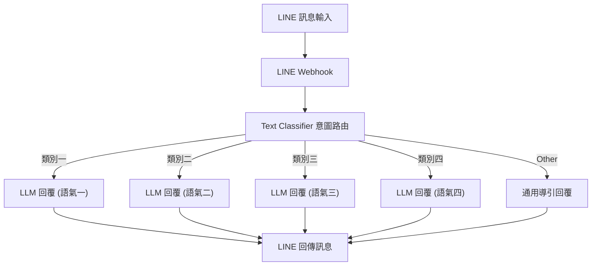
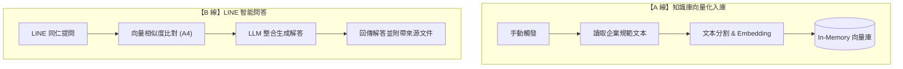

# 賴信翰 - n8n 自動化作品集

> **作者**：賴信翰  
> **作品數量**：2 項專案  
> **專案說明文件**：[`09-賴信翰.docx`](./09-賴信翰.docx)

---

## 專案一：題目一：LINE 智慧客服總機

> **工作流程檔案**：[`題⽬⼀：LINE 智慧客服總機.json`](./題⽬⼀：LINE%20智慧客服總機.json)

### 專案簡介
透過 `Text Classifier` 節點精確識別 LINE 顧客問題意圖，分流至四組具備不同語氣設定的 Basic LLM Chain 節點，並搭配「When No Clear Match」作為 Other 分支。系統在回傳訊息中主動過濾 Markdown 格式標籤（如 `**`、`#`、`-`），確保在 LINE 介面上的閱讀體驗乾淨自然。

---

## 專案二：題目五：LINE 部門知識庫問答 Pro

> **工作流程檔案**：[`題⽬五：LINE 部⾨知識庫問答 Pro.json`](./題⽬五：LINE%20部⾨知識庫問答%20Pro.json)  
> **知識庫文本**：[`員工請假辦法.txt`](./員工請假辦法.txt)｜[`差旅費報支規定.txt`](./差旅費報支規定.txt)｜[`資訊安全政策.txt`](./資訊安全政策.txt)

### 專案簡介
結合向量檢索與 RAG 架構的雙管道工作流：
- **A 線（建立知識庫）**：讀取雲端企業規範文件（員工請假辦法、差旅費報支規定、資訊安全政策），切塊並存入 In-Memory 向量庫。
- **B 線（LINE 問答）**：當同仁於 LINE 提問時，檢索相關文本段落由 AI 生成專業解答，回覆結尾自動標註引用資料來源；若無關內容則如實告知無資料，防止模型幻覺。

