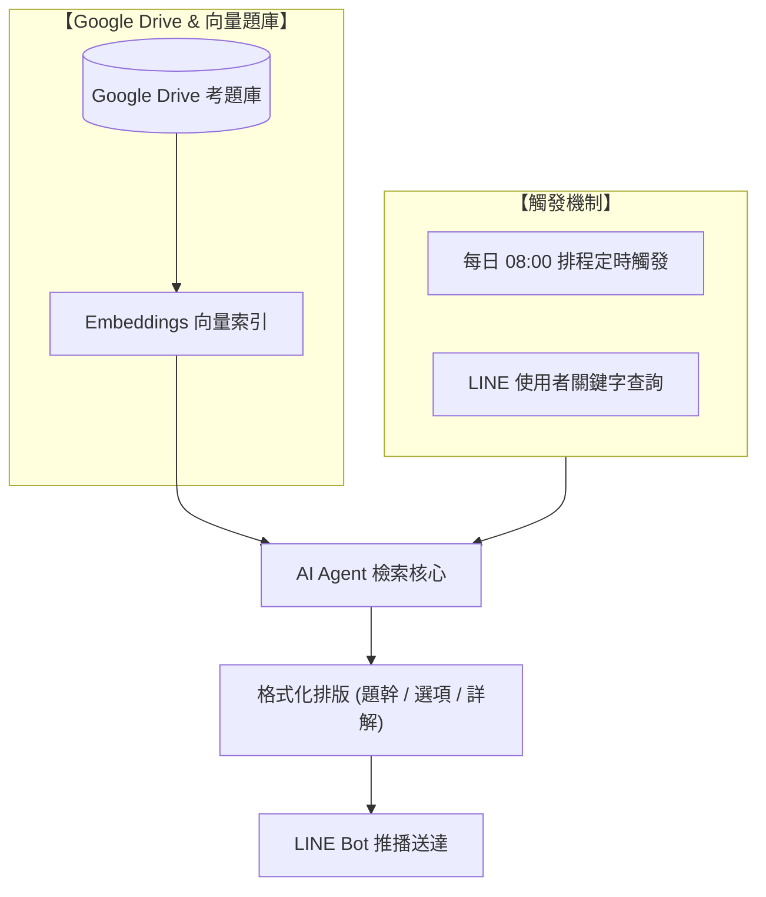

# LINE Bot 串接 Google Drive 主動推播 IPAS 考題

> **作者**：王志雄  
> **專案類型**：n8n 自動化流程 + LINE Bot + Google Drive + 向量資料庫 + 定時推播與檢索  
> **工作流程檔案**：[`line_bot串接google_drive_主動推播IPAS考題內容.json`](./line_bot串接google_drive_主動推播IPAS考題內容.json)  
> **專案簡報與截圖**：[`10_王志雄工作流說明簡報(簡易版).pptx`](./10_王志雄工作流說明簡報(簡易版).pptx)｜[`10-王志雄_實際畫面截圖.docx`](./10-王志雄_實際畫面截圖.docx)

---

## 專案簡介

本專案建置了一個助攻考取「經濟部 IPAS 機器學習工程師能力鑑定」的智慧 LINE 學習助理。

工作流程結合 **Google Drive 題庫管理**、**Embedding 向量資料庫** 與 **n8n 自動化流程**，提供雙重學習輔助管道：
1. **每日早晨定時推播**：每天早上 08:00 自動觸發，從題庫中隨機挑選機器學習考題推播至使用者的 LINE，培養日常備考節奏。
2. **關鍵字即時檢索**：考生可在 LINE 中隨時輸入特定考點或題目關鍵字，由 AI Agent 檢索對應題庫後即時回傳考題與解析。

---

## 系統架構流程圖

