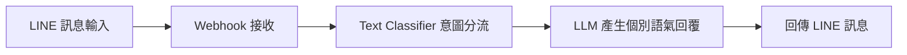
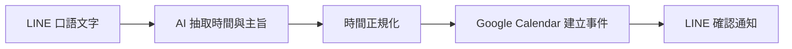
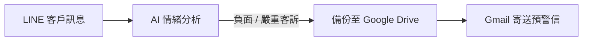

# 連照銘 - n8n 自動化專題作品集

> **作者**：連照銘  
> **作品數量**：3 項專案  
> **專案說明文件**：[`11_連照銘.docx`](./11_連照銘.docx)

---

## 專案一：LINE 智慧客服總機

> **工作流程檔案**：[`LINE智慧客服總機_OK.json`](./LINE智慧客服總機_OK.json)

### 專案簡介
運用意圖分類器與 AI 回覆鏈，自動識別顧客在 LINE 上提出的產品、帳務或常規問題，並分別引導至專屬回覆節點，有效減少人工客服負擔。

---

## 專案二：LINE 一句話排行程

> **工作流程檔案**：[`LINE一句話排行程.json`](./LINE一句話排行程.json)

### 專案簡介
利用 AI 資訊抽取技術（Information Extractor），將用戶口語化的排程文字（如「後天下午兩點開會」）結構化解析出時間與主旨，並直接連線建立 Google Calendar 行程事件。

---

## 專案三：LINE 客訴情緒預警系統

> **工作流程檔案**：[`LINE客訴情緒預警系統.json`](./LINE客訴情緒預警系統.json)

### 專案簡介
即時監控 LINE 進線留言情緒。當顧客言論出現高度負面情緒或投訴關鍵字時，自動將事件記錄至 Google Drive / Sheets，並即時以 Gmail 發送緊急預警信通知主管。

