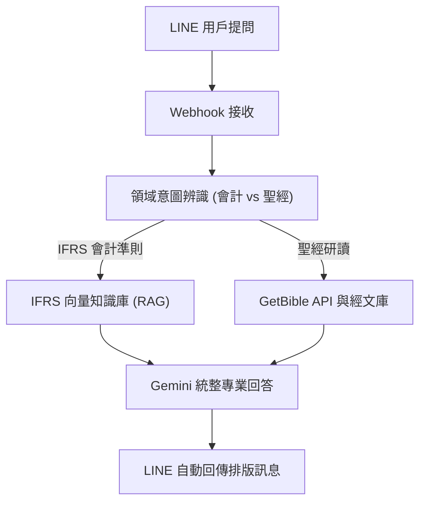

# LINE IFRS 觀念架構 × 聖經摩西五經 雙知識庫問答

> **作者**：戴昱愷  
> **專案類型**：n8n 自動化流程 + LINE Bot + Google Gemini + RAG 知識庫 + GetBible API  
> **工作流程檔案**：[`13-戴昱愷 LINE IFRS觀念架構 × 聖經摩西五經知識庫問答.json`](./13-戴昱愷%20LINE%20IFRS觀念架構%20×%20聖經摩西五經知識庫問答.json)  
> **成果報告**：[`13-戴昱愷 LINE IFRS觀念架構 × 聖經摩西五經知識庫問答_課程成果報告-戴昱愷_2026.09.17版.pdf`](./13-戴昱愷%20LINE%20IFRS觀念架構%20×%20聖經摩西五經知識庫問答_課程成果報告-戴昱愷_2026.09.17版.pdf)

---

## 專案簡介

本專案為一個高達 **48 個節點** 的進階多領域問答系統，成功在單一 LINE 官方帳號下整合「**IFRS 國際會計準則觀念架構**」與「**聖經摩西五經**」兩大異質領域知識庫。

系統主要亮點：
1. **雙知識庫智慧路由**：透過 LLM 初步判定使用者問題類型，自動導流至會計專業知識庫或聖經研讀系統。
2. **會計領域 RAG 檢索**：深度整合 IFRS 規範條文，回答精準的會計處理原則、認列條件與定義。
3. **聖經外部 API 整合**：串接 GetBible API 實現經文即時檢索與背景釋經回答。
4. **全自動友善互動**：使用者僅需以自然語言在 LINE 中提問，不需額外學習指令即可獲得排版工整且附有出處的回答。

---

## 系統架構流程圖

