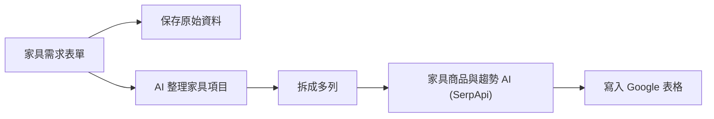
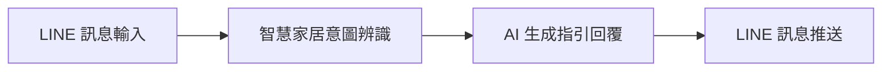

# 郭思儀 - n8n 自動化作品集

> **作者**：郭思儀  
> **作品數量**：2 項專案  
> **專案領域**：家具專案自動化整理、LINE 智慧家居客服

---

## 專案一：家具專案｜AI 自動整理 → Google Sheets

> **工作流程檔案**：[`家具專案｜AI 自動整理 → Google Sheets.json`](./家具專案｜AI%20自動整理%20→%20Google%20Sheets.json)  
> **操作手冊**：[`家具專案_AI自動整理_GoogleSheets_使用說明書.pdf`](./家具專案_AI自動整理_GoogleSheets_使用說明書.pdf)  
> **流程圖截圖**：[`1789456094456.jpg`](./1789456094456.jpg)

### 專案簡介
針對家具採購、裝修與設計專案的一站式自動化工作流。使用者填寫需求表單後，系統自動保存原始表單，並透過 AI 拆解物品項目（尺寸、材質、顏色、預算等），串接 SerpApi 進行網路商品與市場趨勢搜尋，最終將格式化數據彙整追加寫入 Google Sheets 試算表中。

---

## 專案二：LINE 智慧家居客服總機

> **工作流程檔案**：[`LINE 智慧家居客服總機.json`](./LINE%20智慧家居客服總機.json)

### 專案簡介
專為智慧家居品牌設計的 LINE 客服機器人。針對用戶提出的裝置安裝、聯網故障、保固維修等家居情境進行智慧分析與回應，提供流暢的客服引導體驗。

