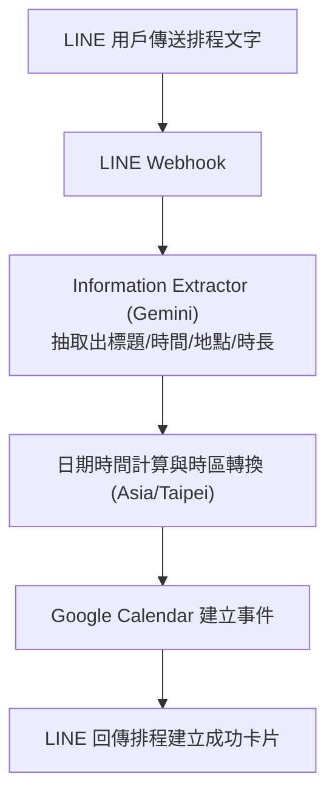

# LINE 一句話排行程

> **作者**：陳全佑  
> **專案類型**：n8n 自動化流程 + LINE Bot + Information Extractor (Gemini) + Google Calendar  
> **工作流程檔案**：[`題目二 - LINE 一句話排行程.json`](./題目二%20-%20LINE%20一句話排行程.json)  
> **完整文件**：[`17-陳全佑(LINE一句話排行程_操作手冊).pdf`](./17-陳全佑(LINE一句話排行程_操作手冊).pdf)｜[`17-陳全佑(LINE一句話排行程_成果報告).pdf`](./17-陳全佑(LINE一句話排行程_成果報告).pdf)｜[`17-陳全佑(LINE一句話排行程_專題書面報告).pdf`](./17-陳全佑(LINE一句話排行程_專題書面報告).pdf)

---

## 專案簡介

本專案將複雜的排程流程簡化為一句自然對話。使用者只需在 LINE 中輸入日常用語（例如「明天早上十點和廠商開會，在會議室 A，大概一小時」），系統透過 **Information Extractor** 與 **Google Gemini** 模型精準解析主旨、開始時間、結束時間與會議地點，自動換算時區並寫入 Google Calendar 行事曆，並於 LINE 即時反饋建立結果。

---

## 系統架構流程圖

