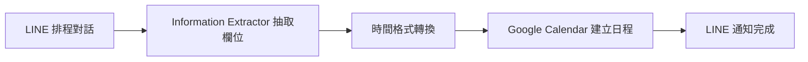
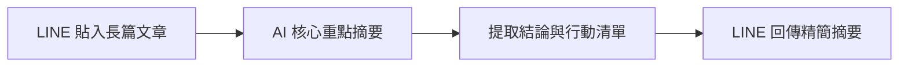

# 許佑群 - n8n 自動化作品集

> **作者**：許佑群  
> **作品數量**：2 項專案  
> **專案總覽文件**：[`18-許佑群.pdf`](./18-許佑群.pdf)

---

## 專案一：題目二：LINE 一句話排行程

> **工作流程檔案**：[`題目二-LINE一句話排行程.json`](./題目二-LINE一句話排行程.json)  
> **說明文件**：[`題⽬⼆：LINE ⼀句話排⾏程.txt`](./題⽬⼆：LINE%20⼀句話排⾏程.txt)

### 專案簡介
使用 Information Extractor 將用戶在 LINE 發送的自然語言文字抽取轉換為 Google Calendar 所需的標準結構化時間與事件格式，實現免手動填表單的智慧行程排定。

---

## 專案二：題目三：LINE 長文摘要秘書

> **工作流程檔案**：[`題目三-LINE長文摘要秘書.json`](./題目三-LINE長文摘要秘書.json)  
> **說明文件**：[`題⽬三：LINE ⻑⽂摘要秘書.txt`](./題⽬三：LINE%20⻑⽂摘要秘書.txt)

### 專案簡介
專為快速閱讀長篇文章、新聞或報告設計的 LINE AI 秘書。使用者在 LINE 中貼入長篇文本或文章內容，工作流透過 LLM 快速提取核心要點、關鍵結論與行動清單，大幅節省閱讀時間。

